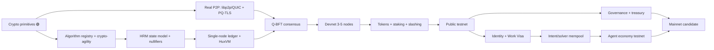

# 00 — Executive Summary

## 1. Thesis

Two civilization-scale transitions are arriving at the same time: **cryptographically
relevant quantum computers** (CRQCs), which break the elliptic-curve and RSA cryptography
that secures every existing blockchain, and **autonomous AI agents**, which will transact,
contract, and accumulate capital at machine speed. No existing Layer-1 is designed for
either, let alone both.

Huxplex is a bet that the right substrate for the next several decades must be **post-quantum
by construction** (not by retrofit) and **AI-native by construction** (agents are
first-class economic actors, not bots bolted onto a human chain), while preserving
**human sovereignty** as a hard, protocol-level constraint rather than a social norm.

The wager in one sentence:

> *A neutral, post-quantum settlement and coordination layer where AI agents earn, spend,
> contract, and govern within cryptographically enforced human-defined limits will be more
> valuable, and more defensible, than either a faster human chain or a permissioned
> enterprise "AI ledger."*

This document is the honest version: what exists, what is only vision, the gap between
them, and the path across it.

## 2. What actually exists today (🟢 ground truth)

The repository is **not** a blockchain. It is a well-tested **post-quantum cryptography and
networking primitive library** (~1,200 LOC of implementation + extensive tests). Concretely:

| Component | Status | Detail |
|---|---|---|
| ML-DSA-44 (Dilithium2) sign/verify | 🟢 | `libcrux-ml-dsa`, 1312 B pk / 2560 B sk / 2420 B sig, context-bound |
| ML-KEM-768 KEM + HKDF session key | 🟢 | `libcrux-ml-kem`, directional derivation |
| BIP32 → ML-DSA seed derivation | 🟢 | hardened path `m/44'/931931'/0'/0'/{i}'` |
| Domain-separated context strings | 🟢 | tx / block phases / gossip / DHT / TLS, with cross-context replay tests |
| PeerId = SHAKE-256(pk)[..32] | 🟢 | `network/peer.rs` |
| Signed GossipSub messages | 🟢 (struct-level) | `GossipMessage::sign/verify` |
| Signed Kademlia DHT entries | 🟢 (struct-level) | `DhtEntry::sign/verify` |

That is the entire substrate. **There is no ledger, no consensus, no VM, no storage engine,
no P2P transport, no tokens, no agents, no governance.** The networking module defines
message *types* but no actual swarm, transport, or peer state machine.

## 3. What is claimed but does not exist (🟡 / 🔴 the gap)

Everything below is **vision-only** and is the subject of this blueprint:

- **State**: Huxplex Resource Machine (HRM), S-EUTXO sharding, Jellyfish Merkle Trees, nullifiers.
- **Consensus**: Q-BFT, LB-VRF leader election, PQ-SSLE, epoch rotation, vector-clock causal ordering.
- **Execution**: HuxVM deterministic WASM, gas schedule, TCHAO parallel scheduler.
- **Networking**: actual libp2p/QUIC transport, PQ-TLS handshake, swarm, peer scoring.
- **Storage**: RocksDB-backed state, signature pruning after finality, snapshots.
- **Economy**: HUX/SVRGN/SNTNC tokens, staking, slashing, fee market, treasury.
- **AI economy**: Work Visa credentials, intents/solvers, zk-STARK task proofs, agent reputation, Agentic DAOs.
- **Identity**: `did:huxplex` method, human biometric DIDs, provenance records, privacy.
- **Governance**: Hive-Mind four-phase lifecycle, biological veto, constitutional layer.

The gap between vision and code is **the entire protocol**. This is not a criticism — the
author frames it as a long-term research initiative — but the blueprint must be honest that
we are at **T0: primitives done, protocol unbuilt**.

## 4. Conflicts found and how we resolve them

A founding architect's first job is to reconcile contradictions before they calcify.

| # | Conflict | Resolution | ADR |
|---|---|---|---|
| 1 | Token model: readme `$HUX/$PLEX/$CRED` vs essays `HUX/SVRGN/SNTNC` | Adopt `HUX/SVRGN/SNTNC`; map old→new; CRED merit ≈ SNTNC accrual | [ADR-0001](adr/0001-canonical-architecture-reconciliation.md) |
| 2 | ML-DSA-44 signature size: essay says 2,560 B | **Wrong.** 2,560 B is the *secret key*; signature is **2,420 B**. Code is authoritative. | [ADR-0002](adr/0002-cryptographic-parameter-set.md) |
| 3 | State model: readme "eUTXO" vs essay "HRM resource machine" | HRM is the superset; eUTXO is a special case of HRM resources. Adopt HRM, present eUTXO as a subset. | [ADR-0003](adr/0003-state-model-hrm.md) |
| 4 | Consensus named "Q-BFT" but unspecified beyond "PBFT + PQ sigs" | Specify as a HotStuff-derived, PQ-authenticated BFT with DAG mempool; reject naive PBFT at scale. | [ADR-0004](adr/0004-consensus-selection.md) |
| 5 | "Proof of Sentience" framing risks overclaiming | Reframe strictly as *measurable non-redundant causal contribution*; never "consciousness." | [ADR-0007](adr/0007-sentience-framing.md) |
| 6 | Validator keys: SLH-DSA-128s vs ML-DSA-44 everywhere | Hybrid: ML-DSA-44 for hot per-block signing, SLH-DSA for long-lived identity/root-of-trust. | [ADR-0002](adr/0002-cryptographic-parameter-set.md) |

## 5. Where the vision is strong, and where it is fragile

**Strong, keep:** PQ-by-construction; context-domain binding (already implemented and
genuinely good); resource/intent model for agents; human veto as a hard constraint;
crypto-agility as a first-class requirement; framing as research not a token sale.

**Fragile, needs work (🔴):**
- **"Proof of Sentience" / novelty scoring** is the riskiest idea in the project. Any
  on-chain "novelty" or "merit" metric is an adversarial optimization target and a likely
  attack surface (grinding, collusion, Sybil amplification). It must be *opt-in, off the
  critical consensus path, and economically bounded*, not a consensus primitive. See
  [ADR-0007](adr/0007-sentience-framing.md) and [`11-research/open-problems.md`](11-research/open-problems.md).
- **zk-STARK "proof of correct task completion"** for arbitrary agent work is, in the
  general case, undecidable. It works only for tasks with a verifiable specification
  (deterministic compute, oracle-checkable outputs). The blueprint scopes it accordingly.
- **Sharding + cross-shard atomicity + PQ signature bloat** simultaneously is a hard
  systems problem; ML-DSA's 2,420 B signatures make bandwidth and state the binding
  constraints. Pruning and aggregation are not optional niceties — they are load-bearing.
- **Biometric human DIDs** create privacy and centralization risks that can swallow the
  whole "sovereignty" thesis if done naively.

## 6. Recommended architecture (one paragraph)

A Rust, `#![forbid(unsafe_code)]` (outside the crypto core) Layer-1 with: an **HRM**
resource state model sharded via **S-EUTXO**; a **HotStuff-derived, DAG-mempool,
PQ-authenticated BFT** (Narwhal/Bullshark-style mempool + Jolteon/HotStuff-2 commit) rather
than naive PBFT; **HuxVM** deterministic WASM execution with a **TCHAO** optimistic-parallel
scheduler; **libp2p/QUIC** transport with a **hybrid (X25519 + ML-KEM-768)** handshake and
ML-DSA-44 authentication; **RocksDB** + Jellyfish Merkle state with **post-finality
signature pruning**; a **triple-token** economy (HUX utility / SVRGN human-sovereignty /
SNTNC agent-merit) with a burn-based fee market; **`did:huxplex`** identities and **Work
Visa** capability credentials for agents; and **four-phase Hive-Mind governance** with a
hard human veto and a minimal **constitutional layer** of unamendable invariants. Every
cryptographic choice is wrapped in a **versioned algorithm registry** so the entire suite
can be rotated under governance without a hard fork of the state model — crypto-agility is
the top architectural priority, above any single algorithm choice. Justifications are in
[`02-architecture/`](02-architecture/) and the ADRs.

## 7. Critical path (what blocks what)

The **binding sequence** is: agility-wrapped crypto → state model → execution → consensus →
devnet. Tokens, identity, agents, and governance are layered on a working chain. **Do not
build the AI economy before there is a chain to run it on.** This is the single most common
way ambitious L1s die.

## 8. Roadmap at a glance

| Phase | Horizon | Outcome | Detail |
|---|---|---|---|
| 0 — Research | Months 0–6 | Specs frozen, agility framework, consensus chosen, prototypes | [phase0](09-roadmap/phase0-research.md) |
| 1 — Testnet | Months 6–18 | Working multi-node chain, tokens, staking, public testnet | [phase1](09-roadmap/phase1-testnet.md) |
| 2 — Mainnet | Months 18–30 | Audited mainnet, governance, treasury, conservative feature set | [phase2](09-roadmap/phase2-mainnet.md) |
| 3 — AI economy | Months 30–48 | Work Visas, intents/solvers, agent reputation, marketplaces | [phase3](09-roadmap/phase3-ai-economy.md) |
| 4 — Global scale | Months 48–60+ | Sharding at scale, cross-chain, crypto-suite v2 migration | [phase4](09-roadmap/phase4-global-scale.md) |

## 9. Top 10 risks (full register in [`08-security/`](08-security/))

1. **Scope collapse** — building the AI economy before a working chain. *Mitigation: phase gates.*
2. **PQ signature bandwidth/state bloat** breaking throughput. *Mitigation: pruning, aggregation research, DAG mempool.*
3. **Novelty/sentience metric becomes an attack surface** and discredits the project. *Mitigation: off critical path, opt-in, bounded.*
4. **Crypto break** in a chosen PQ scheme (ML-DSA/ML-KEM are young). *Mitigation: agility registry, hybrid, SLH-DSA fallback.*
5. **Solo/small team** cannot deliver a civilization-scale L1. *Mitigation: ruthless MVP scoping, leverage existing stacks.*
6. **Hostile AI agents** at scale (spam, market manipulation, collusion). *Mitigation: Work Visa bonds, reputation, rate limits.*
7. **Governance capture** (plutocracy or human-apathy). *Mitigation: log-weighted machine votes, biological veto, quorum design.*
8. **Biometric DID privacy failure** undermines sovereignty claim. *Mitigation: ZK personhood, no raw biometrics on-chain.*
9. **Bridge/cross-chain compromise** (historically the #1 loss vector). *Mitigation: defer bridges; light-client + PQ proofs only.*
10. **Regulatory classification** of SVRGN/SNTNC/HUX as securities. *Mitigation: utility-first design, legal review, no public sale pre-mainnet.*

## 10. What "good" looks like in 12 months

A 3–5 node devnet producing blocks under Q-BFT, signing every block and vote with ML-DSA-44
over domain-separated contexts (reusing today's tested crypto), executing HuxVM transactions
against an HRM ledger with post-finality signature pruning, exporting research metrics on PQ
signature overhead and parallel-execution speedup — and **zero** AI-economy or
"sentience" features in the consensus-critical path. Everything else is earned from there.

---

### Open Questions
- Is a solo/small team the right structure, or should Huxplex target being a *module suite*
  (causal clock, PQ pruning, novelty lib) exported to other chains (the readme's v4 endgame)
  rather than a sovereign L1? See [`11-research/open-problems.md#strategy`](11-research/open-problems.md).
- Can ML-DSA signature aggregation or a SNARK-friendly PQ signature make full sharding viable,
  or is the bandwidth ceiling a hard wall? (Top open research question.)
</content>
