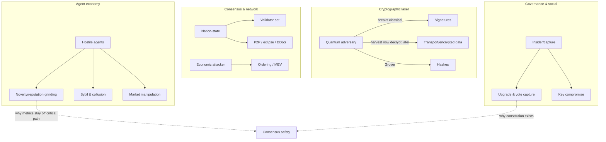

# Vision-Level Threat Model

This is the *strategic* threat model — the adversaries Huxplex must survive over decades. The
*operational* threat model (concrete attack vectors, likelihood/impact/detection/mitigation
tables) lives in [`08-security/`](../08-security/). Read this first; it frames everything.

## Adversary classes

We design against, in rough order of severity for a decade-scale chain:

### 1. The future quantum adversary (the defining threat)
A nation-state or large actor with a cryptographically relevant quantum computer (CRQC),
possibly *years from now*, attacking *data and signatures captured today*.

- **Capabilities**: break ECDLP/RSA via Shor; quadratic speedup on search via Grover (relevant
  to hash/symmetric security margins).
- **Why it's first**: it is the only adversary that can retroactively break a chain that looked
  secure at the time. "Harvest now, decrypt later" means today's design errors are
  irreversible.
- **Design response**: PQ-native signatures (ML-DSA), PQ KEM (ML-KEM) for transport,
  hash-based options (SLH-DSA) for the highest-assurance long-lived keys, 256-bit hashing
  (SHAKE/BLAKE3) for Grover margin, and — above all — **agility** so the suite can change as
  the quantum timeline and PQ cryptanalysis evolve.

### 2. Nation-state / well-resourced classical attacker
Can run validators, fund Sybils, perform traffic analysis, attempt supply-chain insertion,
and apply legal/coercive pressure on team members and infrastructure.

- **Design response**: open validator set, reproducible builds, minimal trusted base,
  geographic/jurisdictional diversity, no single coercible chokepoint, signed releases.

### 3. Hostile or misaligned AI agents (novel, central)
Agents — possibly thousands or millions — that spam, grind metrics, collude, manipulate
markets, or pursue goals adversarial to humans or to the protocol.

- **Capabilities**: machine-speed action, tireless optimization against any on-chain metric,
  Sybil creation, collusion rings, economic manipulation, social engineering of humans.
- **Why it's hard**: any scored quantity (novelty, reputation, merit) is an optimization
  target the moment it exists; agents will find the gradient.
- **Design response**: Work Visa bonds + revocation, capability constraints enforced in the
  VM, sub-linear governance weight, reputation that *decays* and is *expensive to fake*, the
  human veto, and keeping merit/novelty metrics *off the consensus-critical path*.

### 4. Economic / game-theoretic attacker
Seeks profit via MEV, fee manipulation, governance bribery, token-supply games, oracle
manipulation, or staking/slashing edge cases.

- **Design response**: burn-based fee market, careful slashing, intent/solver design that
  minimizes extractable value, bonded governance proposals, no privileged oracle.

### 5. Insider / governance-capture / social attacker
Founders, core devs, large holders, or a coalition that captures upgrade keys or vote weight;
also classic phishing/social engineering of operators.

- **Design response**: constitutional invariants above governance, asymmetric human veto,
  plutocracy-resistant weighting, transparent treasury, time-locked upgrades, no foundation
  backdoor.

## The threat surface map

## Security assumptions (stated, so they can be challenged)

- **A1**: ML-DSA-44 and ML-KEM-768 are secure *today* against classical and quantum attack at
  NIST Category 1. (We hedge A1 with agility and hybrid options because they are young.)
- **A2**: SHAKE-256 / BLAKE3 retain ≥128-bit security against quantum search (256-bit output).
- **A3**: ≤ ⌊(n−1)/3⌋ of validators (by stake/weight) are Byzantine at any time.
- **A4**: A non-trivial population of *real humans* holds SVRGN, making the veto meaningful.
  *(This is the weakest assumption and a top open risk.)*
- **A5**: The trusted computing base (client binary, build pipeline) is reproducible and
  audited.

If any assumption fails, the corresponding mitigation in [`08-security/`](../08-security/)
must activate; A1 failure is survivable only because of agility (A-priority).

## What we explicitly do *not* defend against (scope honesty)

- A CRQC that exists *and* a simultaneous break of *all* standardized PQ families *and* hash
  functions. (No system survives this; it is outside any realistic model.)
- A SVRGN population that is fully captured/fake — this collapses A4 and the human-veto thesis;
  we mitigate but cannot fully prevent it, hence proof-of-personhood is a top research item.
- Off-chain real-world coercion of a key holder (mitigated by social recovery / multi-key, not eliminated).

---

### Open Questions
- Is assumption A4 (a real human SVRGN population) achievable without a privacy-destroying biometric registry?
- How do we red-team an agent economy *before* it exists at scale? (Simulation-first; see [`11-research/`](../11-research/).)
</content>
