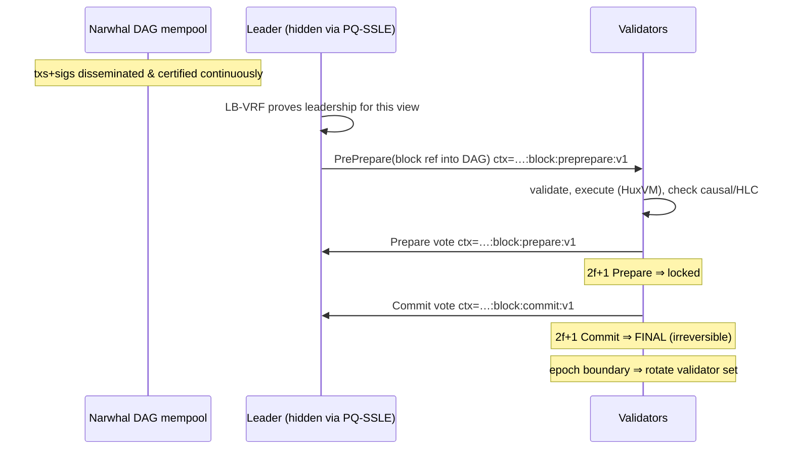

# Consensus — Q-BFT

> This document also satisfies the directive's **Consensus Research** requirement: a
> comparison of Tendermint, HotStuff, Narwhal/Bullshark, DAG architectures, the Avalanche
> family, Substrate/Cosmos SDK approaches, and a custom Rust implementation, with a justified
> recommendation. Decision recorded in [ADR-0004](../adr/0004-consensus-selection.md).

## Requirements

Huxplex consensus must:

1. Be **BFT-safe** under ≤ ⌊(n−1)/3⌋ Byzantine validators with **deterministic finality**
   (agents and escrow settlement need "final means final," not probabilistic).
2. Be **post-quantum authenticated** — every vote/cert uses an algorithm-registry PQ scheme
   (ML-DSA-44 today), with domain-separated phase contexts (already implemented & tested).
3. Tolerate **large signatures** (2,420 B) without collapsing — i.e., decouple data
   dissemination from voting.
4. Support **leader-targeting resistance** (the vision's PQ-SSLE: leader hidden until reveal)
   to prevent DDoS/bribery of the next proposer.
5. Provide **causal ordering** hooks for cross-shard / agent messages (vector clocks + HLC).
6. Be **agile**: the signature scheme and even the BFT variant should be swappable.

## The candidates

| Family | Finality | Throughput model | Leader | PQ fit | Maturity | Notes |
|---|---|---|---|---|---|---|
| **Tendermint/CometBFT** | Deterministic, instant | Monolithic (gossip+vote coupled) | Round-robin, known | Sig-agnostic ✅ | Very high (Cosmos) | Simple, proven; leader known → targetable; throughput limited by coupling data+consensus |
| **HotStuff / HotStuff-2 / Jolteon** | Deterministic | Pipelined, linear comms O(n) | Rotating, known | Sig-agnostic ✅ (but loves BLS aggregation ⚠️) | High (Diem/Aptos) | Linear message complexity; *designed around* threshold/aggregate sigs — PQ has none yet |
| **Narwhal + Bullshark/Tusk** | Deterministic (Bullshark) | **DAG mempool decouples data from consensus** | Leader on DAG | Sig-agnostic ✅ | High (Sui, research) | Best throughput-under-big-data story; mempool reliably disseminates *before* ordering |
| **Pure DAG (Avalanche-style metastable)** | Probabilistic | Gossip sampling | Leaderless | Sig-agnostic ✅ | High (Avalanche) | No hard finality → bad for escrow/settlement determinism |
| **Avalanche (Snowman)** | Probabilistic | Repeated sampling | Leaderless | ✅ | High | Great liveness/scale; probabilistic finality is a poor fit for agent escrow |
| **Substrate (BABE+GRANDPA)** | Hybrid (probabilistic block + finality gadget) | Framework | VRF leader | ❌ classical (sr25519, ed25519) baked in | High framework | Would mean fighting the framework to go PQ-native; see ADR-0005 |
| **Cosmos SDK (CometBFT)** | Deterministic | Framework over Tendermint | Known | ✅ sig-agnostic | High | SDK assumes account model + ed25519 defaults; HRM/UTXO + PQ is swimming upstream |
| **Custom Rust BFT** | As designed | As designed | As designed | ✅ native | Low (we build it) | Maximum fit, maximum effort & risk |

### Why not each

- **Pure Avalanche / metastable DAG**: probabilistic finality is unacceptable for autonomous
  escrow settlement and cross-shard 2PC. Rejected as the *finality* engine (its sampling ideas
  may inform peer selection).
- **Substrate**: superb engineering, but its identity/crypto (sr25519/ed25519), networking, and
  account model are classical and deeply assumed. Going PQ-native and HRM-native means
  replacing the parts that *are* Substrate. Net negative. (ADR-0005.)
- **Cosmos SDK**: CometBFT is signature-agnostic and attractive, but the SDK's account/bank
  model and tooling assume Ethereum/Cosmos-style accounts and ed25519; HRM + S-EUTXO + PQ keys
  fight the grain. We may *borrow* CometBFT's BFT core ideas.
- **HotStuff with BLS aggregation**: HotStuff's *linear* communication depends on aggregating
  votes (BLS threshold sigs). **There is no efficient standardized PQ signature aggregation.**
  Naively, PQ HotStuff loses its headline advantage (you ship 2f+1 × 2,420 B per QC). This is a
  core tension and a research item.

## Recommendation

**Q-BFT = a HotStuff-derived, partially-synchronous BFT core (Jolteon/HotStuff-2 style
2-chain commit) running over a Narwhal-style DAG mempool, PQ-authenticated with ML-DSA-44 and
domain-separated phase contexts, with leader election by a lattice VRF (LB-VRF) wrapped in
single-secret-leader-election (PQ-SSLE).** Build it as a **custom Rust crate**, but
*shamelessly reuse the algorithms and engineering lessons* of CometBFT, HotStuff-2, and
Bullshark rather than inventing a new BFT.

Rationale:

1. **Deterministic finality** (HotStuff/Jolteon) satisfies escrow/settlement needs.
2. **DAG mempool** (Narwhal) is the answer to the PQ-signature-bloat problem: it reliably
   disseminates the heavy transaction+signature data *before and independent of* the voting
   path, so the consensus hot path moves small references, not 2,420 B blobs. This is the
   single most important consensus decision for a PQ chain.
3. **Custom Rust** because PQ-native + HRM + SSLE is not what any framework gives us, and
   consensus is exactly the differentiator we must own. We mitigate the build risk by copying
   well-understood protocols, not by inventing.
4. **LB-VRF + PQ-SSLE** gives leader-targeting resistance with PQ primitives.

### The aggregation caveat (be honest)

Without efficient PQ aggregate signatures, a quorum certificate is `2f+1` separate ML-DSA-44
signatures. At small validator sets (devnet/early mainnet, n ≤ ~100) this is fine. At large
sets it is heavy. Mitigations and the open research path:

- Keep validator set **bounded** (e.g., ≤ 100–150 active) with delegated stake, so a QC is
  ≤ ~150 × 2,420 B ≈ 350 KB — acceptable off the hot path via the DAG.
- Pursue **PQ signature aggregation / SNARK-compressed certificates** (prove "2f+1 valid
  ML-DSA sigs exist" with a zk-STARK) as a Phase-3/4 research item. 🔴
- Consider **SLH-DSA only for identity** and ML-DSA for votes (already the plan).

## Protocol phases (logical)

The phase context strings above (`preprepare`/`prepare`/`commit`) are **already implemented
and tested** in `src/crypto/mod.rs` — phase replay is provably prevented. This is real,
shippable foundation.

## Anti-grinding: causal clocks

Each block carries a **Hybrid Logical Clock** timestamp and a **vector-clock** summary.
- HLC bounds timestamp manipulation (a proposer can't grind time backward/forward freely).
- Vector clocks give causal ordering for asynchronous cross-shard / agent messages and let the
  network *detect causal regression* (used as a slashable fault and as a research signal).
- ⚠️ Vector-clock size grows with participants; use compressed/bounded variants and treat full
  causal histories as research instrumentation, not a consensus requirement at scale.

## Fork choice & finality

With deterministic BFT finality there is no long-range fork choice in the common case (final =
final). For the pre-final DAG, use **heaviest-certified-subDAG** (Bullshark ordering). Reorgs
are only possible below the finalized frontier and are bounded by the BFT safety proof.

## MVP / Production / Future

- **MVP (devnet)**: fixed small validator set, round-robin leader (no SSLE yet), simple
  PrePrepare/Prepare/Commit with ML-DSA-44 sigs (reuse existing contexts), no DAG (direct
  gossip), single shard. Goal: blocks finalize correctly.
- **Production (mainnet)**: stake-weighted dynamic validator set with epoch rotation, LB-VRF
  leader election + PQ-SSLE, Narwhal DAG mempool, slashing for double-sign & causal regression,
  bounded validator set for QC size.
- **Future**: SNARK-compressed quorum certificates, cross-shard BFT, adaptive validator-set
  sizing, formal verification of the safety/liveness proofs.

---

### Open Questions
- Can we get a practical SNARK/STARK-compressed PQ quorum certificate to break the aggregation wall? (Top consensus research item.)
- Order-then-execute vs execute-then-order with a DAG mempool — interaction with HuxVM determinism?
- Is PQ-SSLE worth its complexity at small validator sets, or defer to mainnet?
</content>
