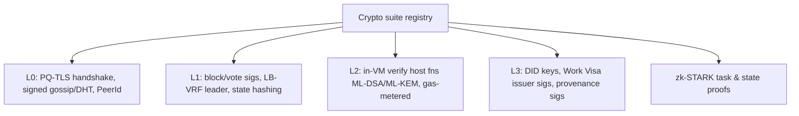

# Cryptography (Architecture View)

> This is the *architectural* role of crypto in the stack. The deep PQ treatment (algorithms,
> parameters, agility, migration) is in [`03-post-quantum/`](../03-post-quantum/). Parameter
> decisions are in [ADR-0002](../adr/0002-cryptographic-parameter-set.md).

## What is already real (🟢)

This is the most mature part of Huxplex — the existing code is genuinely good:

| Primitive | Lib | Sizes | Notes |
|---|---|---|---|
| ML-DSA-44 sign/verify | `libcrux-ml-dsa` 0.0.7 | pk 1312 / sk **2560** / sig **2420** | randomized signing, context-bound; **essay's "2560 B signature" is wrong — that's the sk** |
| ML-KEM-768 KEM | `libcrux-ml-kem` 0.0.7 | ek 1184 / dk 2400 / ct 1088 / ss 32 | HKDF-SHA256 session derivation, directional |
| HD derivation | `bip32` | path `m/44'/931931'/0'/0'/{i}'` | hardened-only → 32-byte ML-DSA seed |
| Hash/XOF | `sha3` (SHAKE-256), `sha2` | — | PeerId = SHAKE-256(pk)[..32] |
| Domain separation | in-house | `huxplex-{net}:{purpose}:v{n}` | **extensively tested cross-context replay prevention** |

The context-binding test suite (tx/block phases/gossip/dht/tls, mainnet vs testnet, prepare vs
commit) is a real asset — it encodes a security discipline most chains add late and badly.

## The cryptographic suite (target)

| Use | Algorithm | Family | Why |
|---|---|---|---|
| Tx & vote signing (hot path) | **ML-DSA-44** ⚠️ | Lattice (MLWE) | Fast-ish, small-ish, FIPS 204; already implemented. **Under review** — see *Role separation* below |
| Validator long-lived identity | **SLH-DSA-128s** | Hash-based | Structure-free; survives a lattice break; rarely signed so size/slowness OK |
| Transport KEX | **ML-KEM-768 (+ X25519 hybrid)** | Lattice + ECC | FIPS 203; hybrid = defense-in-depth during transition |
| Leader election randomness | **iVRF / authenticated iVRF** ⚠️ | Hash-based | Supersedes LB-VRF: 0.02 ms eval/verify (faster than classical ECVRF), no ZK proof of PRF evaluation, +32 B for forward security. **Pending ADR** |
| Leader privacy | **PQ-SSLE** | composed | hide next proposer (anti-DDoS) |
| Task/state proofs | **zk-STARK** | Hash-based | no trusted setup, PQ-safe (no pairings) |
| Hashing | **BLAKE3** (state), **SHAKE-256** (IDs) | — | 256-bit (Grover margin), fast/XOF |
| AEAD | **ChaCha20-Poly1305** (256-bit) | symmetric | constant-time, fast |

**Deliberate family diversity**: lattice (ML-DSA/ML-KEM) for performance, hash-based
(SLH-DSA/STARK/SHAKE/iVRF) for conservatism. A single lattice break does not end the chain.

> **Validated, September 2026.** Two events make this the year's best-supported decision. The
> May 2026 Luo preprint claimed a quantum break of ML-KEM at *all* parameter sets; it was
> refuted in eight days — but for eight days nobody could say so. Separately, a February 2026
> result on the MLWE/LWE hardness gap shaves bits off ML-KEM by exploiting **module structure**,
> contradicting the prior claim that no attack does. Nothing is broken; the direction of travel
> is the point. Likewise **BLAKE3 over an arithmetization-friendly hash** is now the mainstream
> position: the Ethereum Foundation abandoned Poseidon for base-layer hashing in 2026 after its
> own cryptanalysis found issues in Poseidon2. Detail:
> [`brainstorming/01-layer0-technology-review-2026.md`](../brainstorming/01-layer0-technology-review-2026.md) §1.

### Role separation: one hot-path scheme is not enough 🔴

The 2026 literature (*Domain-Specific Post-Quantum Signatures for Blockchains*,
arXiv:2609.24689) argues that transaction authorization and quorum certification are **different
design problems** — different adversaries, cost models and required operations — and that NIST
single-signer primitives are *"not a drop-in replacement for the signature layer of modern
public blockchains."*

| Role class | Needs | Huxplex object | Size budget |
|---|---|---|---|
| **T-class** — transaction authorization | bind chain ID, nonce, fee, intent; priced rejection of invalid input | `Transaction`, `Intent` | ≤ 3 KB (TGEN) |
| **Q-class** — quorum certificate | public aggregation, merge semantics, slashing evidence, light-client verification | `Vote`, block certificate | aggregation-dominated |
| **Identity / governance** | longevity, structure-free assumptions | validator identity, DID, visa issuance | large OK (TROOT) |

Huxplex's hot/cold split (ML-DSA vs. SLH-DSA) is already half of this. What is missing: **`Transaction`
and `Vote` are pinned to the same scheme**, and the suite descriptor below carries a version but
no **role**. Two consequences:

1. The `algo_suite` field should be `{ role, version }`, decided **before the registry is built
   at G1** — adding a role dimension after every object type embeds an algorithm ID is a state
   migration, not a parameter change.
2. **R-A2 (ML-DSA-44 vs -65) should be re-run per role, not globally.** The evidence has moved:
   Sui chose ML-DSA-65 over the cheaper 44, citing AI-assisted attacks that found HAWK
   vulnerabilities surviving years of human review, and verification at parity with Ed25519;
   CNSA 2.0 mandates ML-DSA-87 for national-security systems. Against that, BSC shipped
   ML-DSA-44 and measured a **40–50% TPS reduction** — so the trade is real. Note also that the
   current suite pairs a **Cat-1 signature with a Cat-3 KEX**, which is not a deliberate
   choice; the weakest link sets the margin.

## The overriding architectural property: agility

No algorithm above is hard-coded. Every signed/encrypted object carries an **algorithm-suite
version** (a small integer / enum). The verifier dispatches on it. Adding ML-DSA-65, replacing
ML-KEM-768, or rotating to a future scheme is a **registry update under governance**, not a
hard fork of the state model. The existing `SignatureSchemeId` enum is the seed of this
registry — today it has one variant (`Dilithium2`); it must grow into a versioned suite.

```rust
// Direction of travel (illustrative, not current code):
enum SigRole { Transaction, QuorumCert, Identity, Governance } // ← the missing dimension

enum AlgoSuite {
    V1 { sig: SignatureSchemeId, kem: KemId, hash: HashId }, // ML-DSA-44 / ML-KEM-768 / BLAKE3
    // V2 added later by governance without breaking V1 objects
}
// Resolution is (role, suite version) → primitive, not suite version alone.
```

See [`03-post-quantum/crypto-agility.md`](../03-post-quantum/crypto-agility.md).

## Quorum-certificate aggregation: R-A1 now has candidates

The blueprint records "no efficient PQ signature aggregation standard" as an open void. As of
2026 the question has changed from *"does anything exist?"* to *"which trade, and what does it
cost the key lifecycle?"*

| Scheme | Certificate size | Assumptions | Notes |
|---|---|---|---|
| BLS *(classical baseline)* | 96 B, any committee | pairings | What PQ must replace; not PQ-safe |
| **Chipmunk** | ~20 KB @ 1,024 validators | lattice, synchronized | Leading synchronized-aggregation candidate |
| **Lemur+** (eprint 2026/2054) | ~56 KB @ 10⁶ signers, 42-yr key lifetime | MLWE + MSIS | Multi-hop aggregation; 0.29 s verify @ 2¹³ signers |
| **STARK-compressed multi-sig** | O(1) on-chain | hash-based | Proving cost moves off-chain |
| DKKW / LeanSig | — | hash-based | Hash-based multi-signature alternative |

> **The load-bearing consequence.** Every viable PQ aggregation scheme is **stateful or
> synchronized** — it needs pre-committed, time-indexed key material with a declared lifetime.
> That cannot be bolted onto a plain ML-DSA keypair afterwards. If aggregation is ever wanted,
> the validator key hierarchy in [ADR-0014](../adr/0014-validator-key-management.md) must be
> designed to be aggregation-compatible **now**, while there are zero validators to migrate.
> This pulls against the rotation cadence argued for below, and the tension must be resolved
> deliberately rather than discovered.

## Where crypto plugs into each layer



Note the HuxVM exposes ML-DSA-44 verification and ML-KEM encapsulation as **gas-metered host
functions** (250 / 300 units in the vision schedule) — crypto is callable from smart logic, not
just protocol internals.

## Engineering rules for crypto code

1. `unsafe` is allowed **only** in the vetted crypto primitive layer; everything else
   `#![forbid(unsafe_code)]`.
2. **Constant-time** primitives only; ML-DSA rejection sampling is a timing-side-channel risk —
   rely on audited `libcrux` and add side-channel tests.
3. **FIPS Known-Answer-Test vectors** in CI for every primitive.
4. **Multi-vendor**: keep the ability to swap the ML-DSA/ML-KEM implementation (agility applies
   to *implementations*, not just algorithms) to dodge a single-library bug.
   ✅ *Made concrete 2026-09-22:* where two implementations of one primitive are in the tree, CI
   **MUST** run a differential test between them — `libcrux` ↔ `aws-lc-rs` for ML-DSA-44
   ([ADR-0019](../adr/0019-transport-authentication.md)), `fips205` ↔ RustCrypto `slh-dsa` for
   SLH-DSA-128s. FIPS 204/205 verification is deterministic, so disagreement is a detectable bug,
   not a tolerance.
   ⚠️ **Assurance is not uniform.** `libcrux`'s ML-DSA/ML-KEM core is *formally verified* (hax +
   F*: panic freedom, correctness, secret independence); `aws-lc-rs` is audited but not verified.
   Protocol signatures use the verified path; the TLS transport uses the audited one, on a
   separate key purpose. See [repository-structure](../10-development/repository-structure.md)
   §*Dependency policy for third-party cryptography*.
5. **No homemade crypto.** We compose standardized primitives; we do not invent schemes.
   (LB-VRF/PQ-SSLE/STARK integration uses published constructions, audited.)

## Open risks (crypto-specific)

- ML-DSA/ML-KEM are young (standardized 2024); mitigated by hybrid + diversity + agility.
- No *standardized* PQ signature **aggregation** → consensus QC bloat. Candidates now exist
  (above) but all are stateful (see [consensus.md](consensus.md)).
- PQ-SSLE is less mature than the FIPS primitives; treat as Production-phase, with
  classical-randomness fallback for devnet. (iVRF supersedes LB-VRF and is *better* than the
  FIPS-adjacent baseline — see the suite table.)
- Library churn: `libcrux-*` at `0.0.x` — pin, vendor, and track upstream closely.

### The threat that is actually materializing: implementation attacks 🔴

2026's realized attacks on ML-DSA/ML-KEM are **not mathematical**:

| Attack | Result | Relevance |
|---|---|---|
| Fault attack on the seed pointer (eprint 2025/2009) | Full ML-KEM key/message recovery; **ML-DSA signature forgery**. The vulnerable pattern is *verified present in PQM4, liboqs, PQClean and wolfSSL* | Library choice is not a safety guarantee — this is why rule 4 exists |
| Key recovery from sign leakage (eprint 2026/1366) | First ML-DSA secret-key recovery, at **190,000 signatures** | **A validator signing every block and vote reaches 190k in days, not years** |
| Horizontal fusion attacks (eprint 2026/1904) | Side-channel key recovery | Constant-time is necessary, not sufficient |
| Noisy randomness leakage (eprint 2026/1712) | Statistical inference on ML-DSA | Rejection sampling remains the exposed surface (rule 2) |

The 190k figure changes a design parameter: **key-epoch rotation cadence stops being an
operational nicety and becomes a cryptographic requirement with a number attached.**
[ADR-0014](../adr/0014-validator-key-management.md) already has the right structure — BIP32
index `{i}` as key epoch, cold SLH-DSA authorizing rotation — so this is a parameter to set, not
a redesign. Rule 4 (multi-vendor implementation swap) is promoted by this evidence from prudence
to requirement, and CI needs side-channel tests beyond FIPS KATs.

---

### Open Questions
- Which PQ aggregation candidate (Chipmunk / Lemur+ / STARK-compressed) — and can any of them permit a rotation cadence short enough to respect the 190k-signature leakage bound, or must we choose between compact certificates and frequent rotation?
- Does iVRF's modified uniqueness property hold usefully for a **bounded, known** Q-BFT validator set, or is its advantage specific to Algorand-style sortition from an open set?
- Which concrete PQ-SSLE construction, and is an audited Rust implementation available?
- Should genesis use hybrid signatures (ML-DSA + Ed25519) too, or hybrid only for KEX? (Leaning KEX-only; sig hybrid doubles the already-large sig.)
- What is the correct per-role parameter set — is Cat 3 right for Q-class votes while Cat 1 stays available as a T-class transaction profile?
</content>
