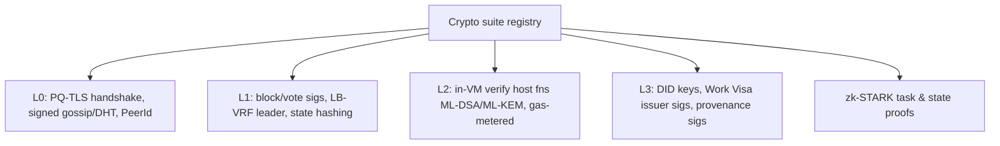

# Cryptography (Architecture View)

> This is the *architectural* role of crypto in the stack. The deep PQ treatment (algorithms,
> parameters, agility, migration) is in [`03-post-quantum/`](../03-post-quantum/). Parameter
> decisions are in [ADR-0002](../adr/0002-cryptographic-parameter-set.md).

## What is already real (🟢)

This is the most mature part of Huxplex — the existing code is genuinely good:

| Primitive | Lib | Sizes | Notes |
|---|---|---|---|
| ML-DSA-44 sign/verify | `libcrux-ml-dsa` 0.0.7 | pk 1312 / sk **2560** / sig **2420** | randomized signing, context-bound; **essay's "2560 B signature" is wrong — that's the sk** |
| ML-KEM-768 KEM | `libcrux-ml-kem` 0.0.7 | ek 1184 / dk 2400 / ct 1088 / ss 32 | HKDF-SHA256 session derivation, directional |
| HD derivation | `bip32` | path `m/44'/931931'/0'/0'/{i}'` | hardened-only → 32-byte ML-DSA seed |
| Hash/XOF | `sha3` (SHAKE-256), `sha2` | — | PeerId = SHAKE-256(pk)[..32] |
| Domain separation | in-house | `huxplex-{net}:{purpose}:v{n}` | **extensively tested cross-context replay prevention** |

The context-binding test suite (tx/block phases/gossip/dht/tls, mainnet vs testnet, prepare vs
commit) is a real asset — it encodes a security discipline most chains add late and badly.

## The cryptographic suite (target)

| Use | Algorithm | Family | Why |
|---|---|---|---|
| Tx & vote signing (hot path) | **ML-DSA-44** | Lattice (MLWE) | Fast-ish, small-ish, FIPS 204; already implemented |
| Validator long-lived identity | **SLH-DSA-128s** | Hash-based | Structure-free; survives a lattice break; rarely signed so size/slowness OK |
| Transport KEX | **ML-KEM-768 (+ X25519 hybrid)** | Lattice + ECC | FIPS 203; hybrid = defense-in-depth during transition |
| Leader election randomness | **LB-VRF** | Lattice | PQ verifiable randomness |
| Leader privacy | **PQ-SSLE** | composed | hide next proposer (anti-DDoS) |
| Task/state proofs | **zk-STARK** | Hash-based | no trusted setup, PQ-safe (no pairings) |
| Hashing | **BLAKE3** (state), **SHAKE-256** (IDs) | — | 256-bit (Grover margin), fast/XOF |
| AEAD | **ChaCha20-Poly1305** (256-bit) | symmetric | constant-time, fast |

**Deliberate family diversity**: lattice (ML-DSA/ML-KEM/LB-VRF) for performance, hash-based
(SLH-DSA/STARK/SHAKE) for conservatism. A single lattice break does not end the chain.

## The overriding architectural property: agility

No algorithm above is hard-coded. Every signed/encrypted object carries an **algorithm-suite
version** (a small integer / enum). The verifier dispatches on it. Adding ML-DSA-65, replacing
ML-KEM-768, or rotating to a future scheme is a **registry update under governance**, not a
hard fork of the state model. The existing `SignatureSchemeId` enum is the seed of this
registry — today it has one variant (`Dilithium2`); it must grow into a versioned suite.

```rust
// Direction of travel (illustrative, not current code):
enum AlgoSuite {
    V1 { sig: SignatureSchemeId, kem: KemId, hash: HashId }, // ML-DSA-44 / ML-KEM-768 / BLAKE3
    // V2 added later by governance without breaking V1 objects
}
```

See [`03-post-quantum/crypto-agility.md`](../03-post-quantum/crypto-agility.md).

## Where crypto plugs into each layer



Note the HuxVM exposes ML-DSA-44 verification and ML-KEM encapsulation as **gas-metered host
functions** (250 / 300 units in the vision schedule) — crypto is callable from smart logic, not
just protocol internals.

## Engineering rules for crypto code

1. `unsafe` is allowed **only** in the vetted crypto primitive layer; everything else
   `#![forbid(unsafe_code)]`.
2. **Constant-time** primitives only; ML-DSA rejection sampling is a timing-side-channel risk —
   rely on audited `libcrux` and add side-channel tests.
3. **FIPS Known-Answer-Test vectors** in CI for every primitive.
4. **Multi-vendor**: keep the ability to swap the ML-DSA/ML-KEM implementation (agility applies
   to *implementations*, not just algorithms) to dodge a single-library bug.
5. **No homemade crypto.** We compose standardized primitives; we do not invent schemes.
   (LB-VRF/PQ-SSLE/STARK integration uses published constructions, audited.)

## Open risks (crypto-specific)

- ML-DSA/ML-KEM are young (standardized 2024); mitigated by hybrid + diversity + agility.
- No efficient PQ signature **aggregation** standard → consensus QC bloat (see
  [consensus.md](consensus.md)).
- LB-VRF / PQ-SSLE are less mature than the FIPS primitives; treat as Production-phase, with
  classical-randomness fallback for devnet.
- Library churn: `libcrux-*` at `0.0.x` — pin, vendor, and track upstream closely.

---

### Open Questions
- Best available PQ signature aggregation / STARK-compressed multi-sig for quorum certs?
- Which concrete LB-VRF and PQ-SSLE constructions, and are audited Rust impls available?
- Should genesis use hybrid signatures (ML-DSA + Ed25519) too, or hybrid only for KEX? (Leaning KEX-only; sig hybrid doubles the already-large sig.)
</content>
