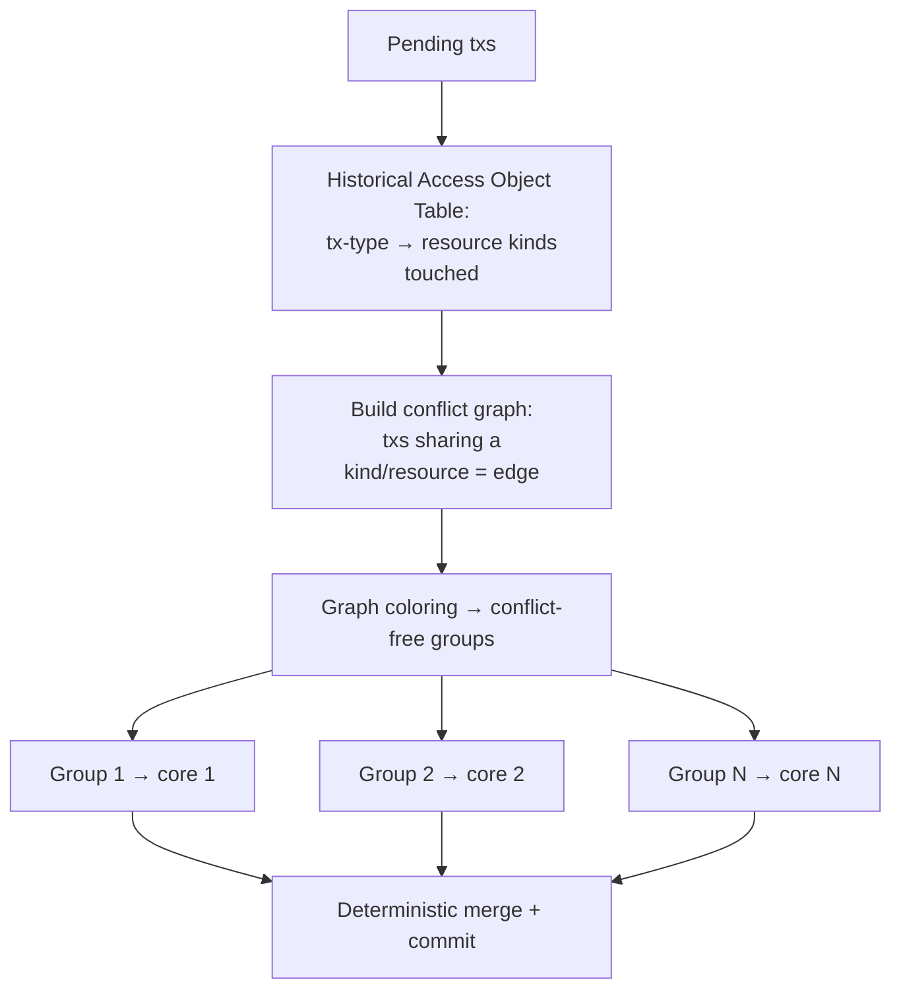

# Execution Engine — HuxVM & TCHAO

## Two components

1. **HuxVM** — a *deterministic* WebAssembly virtual machine that runs resource-logic scripts
   and agent programs with metered gas.
2. **TCHAO** — Transaction Classification by Historical Access Objects — the *parallel
   scheduler* that groups non-conflicting transactions to execute across CPU cores, recovering
   the throughput lost to PQ signature verification overhead.

## HuxVM: determinism above all

Smart-contract VMs that admit nondeterminism cannot reach consensus. HuxVM enforces:

| Rule | Why |
|---|---|
| **No floating point** — fixed-point `i128`/`i256` only | FP results vary across hardware → consensus split |
| **No syscalls / ambient I/O** — only metered host functions | Sandboxing + determinism |
| **No threads / no nondeterministic opcodes** | Reproducibility |
| **Gas-metered; no unbounded loops** | Halting / DoS protection |
| **Typed host functions return HRM resources only** | No direct global-state mutation |

### Gas schedule (from the vision, refined)

| Operation | Units (nano-HUX) | Note |
|---|---|---|
| Basic arithmetic | 1 | |
| Memory op | 3 | |
| SHAKE-256 / 64 B | 5 | |
| **ML-DSA-44 verify** | 250 | reflects ~38× cost vs Ed25519 |
| **ML-KEM-768 encapsulate** | 300 | |
| Cross-shard message | 500 | discourages chatty cross-shard logic |

Crypto is a **gas-metered host function**, callable from logic scripts (e.g., a Work Visa
script verifying an issuer signature). Pricing PQ verification explicitly is essential — it is
the dominant cost and the prime DoS target.

### Engine choice

| Option | Pros | Cons |
|---|---|---|
| **A — `wasmtime`** (recommended) | Mature, fast (Cranelift), good fuel/epoch metering, sandbox | Larger dep; must verify determinism config (disable SIMD/FP/threads) |
| **B — `wasmi`** (interpreter) | Tiny, simple, trivially deterministic, easy gas | Slower; fine for MVP |
| **C — Custom bytecode VM** | Full control, minimal surface | Reinventing a VM; high risk |
| **D — RISC-V (à la Polkadot PolkaVM)** | Future-proof toolchain, good metering | Newer; smaller ecosystem |

**Recommendation**: start with **`wasmi`** for the MVP (determinism is trivial; correctness
first), migrate to **`wasmtime`** with FP/SIMD/threads disabled and fuel metering for
Production performance. Keep a `Vm` trait so the engine is swappable (agility for infra). Watch
**PolkaVM/RISC-V** as a Future option. (ADR-0008.)

> **WASM determinism caveat**: stock WASM allows NaN-payload nondeterminism and SIMD/FP; HuxVM
> must compile with a restricted profile and validate modules at load time to reject
> disallowed opcodes. This validation is consensus-critical.

## TCHAO: parallel execution

The bottleneck on a PQ chain is verification + execution CPU. TCHAO exploits HRM's natural
parallelism (resources are independent):

- **HAOT** predicts which resource *kinds* a transaction will touch (from historical patterns),
  enabling pre-consensus grouping.
- Transactions in the same group may conflict → execute serially within group, in causal order
  (vector clocks). Different groups run in parallel.
- The **merge** must be deterministic regardless of core scheduling — this is the crux.

### Risk: prediction misses

If HAOT mispredicts access sets, a "parallel" group actually conflicts → must detect and
re-execute. Two robust strategies:

- **Option A — Pessimistic (declared access sets)**: transactions *declare* the resources they
  touch (like Solana's account list / Sui's owned objects); the scheduler trusts declarations
  and rejects violators. Simple, sound, but less flexible.
- **Option B — Optimistic (STM / Block-STM)**: execute in parallel speculatively, detect
  read/write conflicts, re-execute conflicting txs (Aptos Block-STM). No declarations needed;
  great for HRM. More complex.
- **Option C — HAOT prediction + fallback**: the vision's approach; predict, then validate and
  re-run on miss.

**Recommendation**: Adopt **Block-STM-style optimistic parallelism (Option B)** as the
production engine — it is proven, needs no perfect prediction, and fits HRM's disjoint-resource
model perfectly — and use **HAOT (Option C)** purely as a *scheduling hint* to reduce
re-execution, not as a correctness dependency. Start MVP **serial** (Option: none) for
correctness, then parallelize. (ADR-0009.)

## Execute-then-finalize

Recommended flow: validators **execute** the proposed block (HuxVM + TCHAO) to produce a state
root, then **vote** on the resulting root. This keeps determinism auditable (everyone computes
the same root or rejects) and gives fast finality. The alternative (order-first, execute-later /
deferred execution) decouples throughput from execution but complicates fraud handling — revisit
with the DAG mempool. See [consensus.md](consensus.md).

## MVP / Production / Future

- **MVP**: `wasmi`, serial execution, scalar gas, restricted opcode set, resource-logic only.
- **Production**: `wasmtime` (restricted profile), Block-STM parallelism + HAOT hints,
  multi-dimensional weight metering, full host-function crypto.
- **Future**: WASM→native AOT with determinism guarantees, RISC-V/PolkaVM evaluation,
  zk-provable execution (STARK over HuxVM traces) for light clients / rollups.

---

### Open Questions
- Optimistic (Block-STM) vs declared-access (Solana/Sui) — which wins under HRM + PQ load? (Bench in Phase 0/1.)
- How to make the parallel **merge** provably deterministic and cheaply re-executable?
- Restricted predicate language vs full WASM for resource `logic` — safety vs expressiveness.
</content>
