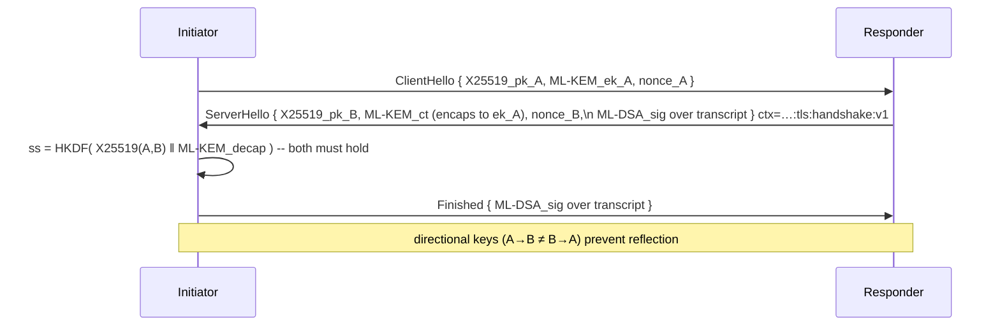

# Networking (Layer 0)

## Current state (🟢 / 🟡)

The repository defines the *message and identity types* but **not a running network**:

- 🟢 `PeerId = SHAKE-256(ml_dsa44_pk)[..32]` (`network/peer.rs`).
- 🟢 `GossipMessage { topic, network, payload, sig, from }` with context-bound sign/verify.
- 🟢 `DhtEntry { key, value, sig, signer_pk }` with `huxplex-…:dht:entry:v1` context.
- 🟢 Canonical topics: `huxplex/shard/{id}/blocks`, `…/mempool`, `huxplex/intents`.
- 🟢 TLS handshake *context strings* defined and tested.
- 🟡 **No transport, no swarm, no peer state machine, no actual DHT, no handshake code.**

So the cryptographic envelope is real; the network engine is unbuilt. That's the right order.

## Target design

| Concern | Choice | Why |
|---|---|---|
| Library | **libp2p (Rust)** | Mature swarm, GossipSub, Kademlia, transport upgrades, used by Ethereum/Filecoin/Polkadot |
| Transport | **QUIC** (UDP) | Lower latency, multiplexed streams, 0-RTT options; ML-KEM-768 ciphertext (1,088 B) fits a datagram |
| Handshake | **Hybrid PQ: X25519 + ML-KEM-768**, authenticated with ML-DSA-44 over the transcript | PQ confidentiality vs HNDL *and* classical safety if ML-KEM is broken (defense in depth) |
| Session AEAD | ChaCha20-Poly1305 (256-bit key from HKDF) | Fast, constant-time, 256-bit for Grover margin |
| Peer ID | SHAKE-256(pk)[..32] 🟢 | Self-certifying; binds identity to PQ key |
| Discovery | Kademlia DHT, ML-DSA-authenticated entries 🟢 | Decentralized peer/resource discovery |
| Propagation | GossipSub per shard + intents overlay 🟢 | Topic-scoped, with peer scoring |

### The handshake (hybrid, recommended)

This is exactly the property the existing `kem768_derive_session_key` already encodes
(directional `peer_a`/`peer_b` binding + protocol label) — the code anticipated this design.

### Why hybrid and not pure ML-KEM

ML-KEM is young. A hybrid X25519+ML-KEM secret is secure if *either* component holds: classical
(X25519) protects against a future ML-KEM cryptanalytic break, ML-KEM protects against a future
CRQC breaking X25519. This is current IETF/NIST transition guidance and is nearly free here.
The classical half can be dropped via the agility registry once ML-KEM is battle-tested.

## Design options (transport/discovery)

**Option A — Build on libp2p (recommended).** Mature, batteries-included; we add the PQ
handshake as a custom security upgrade and PQ-auth the DHT/gossip (envelopes already done).
*Cost*: must integrate PQ into libp2p's noise/tls slot. *Risk*: medium, well-trodden.

**Option B — Custom QUIC stack (`quinn`) + own overlay.** Maximum control over the PQ
handshake and datagram sizing. *Cost*: reinvent peer mgmt, NAT traversal, gossip, DHT. *Risk*:
high. *Verdict*: only if libp2p's security-upgrade extensibility proves inadequate.

**Option C — gRPC/QUIC mesh (validator-only) + libp2p for public.** Two-tier: tight authenticated
mesh among bounded validator set, libp2p gossip for the public. *Cost*: two networks to secure.
*Benefit*: validator path is simpler/faster. *Verdict*: attractive for the bounded-validator-set
consensus design; consider for Production.

**Recommendation**: Option A for the public network; evaluate Option C's validator mesh for the
consensus hot path in Production. Reject B unless forced.

## Security concerns specific to networking

- **Eclipse attacks**: enforce diverse peer selection, address buckets (Kademlia), inbound/
  outbound ratio limits, and validator mesh redundancy.
- **DDoS on leader**: mitigated at consensus layer by PQ-SSLE (hidden leader) — networking must
  not leak the next proposer.
- **Amplification via big PQ messages**: 2,420 B sigs make spam cheap-to-send/expensive-to-verify;
  require proof-of-work-lite or stake-gated gossip for unauthenticated peers, verify signatures
  lazily/batched, and rate-limit per peer with GossipSub scoring.
- **Traffic analysis** (nation-state): consider mixnet/onion options for the intents overlay in
  the privacy roadmap (see [`05-identity/privacy.md`](../05-identity/privacy.md)). 🔴
- **DHT poisoning**: entries are ML-DSA-signed 🟢; add S/Kademlia-style protections.

## MVP / Production / Future

- **MVP**: libp2p + QUIC, hybrid handshake, GossipSub for blocks/mempool on a single shard,
  static bootstrap peers, signed gossip (reuse 🟢 envelopes). 3–5 node devnet.
- **Production**: Kademlia discovery, peer scoring/banning, eclipse resistance, validator mesh
  (Option C), per-shard topics, NAT traversal, metrics.
- **Future**: mixnet/onion for intents privacy, mobile/light-client transport, QUIC datagram
  tuning for PQ sizes, drop classical half of hybrid handshake when ML-KEM matures.

---

### Open Questions
- Does libp2p's security-transport API cleanly accept a hybrid X25519+ML-KEM + ML-DSA upgrade, or do we need a fork?
- How to rate-limit unauthenticated gossip cheaply given expensive PQ verification? (Batch verify? Stake-gated relays?)
- Is a separate validator mesh worth the second-network attack surface?
</content>
