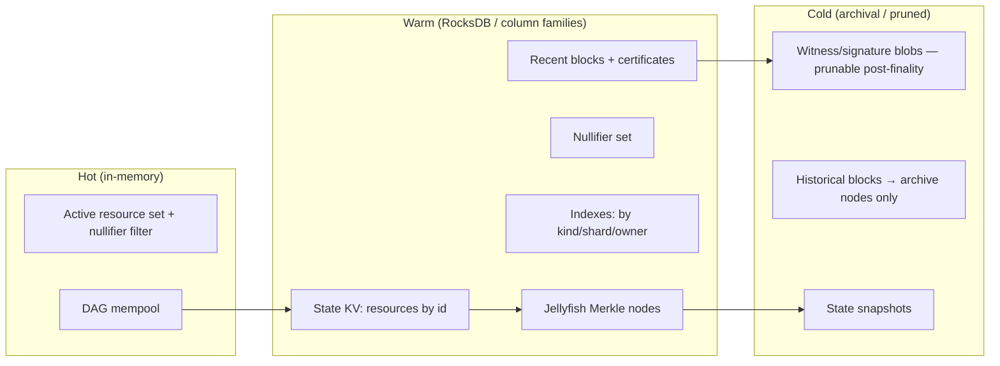

# Storage

## The problem statement

PQ signatures are large (2,420 B each). A naive chain that stores every signature forever has
state growth dominated by witness data. **Storage strategy is therefore a security and
liveness property, not an ops detail**: if state grows unbounded, the validator set
centralizes onto whoever can afford the disk, and the chain's neutrality dies.

## Layered storage model

## Choices

| Concern | Choice | Rationale |
|---|---|---|
| Embedded KV | **RocksDB** | LSM tree, column families, proven in Solana/Aptos/Cosmos; good write throughput |
| Authenticated state | **Jellyfish Merkle Tree (JMT)** per shard | Sparse Merkle variant (Diem/Aptos); efficient sparse proofs; version-friendly |
| Hashing | **BLAKE3** (state/Merkle) + **SHAKE-256** (protocol IDs) | BLAKE3 is fast & parallel; SHAKE for XOF/peer-id (already used 🟢); both 256-bit |
| Serialization | **postcard / bincode** (canonical) | Deterministic, compact; canonical encoding is consensus-critical |
| Witness storage | **SegWit-style separation**, prunable after finality | Keeps active state small despite 2,420 B sigs |

### Why SegWit-style separation matters here more than on Bitcoin

On a classical chain, witness separation is a nice-to-have. On a PQ chain it is existential: the
signature is ~38× larger relative to the rest of the tx than on an Ed25519 chain. By committing
to the witness in the block header (so security is preserved) but storing the witness blob
separately, full nodes can **prune signatures after a block is final** — finality means the
signature has done its job. Archive nodes retain everything for audit/research.

## State commitment & proofs

- Each shard's state is a JMT; key = resource id, value = resource (or its hash + datum).
- Global state root = `hash(shard_root_0 ‖ shard_root_1 ‖ … ‖ shard_root_{k-1})` (single root
  in the non-sharded MVP).
- **Light-client / inclusion proofs**: JMT sparse proofs. ⚠️ Under PQ, the *signatures* in the
  proof path are large; light-client cost is an open concern (see consensus aggregation).

## Nullifiers & double-spend prevention

Consumed resources are recorded as **nullifiers** (a deterministic commitment per consumed
resource). The nullifier set must support fast membership tests:

- Maintain a Merkleized nullifier set + an in-memory probabilistic filter (e.g., Cuckoo/Bloom)
  for the hot path.
- Nullifiers, unlike witnesses, **cannot be pruned** (they prevent replay forever) — so keep
  them compact (32 bytes) and consider accumulator schemes long-term. 🔴

## Pruning & snapshots

- **Witness pruning**: after finality + a safety window, drop signature blobs on full nodes.
- **Spent-resource pruning**: a fully-consumed resource (eUTXO-style) need not stay in active
  state once nullified and beyond reorg depth — only its nullifier persists.
- **Snapshots**: periodic JMT snapshots enable fast sync (state-sync) without replaying all
  history; snapshot roots are signed and gossiped.
- **Archive tier**: optional nodes retain full history + witnesses for research/audit (the
  chain is a "dataset generator," so at least a few archive nodes are essential).

## Design options

**Option A — RocksDB + JMT (recommended).** Battle-tested; matches Aptos/Diem lineage that
also uses JMT; good tooling. *Con*: RocksDB tuning is a dark art; compaction stalls.

**Option B — MDBX / LMDB.** Memory-mapped B-tree; great read latency (Erigon uses MDBX).
*Con*: write amplification differs; less common with Merkle-heavy workloads.

**Option C — Custom append-only log + separate index.** Maximum control of pruning semantics.
*Con*: reinventing a database; high risk.

**Recommendation**: Option A. Keep the storage interface abstract (a `StateStore` trait) so the
backend can change (agility extends to infrastructure, not just crypto).

## MVP / Production / Future

- **MVP**: single RocksDB instance, one JMT, naive (no) pruning, manual snapshots; correctness first.
- **Production**: column families, witness separation + post-finality pruning, state-sync from
  signed snapshots, nullifier filter, metrics on state growth.
- **Future**: per-shard stores, nullifier accumulators, erasure-coded archival/DA layer,
  history expiry policy under governance.

---

### Open Questions
- Accumulator vs. growing nullifier set — what keeps double-spend prevention bounded over decades?
- Data-availability strategy for sharded mode (erasure coding? DA committee? external DA?).
- Exact post-finality pruning window vs. reorg-safety vs. light-client needs.
</content>
