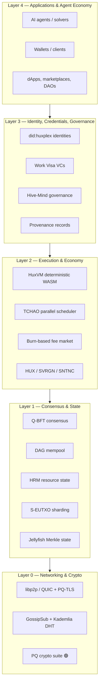
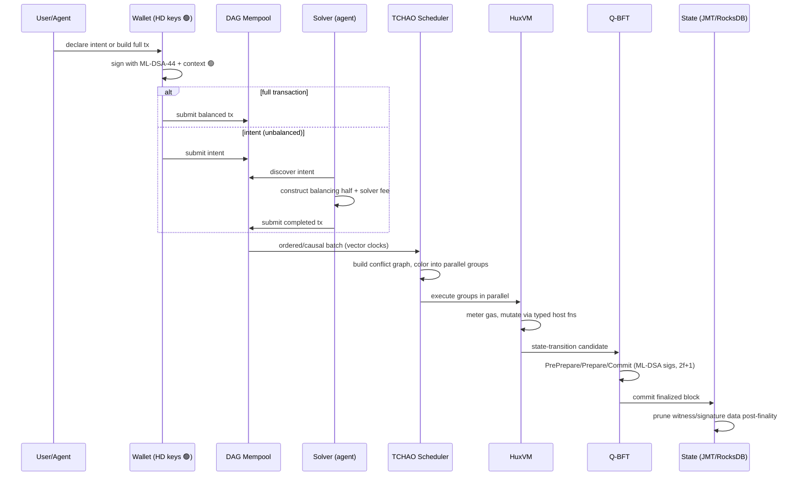

# System Overview

## Purpose

This is the map of the whole machine: the layers, how data flows from a user/agent intent to
a finalized state transition, and where each subsystem's detailed spec lives.

## Layered architecture

Huxplex is organized as a clean stack. Each layer depends only on the layers below it, and
every cross-layer object is **domain-separated and PQ-signed**.

| Layer | Subsystems | Spec | Status |
|---|---|---|---|
| L0 Crypto/Net | PQ suite, transport, gossip, DHT, peer ID | [cryptography](cryptography.md), [networking](networking.md), [`03-post-quantum/`](../03-post-quantum/) | crypto 🟢 / net 🟡 |
| L1 Consensus/State | Q-BFT, DAG mempool, HRM, S-EUTXO, JMT | [consensus](consensus.md), [state-management](state-management.md), [storage](storage.md), [layer1](layer1.md) | 🟡 |
| L2 Execution/Economy | HuxVM, TCHAO, fees, tokens | [execution-engine](execution-engine.md), [transaction-model](transaction-model.md), [`06-tokenomics/`](../06-tokenomics/) | 🟡 |
| L3 Identity/Gov | DID, Work Visa, governance, provenance | [`05-identity/`](../05-identity/), [`07-governance/`](../07-governance/) | 🟡 |
| L4 Apps/Agents | agents, solvers, wallets, marketplaces | [`04-ai-economy/`](../04-ai-economy/) | 🟡 |

## End-to-end lifecycle of a transaction/intent

## Core data objects

| Object | Role | Signed with context |
|---|---|---|
| **Resource** (HRM) | atomic state unit: tokens, VCs, vaults, provenance | logic script validates |
| **Intent** | unbalanced partial tx (a goal) | `huxplex-{net}:intent:v1` |
| **Transaction** | balanced set of consumed+created resources | `huxplex-{net}:tx:v1` 🟢 |
| **Block** | ordered batch + consensus certificate | `…:block:{phase}:v1` 🟢 |
| **Vote** | PrePrepare/Prepare/Commit | `…:block:{phase}:v1` 🟢 |
| **GossipMessage** | propagation envelope | `…:gossip:{topic}:v1` 🟢 |
| **DhtEntry** | authenticated DHT record | `…:dht:entry:v1` 🟢 |
| **Work Visa** | agent capability credential | issuer-signed VC |
| **Provenance record** | human-origin attestation | creator-signed |

(🟢 = context string already defined and tested in `src/`.)

## Design stance: monolith first, modular always

Huxplex is built as a **single Rust workspace of cohesive crates** (a "modular monolith"),
*not* a generic framework (Substrate) and *not* a fragmented microservice mesh.

- We *use* mature libraries (`libp2p`, `wasmtime`/`wasmi`, `rocksdb`, `libcrux`) but own the
  consensus, state, and execution glue — the parts where Huxplex's differentiation lives.
- Crate boundaries mirror the layers above so subsystems can be tested and swapped
  independently (and so the v4 "export as modules" endgame stays possible).
- See [`10-development/repository-structure.md`](../10-development/repository-structure.md) and
  [ADR-0005](../adr/0005-build-strategy.md) (build on Substrate vs. custom Rust).

## Cross-cutting concerns

- **Crypto-agility** threads through every layer (algorithm IDs on every signed object).
- **Determinism** is enforced at L2 (HuxVM) and required for L1 state transitions.
- **Observability**: every layer exports metrics (the chain is a "dataset generator").
- **Pruning**: witness/signature separation at L1 keeps state bounded despite large PQ sigs.

---

### Open Questions
- Where exactly is the L1/L2 boundary for the fee market — is gas a consensus object or an execution object? (Leaning: consensus accounts for gas, execution meters it.)
- Should identity (L3) ever be allowed to influence consensus (L1) — e.g., proof-of-personhood validators? (Default: no; keep L1 economically secured.)
</content>
