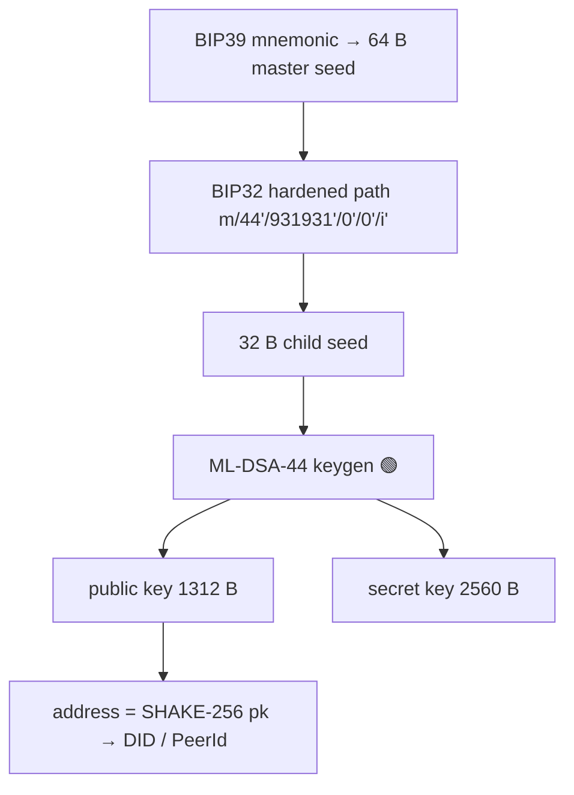

# Key Management

Keys are the whole ballgame: "sovereignty by cryptographic proof" means *losing your key is
losing your sovereignty*, and *stealing your key is stealing your identity*. PQ makes this
harder (no xpub watch-only, large keys) and the agent economy makes it weirder (machines hold
spending keys).

## Key taxonomy

| Key | Scheme | Lifetime | Where it lives | Purpose |
|---|---|---|---|---|
| **Master seed** | 64 B entropy (BIP39 mnemonic) | permanent | cold / HSM / paper | root of an HD tree |
| **Account signing key** | ML-DSA-44 | long | wallet / hot for use | sign txs (`…:tx:v1`) 🟢 |
| **Validator identity key** | **SLH-DSA-128s** | very long | HSM / cold | validator root of trust, registration |
| **Validator block-signing key** | ML-DSA-44 | epoch / rotating | hot on the node | sign votes (`…:block:*:v1`) 🟢 |
| **Transport key** | ML-KEM-768 (+X25519) | session/short | node memory | PQ-TLS handshake 🟢 |
| **Agent operating key** | ML-DSA-44 | scoped (Work Visa) | agent runtime | act under capability constraints |
| **DID controller key** | ML-DSA-44 | long, rotatable | controller's wallet | control `did:huxplex` document |

### Two-tier validator keys (important)

Validators have a **cold identity key (SLH-DSA)** that almost never signs (registration, key
rotation authorization) and a **hot block-signing key (ML-DSA-44)** that signs every vote. If
the hot key is compromised, the cold key authorizes a rotation without losing validator
identity or stake history. This mirrors Ethereum's withdrawal/validator key split and is good
hygiene; SLH-DSA's slowness is irrelevant for a key used a few times a year.

## Derivation

- Deterministic & reproducible (tested 🟢): same seed + index → same keypair.
- Hardened-only (required for ML-DSA; no public-only derivation).
- **No xpub / watch-only**: a known PQ limitation — exchanges/custodians cannot derive deposit
  addresses from a public parent. Workarounds: pre-generate address batches, or per-deposit DIDs.

## Storage & protection

| Tier | Mechanism | For |
|---|---|---|
| Cold | Air-gapped device, paper mnemonic, HSM | master seed, validator identity |
| Warm | Encrypted keystore (Argon2id + AEAD), OS keychain | account keys |
| Hot | In-memory, zeroized on drop, mlock'd | validator block key, transport, agent keys |

- **Zeroization**: secret material must be zeroized after use (`zeroize` crate); never logged.
  ⚠️ Today's `PrivateKey { bytes: Vec<u8> }` is not zeroizing — a Production must wrap secrets in
  zeroizing types. (Backlog item.)
- **HSM/enclave** support for validators and high-value agents (PKCS#11 / TEE). PQ HSM support
  is nascent — track vendor readiness.

## Rotation & revocation

- **Routine rotation**: validator block-signing keys rotate per epoch (limits exposure window).
- **Compromise rotation**: cold key authorizes new hot key; DID document updates verification
  method; old key added to a revocation/expiry list.
- **Algorithm rotation**: when the suite version bumps (agility), keys are re-derived/re-issued
  under the new scheme; both suites verify during the migration window. See
  [migration-strategy.md](migration-strategy.md).

## Recovery & social recovery

Key loss is the #1 real-world failure. Options (application/L3 layer, not consensus):

- **Mnemonic backup** (BIP39) — baseline.
- **Social recovery** — M-of-N guardians (other DIDs) can authorize a key rotation on the DID
  document after a timelock. Recommended default for human identities.
- **Multi-key accounts** — resource `logic` requiring k-of-n signatures (native multisig via
  HRM logic scripts).
- **Agent key recovery** — an agent's operating key is *issued under* a Work Visa from a
  controller; the controller can revoke + reissue. Agents are *not* their own root of trust.

## Agent key management (the novel part)

- Agents hold **scoped, revocable** operating keys, not sovereign master keys.
- The controlling human/DAO holds the root; the agent's authority = a Work Visa credential with
  constraints (spend caps, expiry, capabilities) enforced in HuxVM.
- Revocation must be **fast** (sub-epoch) — a rogue agent's key is killed by consuming/revoking
  its Work Visa resource. See [`04-ai-economy/agent-wallets.md`](../04-ai-economy/agent-wallets.md).

## MVP / Production / Future

- **MVP**: BIP39 mnemonic → BIP32 → ML-DSA (🟢), encrypted keystore, single-key accounts.
- **Production**: zeroizing secret types, two-tier validator keys (SLH-DSA cold), HSM support,
  social-recovery multisig logic, Work Visa-scoped agent keys + fast revocation.
- **Future**: threshold/MPC signing for high-value keys, PQ hardware wallets, enclave-backed
  agent runtimes, automated key-rotation under governance during suite migration.

---

### Open Questions
- Threshold/MPC ML-DSA signing — is there a practical, audited construction?
- Best UX for "no watch-only" PQ wallets for exchanges/custodians?
- Default social-recovery timelock and guardian count for human DIDs.
</content>
