# Cryptographic Migration Strategy

Huxplex is PQ-native at genesis, so it avoids the *classical→PQ* migration that haunts existing
chains. But it does **not** avoid the harder, perpetual problem: **PQ→PQ migration** as schemes
are broken, deprecated, or superseded over decades. This document is the playbook for changing
the cryptographic suite *on a live chain without a contentious hard fork*.

## Two migrations, very different

| Migration | Who faces it | Huxplex status |
|---|---|---|
| Classical → PQ | every existing L1 (BTC/ETH/…) | **Avoided** — PQ from genesis |
| PQ → PQ (suite v_n → v_{n+1}) | Huxplex, forever | **The real, recurring problem** |

Because the classical→PQ trap is avoided, the strategy focuses on making PQ→PQ routine.

## The migration state machine

Every signed/encrypted object carries an `algo_suite` version. Migration is a governed
transition between suite versions with overlapping validity windows:

```mermaid
stateDiagram-v2
    [*] --> SuiteV1: genesis (ML-DSA-44 / ML-KEM-768 / BLAKE3)
    SuiteV1 --> Announced: trigger (cryptanalysis / NIST advisory / scheduled)
    Announced --> DualAccept: V2 registered; nodes accept BOTH V1 and V2
    DualAccept --> DualRequire: new objects MUST be V2; V1 still verifiable
    DualRequire --> V1Sunset: V1 acceptance window closes after re-keying deadline
    V1Sunset --> SuiteV2: V1 fully deprecated
    SuiteV2 --> [*]
```

Phases:

1. **Announced** — governance ratifies suite v2 (new algorithm registered, audited, KATs in
   CI). A migration timeline and deadlines are published.
2. **Dual-accept** — nodes verify *both* v1 and v2. Users/validators begin re-keying: derive new
   keys under v2, link them to existing DIDs, optionally co-sign a "key transfer" with the old
   key to bind identity across the change.
3. **Dual-require** — all *new* objects must be v2; v1 still verifiable so old finalized history
   stays valid. Unmigrated accounts are nudged (fees, warnings, governance deadline).
4. **Sunset** — v1 signing acceptance ends at a block-height deadline; assets in unmigrated
   accounts may require v1-history-anchored proofs to recover (don't strand users).
5. **V2** — v1 retained only for historical verification of finalized blocks.

## Migration triggers (when to start the clock)

Define these *before* you need them (a panic migration is a failed migration):

- A credible cryptanalytic result weakening a chosen scheme (even sub-break).
- A NIST/IETF advisory deprecating a parameter set.
- A new standard offering materially better size/speed (opportunistic, slow path).
- A confirmed CRQC milestone changing the threat timeline.
- A scheduled review (e.g., every N years re-evaluate the suite regardless).

Trigger → emergency vs. routine path:
- **Routine** (opportunistic/scheduled): full multi-phase governance timeline (months).
- **Emergency** (active break): the constitutional **emergency governance** path (see
  [`07-governance/`](../07-governance/)) compresses the timeline; dual-accept may be skipped
  straight to dual-require if v1 is dangerous. Human veto still applies.

## Re-keying mechanics

- **Accounts/DIDs**: add a v2 verification method to the DID document, authorized by the v1
  controller key; optionally publish a signed "rotation" record binding old↔new identity.
- **Validators**: cold (SLH-DSA) identity key authorizes a new v2 hot key; stake/identity
  continuity preserved.
- **Funds in plain resources**: spend from v1-locked resources into v2-locked resources before
  sunset; provide a long grace window and recovery path via v1-history proofs.
- **Hybrid as a migration tool**: a hybrid object (v1 ‖ v2) is itself a clean migration step —
  it is valid under both and lets the ecosystem move incrementally.

## What makes this *not* a hard fork

The state model, consensus rules, and serialization are unchanged across a suite migration —
only the *crypto dispatch* changes, and it was always version-dispatched. New software must ship
to *add* a verifier, but old objects never become invalid, and there is no contentious
chain-split because both suites coexist during the window. This is the payoff of
[crypto-agility.md](crypto-agility.md): migration is configuration + time, not a rewrite.

## Risks & mitigations

| Risk | Mitigation |
|---|---|
| Stranded/unmigrated funds at sunset | Long grace window; v1-history-anchored recovery; on-chain reminders |
| Migration itself introduces a bug | Audit v2 before Announced; KATs; testnet dress rehearsal of full state machine |
| Governance can't agree under time pressure | Pre-ratified emergency path with the human veto preserved |
| Attacker exploits the dual-accept window | Window is bounded; downgrade attacks prevented by binding `algo_suite` into the signed payload |
| Both suites share a broken family (all-lattice) | Family diversity: keep a hash-based (SLH-DSA) option always available |

## MVP / Production / Future

- **MVP**: `algo_suite` field present on all signed objects from day one (even with one suite).
- **Production**: the full dual-accept→sunset state machine implemented and **rehearsed on
  testnet** (migrate a live testnet from suite v1 to a dummy v2 end-to-end).
- **Future**: automated migration tooling, wallet auto-rekey, formal verification of the
  migration state machine, periodic scheduled suite reviews under governance.

---

### Open Questions
- Concrete sunset grace period (in blocks/years) that balances safety vs. stranding risk.
- How to handle privacy-shielded resources (ZK) across a suite change without breaking unlinkability?
- Should there be a permanent "v0 history verifier" requirement on archive nodes forever?
</content>
