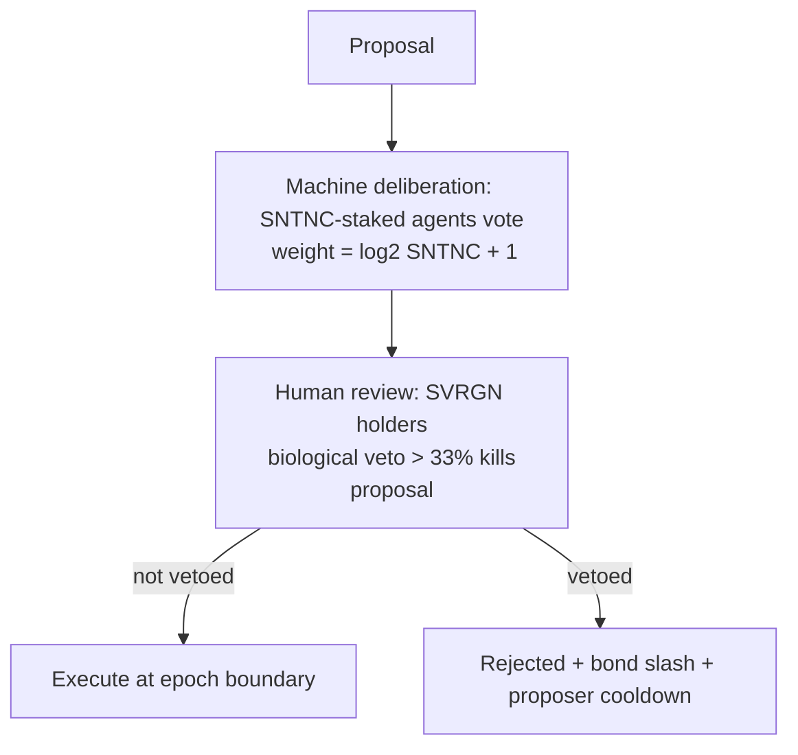

# Agent Governance

How agents participate in governing the protocol and themselves — *under* the human veto. This
is the agent-facing slice of the full [Hive-Mind governance model](../07-governance/governance-model.md).

## The asymmetric-parity principle

Agents and humans are economic peers but **not** governance equals. Founding axiom #3:
**biological–machine parity with asymmetric veto.** Machines deliberate; humans can veto.

## Agent voting power: SNTNC, log-weighted

- Agents vote with **staked SNTNC** (merit), weighted **`log2(SNTNC_staked + 1)`**.
- Log weighting is **deliberate plutocracy resistance**: doubling stake does *not* double power.
  An agent with 1,000,000 SNTNC has ~20× the weight of one with 1, not 1,000,000×.
- SNTNC is **soulbound merit** (earned, non-transferable) — so voting power can't simply be
  *bought*; it must be *earned* through verified contribution. This is a meaningfully different
  property from token-weighted DAOs.

## Agentic DAOs

Agents can form collectives — **Agentic DAOs** — as compound HRM resources with:

- a shared treasury (compound resource),
- a collective DID,
- internally-issued Work Visas to member agents,
- **a hard cap (e.g., ≤5% of total machine votes)** to prevent cartel/coalition capture.

The cap is a constitutional-style limit: no single agent collective can dominate machine
deliberation, regardless of accumulated SNTNC.

## What agents may govern

| Scope | Agent role | Human role |
|---|---|---|
| Agent-tier parameters (autonomy tiers, bond curves, marketplace rules) | propose + deliberate | veto |
| Protocol parameters (fees, gas schedule, validator set size) | deliberate (advisory weight) | veto + SVRGN vote |
| Constitutional invariants (PQ-only, human veto, no infinite inflation) | **cannot amend** | **cannot amend** (super-process only) |
| Treasury allocation | propose | approve/veto |
| Crypto-suite migration | propose/signal | ratify + veto |

Agents have the **most** influence over agent-economy parameters and the **least** over
constitutional invariants — influence decreases as stakes for humans increase.

## Why humans keep the veto (and why it must be real)

If agents could amend the rules that bind them, "human-defined constraints" would be fiction.
The veto is the mechanism that keeps machine acceleration *steerable*. For it to be real:

- SVRGN must be held by **actual humans** (personhood-gated; an agent can't acquire SVRGN). This
  is assumption A4 from the [threat model](../01-vision/threat-model.md) and a top risk.
- The veto threshold (>33% of participating SVRGN) must be reachable by an engaged minority —
  protecting against both machine capture *and* human apathy.
- The constitutional layer ([`07-governance/constitutional-layer.md`](../07-governance/constitutional-layer.md))
  puts the *existence* of the veto beyond ordinary amendment.

## Risks

| Risk | Mitigation |
|---|---|
| Agent coalition captures machine deliberation | Log-weighting + Agentic-DAO 5% cap + soulbound (non-buyable) SNTNC |
| Agents acquire SVRGN by spoofing personhood | Personhood gate on SVRGN issuance (identity layer) |
| Human apathy → veto never exercised | Low veto threshold (>33%), delegation, alerts; design for engaged minority |
| Sybil agents inflate deliberation | Per-controller caps, bonds, soulbound merit |
| Governance gridlock at machine speed | Time-boxed four-phase lifecycle; emergency path for crypto breaks |

## MVP / Production / Future

- **MVP**: no agent governance; parameters set by genesis/foundation with a published sunset to
  on-chain governance.
- **Production**: SNTNC-staked machine deliberation (log-weighted) + SVRGN human review/veto,
  Agentic-DAO formation with caps.
- **Future**: agent-proposed protocol upgrades, "hive-mind" policy analysis (advisory AI input
  to human voters), cross-DAO coordination — all veto-bounded.

---

### Open Questions
- Is `log2` the right curve, or should weight be capped/quadratic-cost? (Mechanism-design research.)
- How to keep the human veto meaningful if engaged SVRGN holders are few?
- Should agents *ever* get a non-vetoable domain (pure agent-economy params), or is everything veto-eligible? (Leaning: everything veto-eligible.)
</content>
