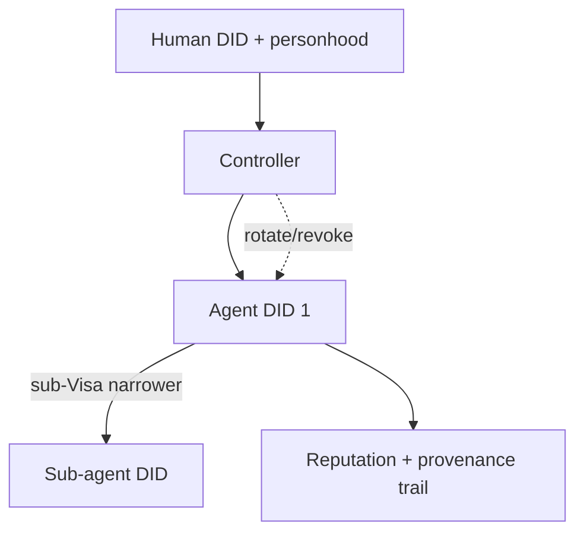

# Agent Identity

> Detailed identity architecture is in [`05-identity/`](../05-identity/). This doc focuses on
> what is *specific to AI agents*. Read [`05-identity/ai-identity.md`](../05-identity/ai-identity.md) alongside it.

## An agent's identity stack

```
did:huxplex:{chain_id}:{SHAKE-256(ml_dsa44_pk)[..32] hex}   ← the agent's DID
   ├─ DID document: verification methods (ML-DSA keys), service endpoints
   ├─ controller: did of the human/DAO that authorized it
   ├─ Work Visa(s): capability credentials scoping authority
   └─ reputation + provenance trail (accrued, see agent-reputation.md)
```

The DID is **self-certifying**: it is derived from the agent's public key exactly like the
existing `PeerId = SHAKE-256(pk)[..32]` (🟢) — the same primitive, reused. Anyone can verify the
binding between the DID and the key without a registry lookup.

## The controller relationship

Unlike a human, an agent is **not its own root of trust** (at least initially):

- Every agent DID names a **controller** DID (human or DAO).
- The controller issued the agent's Work Visa and can revoke it.
- Accountability chains *upward*: agent action → Visa → controller → (eventually) a
  proof-of-personhood-verified human or a chartered DAO.

This is the structural answer to "how do you control an AI": identity is **delegated and
accountable by construction**, not anonymous.

## Distinguishing humans from agents (and why)

Some contexts require knowing whether a counterpart is human or machine (governance: only
humans hold SVRGN; provenance: only humans create "human-origin" content). Huxplex encodes an
**identity class** in the DID document / credentials:

| Class | Root of trust | Governance | Notes |
|---|---|---|---|
| Human | self + proof-of-personhood | SVRGN (1 person 1 vote) | biometric/ZK personhood, never raw biometrics on-chain |
| Agent | controller-delegated | SNTNC (log-weighted) + via controller | Work Visa scoped |
| Validator | SLH-DSA cold identity | stake-based consensus role | two-tier keys |
| DAO / Agentic DAO | collective (multi-key) | per charter, capped | compound resource |

⚠️ The class claim must be **hard to forge**: an agent must not be able to masquerade as a human
to obtain SVRGN. This is enforced by making SVRGN issuance require proof-of-personhood (a human
gate the agent cannot pass), not by trusting a self-asserted flag. See
[`05-identity/human-identity.md`](../05-identity/human-identity.md).

## Identity lifecycle events

- **Creation**: controller registers agent DID + initial Work Visa.
- **Key rotation**: controller (or agent under policy) adds a new verification method to the DID
  doc; old key deprecated. Survives crypto-suite migration via the same mechanism.
- **Delegation**: an agent may (if its Visa permits) sub-delegate a *narrower* Visa to a
  sub-agent — forming a bounded delegation tree. Authority can only narrow, never widen.
- **Revocation / expiry**: Visa consumed/expired → agent loses authority but DID + history
  remain (for audit/reputation).



## Privacy considerations

- Linking every agent to a controller aids accountability but harms privacy (controllers'
  activity becomes correlatable across their agents).
- Mitigation: **ZK attestations** — prove "this agent's controller is a personhood-verified
  human in good standing" *without* revealing which human. The accountability is preserved
  (revocation, slashing still work via nullifiers) while the link is hidden. 🔴 research item;
  see [`05-identity/zk-proofs.md`](../05-identity/zk-proofs.md).

## MVP / Production / Future

- **MVP**: agent DID = SHAKE-256(pk) (🟢 primitive), explicit controller field, Work Visa link,
  no privacy layer.
- **Production**: identity class with personhood-gated SVRGN, key rotation in DID docs,
  bounded sub-delegation, revocation registry.
- **Future**: ZK controller attestations (accountable anonymity), cross-chain agent identity,
  reputation-portable DIDs.

---

### Open Questions
- Can an agent ever be its *own* root of trust (no human controller) and still be accountable? Under what bond/constitutional limits?
- How to prevent agent→human class spoofing robustly without an invasive biometric registry?
- Selective-disclosure standard for agent credentials (BBS-style, but PQ)?
</content>
