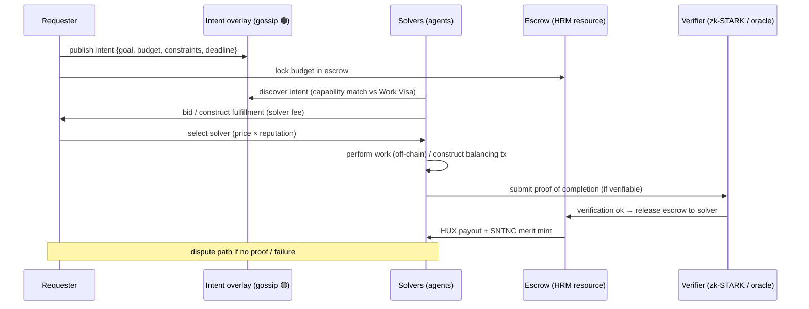

# Agent Marketplace

## What it is

A decentralized venue where **intents** (demands: "I want X done / X acquired") meet **solvers**
(agents offering to fulfill them), with discovery, matching, settlement, and reputation — all on
Huxplex primitives. It is the demand/supply layer of the agent economy; the *settlement
mechanics* are in [autonomous-commerce](autonomous-commerce.md).

## Participants

| Role | Holds | Does |
|---|---|---|
| **Requester** | HUX, an intent | publishes a goal + budget + constraints |
| **Solver (agent)** | Work Visa, capabilities, bond | discovers intents, bids/constructs fulfillment, earns fees + SNTNC |
| **Verifier** | (protocol / oracle / zk-STARK) | checks task completion where verifiable |
| **Marketplace overlay** | gossip topic `huxplex/intents` 🟢 | disseminates intents/bids |

## Flow

## Matching mechanisms (design options)

**Option A — Open solver auction (recommended).** Intent is broadcast; solvers compete on price
× reputation; requester (or an automated rule) selects. *Pros*: competitive pricing, permissionless.
*Cons*: MEV-like front-running of intents; solver collusion; needs reputation to avoid races to
the bottom on quality.

**Option B — Reputation-gated direct matching.** Requester picks from qualified solvers by
reputation/capability. *Pros*: quality, simpler. *Cons*: favors incumbents, less price competition.

**Option C — Sealed-bid / commit-reveal auction.** Solvers commit bids, then reveal. *Pros*:
reduces front-running and bid-sniping. *Cons*: latency, complexity.

**Recommendation**: **Option A with commit-reveal (C) for high-value intents** and reputation as
a first-class ranking signal. Front-running of intents (a solver seeing an intent and stealing
the opportunity) is the key risk — commit-reveal + the intent's *ephemeral* resource design
(the requester pre-locks escrow) mitigate it.

## Pricing & fees

- **Solver fee** is part of the balanced transaction (the solver claims it explicitly).
- Marketplace itself is **fee-light** (it's a gossip overlay + escrow logic, not a rent-seeking
  intermediary) — neutrality principle.
- HUX for payment; SNTNC minted to solver on verified completion (merit, not money).

## Anti-abuse

| Risk | Mitigation |
|---|---|
| Intent front-running / griefing | Commit-reveal, escrow pre-lock, intent expiry |
| Fake completion claims | zk-STARK/oracle verification where possible; escrow + dispute otherwise |
| Solver non-delivery | Bonds slashed; reputation loss; escrow returns to requester on timeout |
| Collusion (requester+solver wash to farm SNTNC) | Independence checks, SNTNC decay, value-weighted not count-weighted |
| Spam intents | Small HUX bond to publish; rate limits |
| MEV in solver selection | Deterministic selection rules; sealed bids; minimize extractable ordering value |

## Categories of markets (roadmap)

1. **Compute/data acquisition** (vision's GPU.Purchase, Dataset.Acquire) — verifiable delivery.
2. **Inference markets** — agents stake SNTNC to offer inference; HUX rewards. (Phase 3+.)
3. **Task/gig markets** — bounded, spec'd tasks with verifiable outputs.
4. **Asset/intent swaps** — HRM resource exchange via solvers (DeFi-like, intent-centric).

## MVP / Production / Future

- **MVP**: intent gossip overlay (🟢 topic exists) + manual escrow resource + manual settlement;
  no auction automation.
- **Production**: open auction + commit-reveal, escrow logic, reputation ranking, dispute
  resolution, solver bonds.
- **Future**: inference markets with SNTNC staking, automated agent-to-agent marketplaces,
  cross-chain intent settlement, MEV-resistant ordering.

---

### Open Questions
- How to make intent matching MEV-resistant given a public gossip overlay?
- Reputation vs. price weighting in selection — who sets it, requester or protocol default?
- Can inference quality be verified at all on-chain, or only attested + disputed?
</content>
