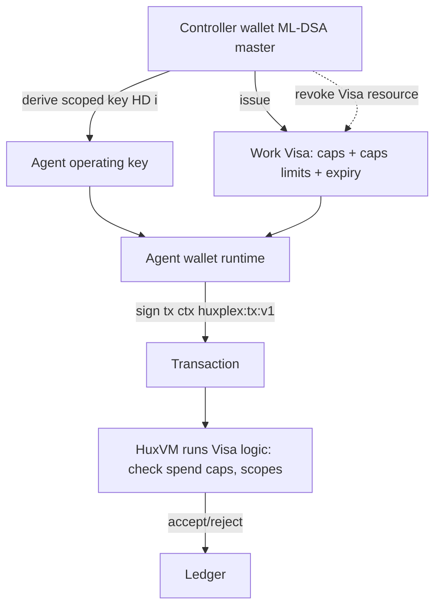

# Agent Wallets

## What's different about an agent wallet

A human wallet protects a *sovereign* key. An agent wallet holds a *delegated, scoped,
revocable* key whose authority is defined by a Work Visa and enforced on-chain. The design
goals invert: we *want* the ability to constrain and revoke an agent wallet, because the agent
acts at machine speed without a human clicking "confirm."

| Property | Human wallet | Agent wallet |
|---|---|---|
| Root of trust | self (master seed) | controller (human/DAO) |
| Authority bound by | nothing (sovereign) | Work Visa constraints (in-VM) |
| Revocable by third party | no | yes (controller, sub-epoch) |
| Spend confirmation | human in loop | autonomous within limits |
| Recovery | mnemonic / social | controller re-issues |

## Architecture



- The agent's key is **HD-derived** from the controller's tree (or independently generated and
  linked via the agent DID), but its *power* comes from the Work Visa, not the key alone.
- Every agent tx triggers the Visa's **constraint logic** in HuxVM: spend caps per epoch, max
  per-tx value, allowed resource kinds, allowed counterparties. Breach → tx rejected.

## Constraint enforcement (the core mechanism)

Constraints are HRM resource logic, not off-chain policy:

```
// Pseudocode for a Work Visa's logic script (runs in HuxVM)
fn authorize(tx, visa, epoch_state):
    require tx.now < visa.expiry
    require visa not in revocation_set
    require sum(tx.outgoing) + epoch_state.spent[visa] <= visa.max_spend_per_epoch
    require tx.value <= visa.max_tx_value
    require tx.touched_kinds ⊆ visa.allowed_kinds
    update epoch_state.spent[visa] += sum(tx.outgoing)
```

This makes "the agent may spend at most 1000 HUX/epoch on GPUs" a **consensus-enforced fact**,
not a hope. It is also why constraint logic must be cheap (it runs on every agent tx).

## Spending models

- **Direct spend**: agent signs and submits within caps.
- **Allowance / streaming**: a resource granting a rate-limited draw (e.g., X HUX per block) for
  recurring agent expenses (compute, data) — implemented as HRM resources with replenishing logic.
- **Escrowed task spend**: funds locked in escrow, released on verified task completion
  (zk-STARK or oracle) — see [autonomous-commerce](autonomous-commerce.md).
- **Sponsored fees (account abstraction)**: a controller or DAO can pay an agent's HUX fees so
  the agent need not hold gas directly — useful for fleets of micro-agents.

## Security & abuse

| Threat | Mitigation |
|---|---|
| Compromised agent key | Visa caps bound the damage; controller revokes (sub-epoch); reputation/bond slashed |
| Runaway spend (bug/rogue) | Per-epoch + per-tx caps enforced in-VM; circuit-breaker resource |
| Agent drains then disappears | Bonds posted up front; escrow for counterparties; reputation loss |
| Key theft → impersonation | Domain-separated signing (🟢) prevents cross-context replay; DID binds key to agent |
| Fee-grief (spam from many agents) | Bonds + fees per Visa; rate limits; issuer accountability |

## Multi-agent treasuries (Agentic DAOs)

Groups of agents can share a treasury as a **compound HRM resource** with a collective DID and
internal Work Visas — capped (e.g., ≤5% of machine governance weight) to prevent cartels. See
[agent-governance](agent-governance.md).

## MVP / Production / Future

- **MVP**: single agent key + Work Visa resource, per-epoch/per-tx spend caps enforced in HuxVM,
  manual controller revocation.
- **Production**: allowance/streaming resources, escrow integration, sponsored fees, circuit
  breakers, bond posting, reputation hooks.
- **Future**: MPC/threshold agent keys, enclave-backed agent runtimes, shared Agentic-DAO
  treasuries, autonomous budget management within constitutional limits.

---

### Open Questions
- Should agent keys derive from the controller's HD tree (linkable) or be independent + DID-linked (less linkable)? Privacy vs. recoverability.
- How cheap can per-tx Visa constraint checks be made under PQ verification cost?
- Default circuit-breaker (auto-suspend) thresholds for anomalous agent spend.
</content>
