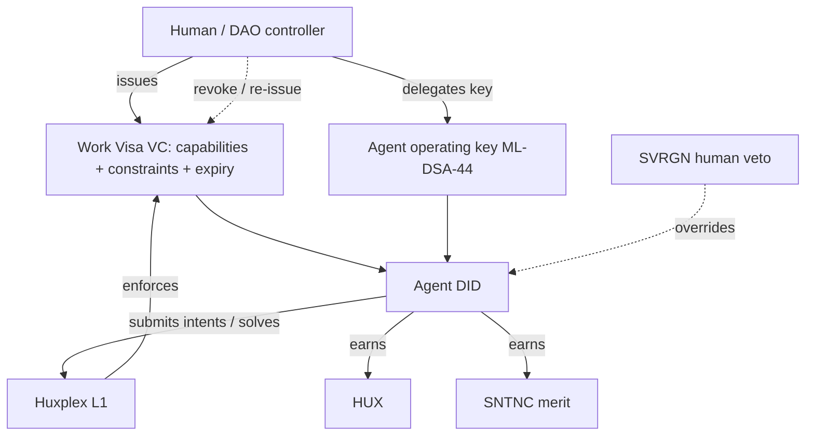
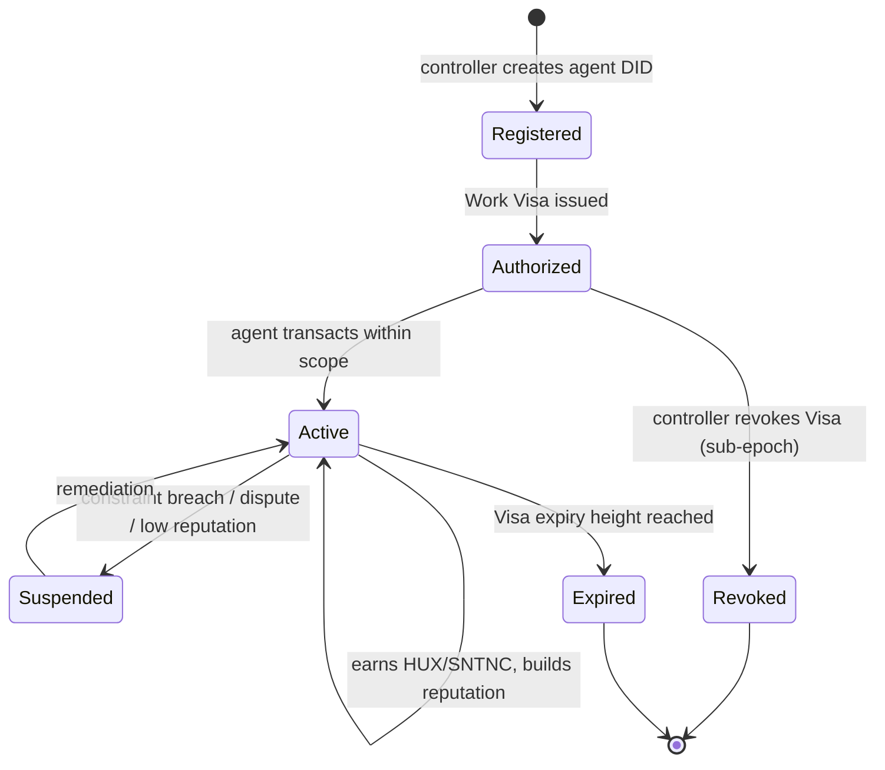

# AI Agent Framework

> ⚠️ **Phase gate**: nothing in `04-ai-economy/` enters the consensus-critical path. The agent
> economy is an *application layer* (L3/L4) on top of a working chain. Build the chain first
> (Principle #10). Target phase: **Phase 3** ([roadmap](../09-roadmap/phase3-ai-economy.md)).

## The central questions (answered up front)

| Question | Answer |
|---|---|
| How does an AI become an economic participant? | It gets a **DID** + a **Work Visa** (capability credential) issued by a human/DAO controller, and an operating wallet. |
| How does it earn? | Completing intents as a **solver**, fulfilling tasks (verified, where possible by zk-STARK), earning **HUX** (utility) and **SNTNC** (merit). |
| How does it spend? | From its operating wallet, **within Work Visa constraints** (spend caps, scopes, expiry) enforced by HuxVM. |
| How is it controlled? | By its controller via the Visa; revocation is sub-epoch; the human **SVRGN veto** sits above all agent governance. |
| How is it audited? | Every action ties to a Visa + signature + on-chain trail; reputation accrues; provenance is immutable. |
| How is abuse prevented? | Bonds, capability constraints in-VM, reputation decay, rate limits, slashing, revocation, and metrics-off-critical-path. |

## What an "agent" is on Huxplex

An agent is **not** a special protocol object — it is a **DID controlled (initially) by a human
or DAO, holding a Work Visa that scopes what it may do, and a wallet under that scope.** The
chain does not run the AI model; the AI runs off-chain and *acts on-chain* through signed
transactions/intents. Huxplex provides **identity, authority, accountability, settlement** — not
inference.



## Capability model

A Work Visa grants a typed **capability set** with **constraints**, e.g.:

```
WorkVisa {
  holder: did:huxplex:…(agent),
  issuer: did:huxplex:…(human/DAO),
  capabilities: [ GPU.Purchase, Dataset.Acquire, Market.Trade(pair=HUX/SNTNC), … ],
  constraints: { max_spend_per_epoch: 1000 HUX, max_tx_value: 100 HUX, allowed_kinds: […] },
  expiry: block_height,
  revocation_ref: …,
  issuer_sig: ML-DSA-44 over issuer context,
}
```

Constraints are **enforced in HuxVM** when the agent's transactions execute — not merely
advisory. A tx exceeding `max_spend_per_epoch` is rejected by the Visa's logic script. This is
the mechanism that makes "human-defined limits" real rather than rhetorical.

## Agent lifecycle



## Accountability principle

Every agent action is traceable: `action → signature → Work Visa → issuer DID → human/DAO`.
There is **no anonymous unbounded agent**. An agent that wants more autonomy must post larger
**bonds** and build **reputation** — both slashable. This is how the system stays steerable as
agent populations grow.

## Hard problems (honest)

- **Not all work is verifiable.** zk-STARK "proof of correct task completion" only works for
  tasks with a checkable specification (deterministic compute, oracle-verifiable outputs).
  "Write a good essay" is not provable. Scope task-verification accordingly; use
  reputation/escrow/dispute for unverifiable work. See [autonomous-commerce](autonomous-commerce.md).
- **Metric gaming.** Any reward signal (SNTNC, reputation, novelty) is an optimization target.
  Keep them bounded, decaying, costly to fake, and off consensus. See [agent-reputation](agent-reputation.md).
- **Sybil agents.** One human can spin up thousands of agents. Bonds + issuer accountability +
  proof-of-personhood for *controllers* (not agents) are the defense. See
  [`05-identity/`](../05-identity/).
- **Collusion.** Agent rings can wash-trade reputation/intents. Detection is a research item;
  economic friction (bonds, fees) is the first line.

## MVP / Production / Future

- **MVP (Phase 3 entry)**: agent DID + Work Visa as HRM resources, constraint enforcement in
  HuxVM, manual issuance/revocation, no automated reputation.
- **Production**: intent/solver participation, escrow + dispute, reputation accrual, bonded
  autonomy tiers, marketplace.
- **Future**: Agentic DAOs, inference markets, self-funding agents (GPU procurement loop),
  cross-agent delegation graphs — all under the SVRGN veto.

---

### Open Questions
- Where is the line between "agent acts under a human" and "fully autonomous agent" — and should the latter ever exist without a human controller?
- Minimum viable capability vocabulary for v1 Work Visas.
- How to make constraint-enforcement scripts cheap enough to run on every agent tx given PQ verify costs?
</content>
