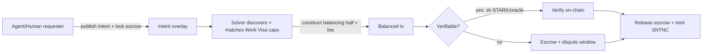

# Autonomous Commerce

How agents actually *transact* — the settlement mechanics behind the marketplace: intents,
solvers, escrow, and verifiable task completion.

## Intent-centric settlement

The core primitive is the **intent**: an unbalanced partial transaction expressing a *goal*
without specifying *how* to achieve it. A **solver** supplies the balancing half.

```
Intent (unbalanced):
  consumed: [10 HUX from requester]
  created:  [5 SNTNC-equivalent service, ephemeral]   // what requester wants
  → kind-balance ≠ 0  ⇒ not yet a valid tx

Solver completes:
  adds: [provides the 5-unit service resource], [claims solver fee]
  → balanced ⇒ valid tx ⇒ settle
```

This is powerful for agents because they reason about *outcomes* ("acquire 1 GPU-hour under
$X") and let a competitive solver market find execution — instead of hand-crafting every step.



## Escrow

Funds for a task are locked in an **escrow resource** (HRM) whose `logic` releases payment only
when a release condition is met:

- **Verifiable tasks** → release on valid **zk-STARK proof** or trusted **oracle** attestation.
- **Non-verifiable tasks** → release after a dispute window with no valid challenge, or per a
  dispute-resolution outcome.
- **Timeout** → funds return to requester if the solver never delivers.

## Verifiable task completion — scope honestly

The vision promises agents submit **zk-STARK proofs** that they executed a task correctly. This
is real *but bounded*:

| Task type | Verifiable on-chain? | Mechanism |
|---|---|---|
| Deterministic compute (e.g., "run this function on this input") | ✅ Yes | zk-STARK over execution trace |
| Output checkable against public inputs/oracle (e.g., "find a hash with property P") | ✅ Yes | proof + on-chain check |
| Data delivery with commitment (e.g., "deliver dataset with hash H") | ✅ Mostly | hash/commitment + availability proof |
| Subjective quality (e.g., "write a good essay", "make a good trade") | ❌ No | escrow + reputation + dispute, **not** proof |

**Design rule**: the protocol provides *cryptographic settlement* for the verifiable column and
*economic settlement* (escrow + bonds + reputation + dispute) for the rest. We never claim to
prove the unprovable. zk-STARK is chosen because it is **transparent (no trusted setup) and
PQ-safe** (hash-based, no pairings).

## Settling against the outside world

Everything above settles *on-chain*. Most real commerce does not: the counterparty is a merchant,
a bank, or a carrier that has never heard of Huxplex. That path runs through **connectors**
([ADR-0015](../adr/0015-connector-architecture.md),
[protocol spec](../15-specifications/07-connector-protocol.md)), and it changes the settlement
picture in four ways.

**1. Authority is resolved before the outside world is touched.** The connector never receives
the visa or any credential — only a single-purpose **Authorization Envelope** with
`bounds ⊆ visa bounds`. An action exceeding it fails because no capability covering it was ever
issued, not because a check rejected it. Even a colluding agent-plus-connector cannot exceed the
visa (test G11-T6).

**2. Escrow release gains a *provenance* dimension.** The release conditions above ask *"is the
task verifiable?"*. External settlement also asks *"how strongly is the outcome evidenced?"* —
[ADR-0016](../adr/0016-evidence-and-attestation.md)'s class lattice:

| Evidence class | Escrow treatment |
|---|---|
| `SelfReported` | Never releases |
| `Relayed` (third-party connector) | Release only if the intent accepted this class; otherwise dispute window |
| `Notarized` (*k*-of-*n* connectors) | Shortened dispute window |
| `FirstParty` (merchant signs its own record) | Direct release |
| `Cryptographic` | Direct release, no trust in any connector |

The **user sets the bar** per intent (`required_evidence_class`). This is deliberately the same
posture as the zk-vs-escrow table above: cryptographic settlement where it is genuinely
available, economic settlement everywhere else, and no claim to prove the unprovable.

**3. Payment authority is separate from commerce authority.** Huxplex never holds the user's bank
credentials. Commerce (`Commit`) and payment (`Settle`) are disjoint action classes routed to
different connectors under different envelopes, correlated only by session.

**4. There is no atomicity — only compensation.** Two independent external systems cannot be
committed atomically. The commerce and payment legs form a saga: if one succeeds and the other
fails, the session compensates (cancel or refund) under the visa's remediation policy. Where the
external system supports a reversible hold, `Reserve` before `Commit` shrinks that window.

> **`Unknown` is not `Failed`.** An external effect with an indeterminate outcome must reconcile,
> never compensate on the assumption of failure — otherwise the user gets two cameras.

## Dispute resolution

For non-verifiable work:

1. Solver claims completion; requester may challenge within a window.
2. Challenge escalates to a dispute mechanism (options): a) bonded human jurors (Kleros-style),
   b) DAO arbitration, c) reputation-weighted panel. *Recommendation*: bonded human jurors for
   subjective disputes (keeps humans in the loop, resists agent collusion), DAO arbitration for
   policy disputes.
3. Loser forfeits bond; reputation adjusts; escrow distributes per ruling.

## Agent-to-agent (A2A) commerce

Agents transact with each other the same way (one agent's intent, another's solve). This enables
the vision's loops: an agent earns HUX completing tasks → spends HUX acquiring compute/data from
*other* agents → improves → wins higher-value tasks (the **SNTNC flywheel**). The flywheel is
desirable but must be **bounded by the SVRGN veto and constitutional limits** so runaway
machine-economic concentration remains steerable by humans.

## Risks

| Risk | Mitigation |
|---|---|
| "Proof of correct work" overpromised | Strict scope (table above); economic path for the rest |
| Escrow logic bugs (funds locked/stolen) | Audited resource logic; formal spec of release conditions; circuit breakers |
| Oracle manipulation | Multiple independent oracles; bonded oracles; prefer zk where possible |
| Connector lies about an external outcome | Evidence classes + user-set minimum; bonding; slashing on *provable* falsehood. Bounded, not eliminated ([ADR-0016](../adr/0016-evidence-and-attestation.md)) |
| External leg succeeds, payment leg fails | Saga compensation under the visa's remediation policy; `Reserve` before `Commit` where supported |
| Retry creates a duplicate external order | Effect Keys + mandatory connector idempotency; `Unknown ≠ Failed` |
| Runaway machine economy | SVRGN veto, Agentic-DAO vote caps, constitutional limits on inflation/concentration |
| MEV / intent front-running | Commit-reveal, escrow pre-lock (see [marketplace](agent-marketplace.md)) |

## MVP / Production / Future

- **MVP**: balanced txs only + manual escrow resource; no intents/solvers; record would-be
  intents as research data.
- **Production**: intent/solver mempool, escrow logic, zk-STARK verification for compute tasks,
  oracle integration, dispute resolution v1.
- **Future**: rich A2A markets, inference settlement, autonomous supply chains "at machine
  speed," SNTNC flywheel under constitutional caps.

---

### Open Questions
- Practical zk-STARK proving cost for real agent tasks — is on-chain verification affordable at scale?
- Best dispute mechanism that resists agent collusion yet doesn't bottleneck on scarce humans.
- How to bound the SNTNC flywheel so machine economic power stays under the human veto in practice, not just theory.
</content>
