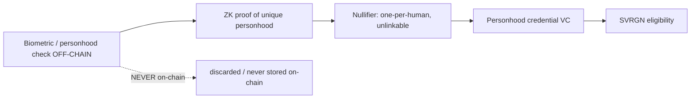

# Human Identity

> This is where the "sovereignty" thesis can succeed or quietly die. The vision says SVRGN
> requires a "biometric-verified DID." Done naively, an on-chain biometric registry is a
> privacy and centralization catastrophe that **inverts** the sovereignty promise. This doc
> resolves that tension.

## The requirement and the trap

The human-veto governance ([agent-governance](../04-ai-economy/agent-governance.md)) needs a
**Sybil-resistant, one-person-one-vote** human credential (SVRGN eligibility). That requires
**proof of personhood**: a guarantee that one human → one (or bounded) credential, and that an
agent cannot obtain it.

**The trap**: implementing this with raw biometrics on-chain, or a single biometric authority,
would create:
- a honeypot of immutable biometric data (you can't rotate your iris),
- a central party who decides who is "human" (a sovereignty-killing chokepoint),
- mass-surveillance correlation across all of a human's activity.

## Design rule: prove personhood, store nothing biometric

- The personhood check happens **off-chain**; the chain receives only a **zero-knowledge proof**
  that "the holder passed a unique-human check," plus a **nullifier** that prevents the same
  human from claiming twice — **without** revealing identity or biometrics.
- No raw biometric ever touches the chain. The credential is rotatable; the human is not doxxed.

## Personhood mechanisms (design options, pick a portfolio)

**Option A — Federated personhood providers + ZK.** Multiple independent providers (no single
authority) attest personhood; the chain accepts a ZK proof "attested by ≥k independent providers."
*Pros*: no single chokepoint, decentralizable. *Cons*: provider trust/collusion; bootstrapping.

**Option B — Biometric uniqueness via ZK (Worldcoin-style, but provider-neutral).** Off-chain
uniqueness proof → ZK nullifier on-chain. *Pros*: strong Sybil resistance. *Cons*: hardware
trust, exclusion/accessibility, privacy optics, centralization of the device maker.

**Option C — Social-graph / web-of-trust personhood.** Humans vouch for humans (BrightID-like).
*Pros*: no biometrics, decentralized. *Cons*: weaker guarantees, attackable by dense fake graphs.

**Option D — Government/eID credential + ZK.** Use existing eIDs, prove validity in ZK.
*Pros*: leverages real infrastructure. *Cons*: excludes the unbanked/undocumented; state dependency.

**Recommendation**: **Do not pick one.** Accept a **portfolio of personhood credentials** (A, C,
and optionally B/D) behind a common ZK interface, with governance-tunable strength tiers.
Decentralize the *set* of acceptable providers so no single one is a chokepoint. Treat strong
personhood as a **Phase 3+** problem and **start with a weaker, explicit bootstrap** (e.g.,
foundation-attested + social vouching) clearly labeled as provisional. This is an honest 🔴 area.

## Sovereignty-preserving properties (must-haves)

1. **No raw biometrics on-chain, ever.** Only ZK proofs + nullifiers.
2. **No single personhood authority.** Multiple independent, governance-curated providers.
3. **Rotatable credentials.** Personhood credentials can be reissued without re-enrolling
   identity-defining secrets.
4. **Unlinkable.** A human's SVRGN voting should not deanonymize their economic activity.
5. **Revocable for fraud, with due process.** Detected fraudulent personhood claims can be
   nullified, but revocation power must itself be governance-bounded (no silent disenfranchisement).

## What human identity unlocks

| Capability | Requires |
|---|---|
| Hold **SVRGN** (governance + veto) | personhood credential |
| Create **human-origin provenance** | personhood credential (so "human content" means human) |
| Be a Work Visa **controller** at scale | personhood (accountability root for agents) |
| Social recovery guardian | a DID (personhood not strictly required) |

## Risks

| Risk | Mitigation |
|---|---|
| Biometric honeypot | Never store biometrics on-chain (rule #1) |
| Central personhood authority captures the chain | Multi-provider, governance-curated, no single root |
| Sybil humans (fake personhood) | ZK uniqueness nullifiers, multi-provider attestation, bonds |
| Exclusion (can't prove personhood) | Portfolio of methods incl. social graph; accessibility as a design goal |
| Agent masquerades as human | Personhood gate is exactly the agent-impassable barrier; class binding in DID |
| Coercion (someone forced to vote/transfer) | SVRGN non-transferable; consider duress/recovery mechanisms |

## MVP / Production / Future

- **MVP**: provisional foundation/social-vouch personhood, clearly labeled bootstrap; no
  biometrics; SVRGN issuance gated by it.
- **Production**: multi-provider ZK personhood portfolio, nullifier-based uniqueness, revocation
  with due process, unlinkable SVRGN.
- **Future**: fully decentralized personhood market, accessibility-complete coverage,
  duress-resistant credentials.

---

### Open Questions
- Which personhood portfolio is strong enough for a meaningful veto yet decentralized and inclusive? (Top sovereignty risk.)
- How to bound credential-revocation power so it can't be used to disenfranchise dissenters?
- Can we make SVRGN voting fully unlinkable while keeping one-person-one-vote auditable?
</content>
