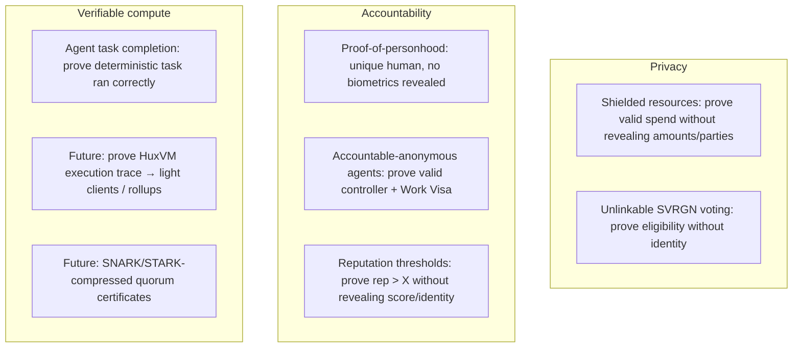

# Zero-Knowledge Proofs

## Why ZK, and why STARKs specifically

ZK proofs let Huxplex deliver three things at once: **privacy** (prove without revealing),
**accountability** (prove compliance/uniqueness), and **verifiable compute** (prove a task ran
correctly). The choice of proof system is constrained by the PQ mandate.

**Recommendation: zk-STARKs as the primary system.** Rationale:

| Property | zk-STARK | zk-SNARK (Groth16/PLONK) |
|---|---|---|
| Post-quantum safe | ✅ hash-based only | ❌ pairing/discrete-log assumptions (quantum-broken) |
| Trusted setup | ✅ none (transparent) | ⚠️ required (ceremony risk) or universal SRS |
| Proof size | ❌ large (10s–100s KB) | ✅ small (~hundreds of bytes) |
| Verifier cost | medium | ✅ very cheap |
| Maturity | medium | high |

For a chain whose entire premise is surviving quantum attack, **pairing-based SNARKs are a
non-starter for anything security-critical** — they would be the one quantum-fragile component
in a quantum-resistant system. STARKs' larger proofs are the price of PQ safety, and they
compose well with our hash-everything stance (SHAKE-256/BLAKE3).

## Where ZK is used

## The four flagship ZK applications

1. **Proof of personhood** (privacy + Sybil resistance) — prove "I am a unique human attested by
   ≥k providers" → nullifier; no biometrics on-chain. Gates SVRGN. See
   [human-identity](human-identity.md).
2. **Verifiable agent task completion** — prove a deterministic/checkable task executed
   correctly, releasing escrow. Honest scope: only verifiable tasks (see
   [`04-ai-economy/autonomous-commerce.md`](../04-ai-economy/autonomous-commerce.md)).
3. **Shielded resources** — HRM's nullifier model is already "shielded-friendly"; a ZK layer can
   prove a transaction is valid (balance + ownership) without revealing amounts/parties. See
   [privacy](privacy.md).
4. **Accountable anonymity for agents** — prove valid, non-revoked controllership without
   doxxing the controller. The holy grail reconciling accountability and privacy.

## Compressed consensus (research)

A standout future use: prove "2f+1 valid ML-DSA-44 signatures over this block exist" as a single
STARK, **compressing the quorum certificate** and attacking the PQ-aggregation wall that
threatens consensus scalability ([`02-architecture/consensus.md`](../02-architecture/consensus.md)).
This is hard (proving lattice-signature verification in a STARK circuit is expensive) but
potentially decisive. 🔴

## Cost realism

STARK proving is **computationally heavy** and proofs are **large**. Implications:

- On-chain STARK *verification* must be gas-metered carefully; large proofs stress the PQ-bloated
  bandwidth budget further.
- Proving is done off-chain (by agents/provers); the chain verifies.
- Not every interaction can afford ZK — use it where the value (privacy/verifiability) justifies
  the cost, and lean on economic mechanisms (escrow/bonds/reputation) elsewhere.

## ZK agility

Proof systems evolve (better STARKs, new transparent PQ-safe SNARKs). Like crypto-agility, the
**ZK system is versioned**: proofs carry a proof-system id, and the verifier dispatches.
Migrating the ZK stack must not strand shielded resources (an open problem — privacy + migration
interact badly).

## MVP / Production / Future

- **MVP**: no ZK in consensus; prototype a STARK proof-of-personhood and a verifiable-compute
  demo off the critical path (research artifacts).
- **Production**: ZK proof-of-personhood gating SVRGN, ZK task-completion for escrow, versioned
  proof-system registry.
- **Future**: shielded resources, accountable-anonymous agents, STARK-compressed quorum
  certificates, zk-proven HuxVM execution for light clients.

---

### Open Questions
- Concrete STARK framework (Winterfell / Plonky3 / Stwo) with a maintained Rust impl and PQ-clean assumptions?
- Can STARK-compressed PQ quorum certificates be made cheap enough to matter for consensus?
- How to migrate a ZK proof system without breaking unlinkability of existing shielded state?
</content>
