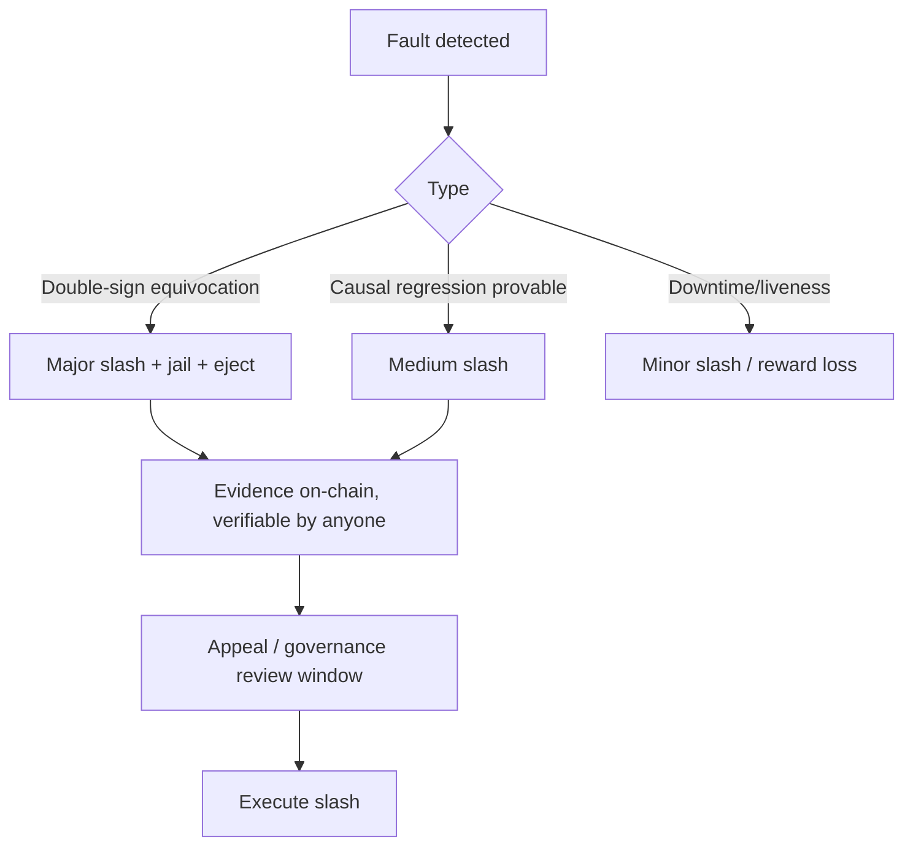

# Staking

## Purpose

Staking secures consensus: validators bond **HUX** as economic collateral; misbehavior is
**slashed**. This is the economic half of Q-BFT safety — cryptography prevents forgery, staking
makes Byzantine behavior expensive.

## Staking model

| Parameter | Choice (initial) | Rationale |
|---|---|---|
| Staked asset | **HUX** | utility token aligns security with usage |
| Validator set | **bounded** (e.g. ≤100–150 active) | keeps PQ quorum certificates (2f+1 × 2,420 B) tractable; see [consensus](../02-architecture/consensus.md) |
| Selection | stake-weighted, top-N by bonded stake | open, permissionless entry |
| Delegation | yes (nominated PoS style) | lets non-operators contribute security |
| Min self-bond | required | skin in the game; anti-Sybil among validators |
| Unbonding period | long (e.g. weeks) | prevents long-range / stake-grinding attacks |
| Leader election | LB-VRF + PQ-SSLE | PQ randomness + leader privacy |

## Why bounded validator set (PQ-specific reasoning)

On classical chains you can have thousands of validators because BLS aggregation makes a quorum
certificate small. **PQ has no efficient aggregation**, so each commit certificate is
`2f+1` separate 2,420 B ML-DSA signatures. To keep that manageable (~150 × 2,420 B ≈ 350 KB,
disseminated off the hot path via the DAG mempool), the **active** validator set is bounded.
Delegation lets many participants share in security without bloating the certificate. If
STARK-compressed certificates mature, this bound can relax (Future). This is a direct
consequence of the [aggregation open problem](../11-research/open-problems.md).

## Two-tier validator keys

Staking ties to a validator identity rooted in an **SLH-DSA cold key** (rarely used) with a
rotating **ML-DSA hot block-signing key**. Compromise of the hot key → cold key authorizes
rotation without losing stake/identity. See [`03-post-quantum/key-management.md`](../03-post-quantum/key-management.md).

## Slashing

Principles:
- **Provable faults only.** Double-signing is cryptographically provable (two signed conflicting
  votes over the same height/context — the domain-separated phase contexts make this clean 🟢).
- **Causal regression** as a slashable fault is novel and 🔴 risky — define it *precisely and
  deterministically* or it becomes a false-positive nightmare. Start without it; add once the
  vector-clock semantics are battle-tested.
- **Bounded penalties + due process.** Catastrophic auto-slashing on ambiguous evidence will
  drive validators away. A short challenge/governance window for non-equivocation faults.
- **Correlation penalties** (à la Ethereum): correlated mass-faults (e.g., a coordinated attack)
  slashed harder than isolated ones — discourages cartels.

## Delegation & reward distribution

- Delegators nominate validators; rewards split by commission.
- Slashing also hits delegators (skin in the game → choose validators carefully).
- Reward = block reward (emission) + fee share, distributed pro-rata minus commission.

## Attack resistance

| Attack | Mitigation |
|---|---|
| Long-range / weak-subjectivity | long unbonding, finality checkpoints, social-consensus weak-subjectivity hash |
| Stake grinding (manipulate leader election) | LB-VRF (unbiasable), HLC anti-grinding, PQ-SSLE |
| Cartel / collusion (>1/3) | bounded set + delegation diversity + correlation slashing + governance |
| Nothing-at-stake | BFT finality (not longest-chain) removes the classic NaS problem |
| Validator DDoS (target next leader) | PQ-SSLE hides leader until reveal |
| Cheap-entry Sybil validators | min self-bond + bounded set |

## MVP / Production / Future

- **MVP (devnet)**: fixed validator set, simple stake bonding, double-sign slashing only,
  round-robin leader (no SSLE).
- **Production (mainnet)**: open stake-weighted bounded set, delegation, full slashing (no causal-
  regression yet), LB-VRF + PQ-SSLE, unbonding period, correlation penalties.
- **Future**: causal-regression slashing (once precise), relaxed set size via STARK-compressed
  certificates, restaking/shared-security exploration (carefully — restaking adds systemic risk).

---

### Open Questions
- Exact active-set size vs. decentralization vs. certificate size — quantify the sweet spot.
- Can "causal regression" be made a deterministic, false-positive-free slashable fault?
- Unbonding period that balances long-range safety vs. capital liquidity for validators.
</content>
