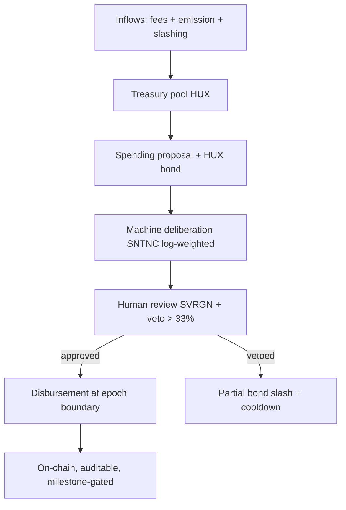

# Treasury

## Purpose

A protocol-owned, governance-controlled pool of **HUX** that funds the chain's long-term
development, security, and ecosystem **without** depending on a foundation's goodwill or a token
sale. For a decade-scale chain, a credibly-neutral, on-chain treasury is what lets the project
outlive its founders.

## Funding sources

| Source | Mechanism | Notes |
|---|---|---|
| Fee allocation | a fraction of fees routed to treasury (rest burned/validators) | sustainable, usage-linked |
| Emission allocation | a slice of block emission | bootstrap-era funding |
| Slashing proceeds | slashed stake (partial) → treasury | turns misbehavior into public good |
| Genesis endowment | initial allocation | bounded, transparent, vested |
| Donations/grants-in | external contributions | optional |

## Governance of the treasury

- Spending follows the **four-phase Hive-Mind** lifecycle (machine deliberation → human review/
  veto) — see [`07-governance/governance-model.md`](../07-governance/governance-model.md).
- **Milestone-gated disbursement**: large grants release in tranches against verifiable
  milestones, not lump sums — reduces waste and rug risk.
- **Full transparency**: every inflow/outflow is on-chain and auditable (neutrality principle).

## Spending categories

| Category | Examples | Doc |
|---|---|---|
| Core development | protocol engineering, audits | [`08-security/audits.md`](../08-security/audits.md) |
| Security | audits, bug bounties, formal verification | [`08-security/`](../08-security/) |
| Ecosystem grants | builders, agents, tooling, research | [`12-business/grants.md`](../12-business/grants.md) |
| Research | the open research agenda | [`11-research/`](../11-research/) |
| Infrastructure | RPC, archive nodes, public goods | [`13-operational/`](../13-operational/) |
| Incentives | testnet programs, bootstrapping | [incentives](incentives.md) |

## Safeguards (treasury is a prime attack target)

| Risk | Mitigation |
|---|---|
| Governance capture drains treasury | Human veto, per-epoch spend caps, milestone gating, time-locks |
| Plutocratic raid | SNTNC log-weighting + SVRGN veto + spending caps |
| Founder/insider self-dealing | On-chain transparency, no privileged withdrawal, vesting |
| Treasury concentration risk (all in HUX) | Diversification policy (carefully — avoid custodial assets/bridges) |
| Slow starvation (under-funding) | Sustainable fee/emission allocation; runway monitoring |

## Endowment / runway model

The treasury should target a **multi-year runway** at any time, with spending throttled by a
governance-set **maximum draw-down rate** (e.g., ≤X% of treasury per year) so no single period
can deplete it. Runway is a monitored metric ([`13-operational/monitoring.md`](../13-operational/monitoring.md)).

## What the treasury must *not* do

- ❌ Hold custodial cross-chain assets via bridges (bridge risk — see
  [`08-security/attack-vectors.md`](../08-security/attack-vectors.md)).
- ❌ Have any privileged "foundation can withdraw" path.
- ❌ Fund anything that violates constitutional invariants.
- ❌ Make undisclosed/off-chain disbursements.

## MVP / Production / Future

- **MVP**: foundation-held bootstrap budget with a *published commitment* to migrate to on-chain
  treasury at mainnet; transparent accounting.
- **Production**: on-chain treasury funded by fees/emission/slashing, Hive-Mind spend governance,
  milestone-gated grants, draw-down cap, runway monitoring.
- **Future**: endowment model (spend from yield-equivalent, preserve principal), diversified
  (non-custodial) reserves, automated milestone verification.

---

### Open Questions
- How to diversify treasury reserves without taking on bridge/custodial risk?
- Right max annual draw-down rate to guarantee multi-decade runway?
- Should slashing proceeds be burned instead of treasury-bound (avoid perverse incentive to slash)?
</content>
