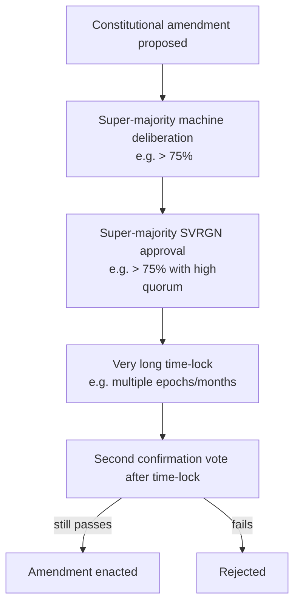

# Constitutional Layer

## Why a constitution

Ordinary governance — even good governance — can be captured by a momentary majority, a whale
coalition, a clever agent cartel, or simple panic. A chain meant to last decades needs a small
set of **invariants that no ordinary vote can change**. The constitution is the answer to
"what stops governance from voting to destroy the things that make Huxplex *Huxplex*?"

## The invariants (the unamendable core)

These are *candidates* — the actual set is itself a foundational decision (see open questions).
The principle: keep it **minimal** (every invariant is a rigidity you can't undo) and **about
limits on power**, not about specific parameters.

| # | Invariant | Why it's constitutional |
|---|---|---|
| C1 | **Post-quantum only.** No classical-only cryptography may secure consensus or funds. | The reason the chain exists; a vote to "save gas" with classical sigs would be suicidal. |
| C2 | **The human veto exists.** SVRGN holders always retain a biological veto over non-constitutional changes. | Founding axiom #3; without it, "human sovereignty" is meaningless. |
| C3 | **No infinite inflation.** No governance action may grant unbounded token issuance. | Prevents an inflation attack draining all holders / funding capture. |
| C4 | **No retroactive seizure.** Governance cannot confiscate finalized, lawfully-held resources from an identity. | Property sovereignty; prevents majoritarian theft. |
| C5 | **Crypto-agility preserved.** The ability to rotate the crypto suite may never be removed. | A chain that can't migrate dies when its crypto breaks. |
| C6 | **One-person-one-vote for SVRGN.** Human governance weight may never be made purchasable/stake-weighted. | Prevents converting sovereignty into plutocracy by amendment. |
| C7 | **Open validation.** The validator set may not be made permissioned/closed by ordinary vote. | Neutrality / censorship-resistance. |

## How invariants are protected (the "super-process")

Invariants aren't *strictly* immutable (true immutability is its own risk — you can't fix a
mistake), but changing one requires a **deliberately painful** process, far beyond ordinary
governance:

- **Dual super-majorities** (both chambers, high thresholds + high quorum).
- **Long time-lock** so the community can react (or fork) before it takes effect.
- **Double confirmation** (vote, wait, vote again) to defeat flash-mob/panic amendments.
- The human veto applies at maximal strength.

This makes constitutional change *possible but extremely hard* — the right balance between
"can't fix mistakes" (pure immutability) and "majority can do anything" (no constitution).

## Constitution vs. emergency

There is a tension: an active crypto break needs *fast* action (emergency governance), but the
constitution makes change *slow*. Resolution: **the emergency path operates *within*
constitutional bounds** — it can rotate the crypto suite *fast* (C5 explicitly *permits* and
*requires* agility; emergency migration is constitutional-compatible) but cannot, e.g., remove
the human veto or seize funds, no matter the emergency. The constitution constrains even
emergencies. See [`08-security/incident-response.md`](../08-security/incident-response.md).

## The fork as the ultimate backstop

If governance is captured and tries to violate the spirit of the constitution, the final
safeguard is the **social layer**: clients are open-source and reproducible; the community can
**fork** away from a captured chain. The constitution + long time-locks exist precisely to give
the community *time and clear grounds* to coordinate a fork if needed. Constitutional legitimacy
is ultimately social; the on-chain mechanics buy time and clarity. See
[protocol-upgrades](protocol-upgrades.md) §fork-governance.

## Design options

**Option A — Minimal constitution + hard super-process (recommended).** Few invariants, painful
to change, fork as backstop. *Pros*: durable, flexible enough to fix mistakes. *Cons*: choosing
the set is hard; super-process could still be captured (mitigated by time-lock + fork).

**Option B — Hard immutability (truly unchangeable invariants).** *Pros*: maximally credible.
*Cons*: can't fix a flawed invariant; a single bad choice is permanent. Rejected as too brittle.

**Option C — No constitution (pure governance).** *Pros*: maximally flexible. *Cons*: nothing
stops majority capture; fails decade-survival. Rejected.

## MVP / Production / Future

- **MVP**: invariants written down as binding social/spec commitments; enforced by foundation +
  client code (no on-chain amendment process yet).
- **Production**: constitution encoded in protocol; super-process implemented; emergency path
  bounded by it; time-locks live.
- **Future**: formal verification that ordinary governance *cannot* reach constitutional state;
  refined invariant set via the (rare) super-process.

---

### Open Questions
- What is the *exact* minimal invariant set? (A foundational decision — get it wrong in either direction and the chain suffers for decades.)
- Super-process thresholds/time-locks: painful enough to resist capture, not so painful that real fixes are impossible?
- Can "no retroactive seizure" (C4) be reconciled with fraud/personhood-revocation needs?
</content>
