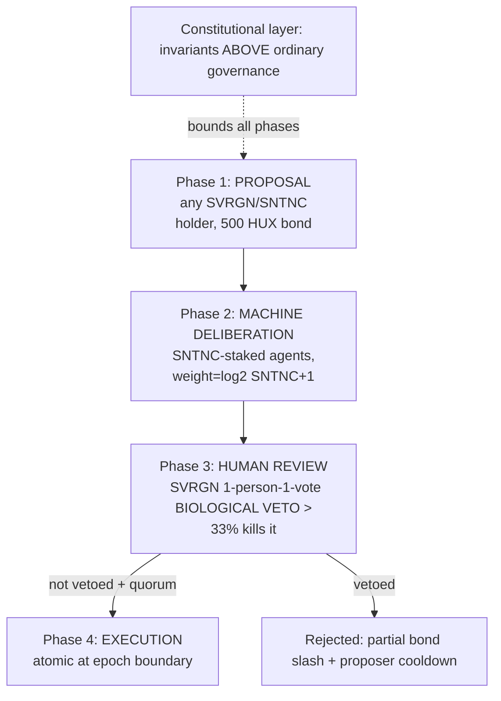

# Governance Model — Hive-Mind Sovereignty

## The model in one diagram

Four phases on ~36-block increments (illustrative): **Proposal → Machine Deliberation →
Human Review (with veto) → Execution.** This is the vision's design, adopted with guardrails.

## The two chambers + the constitution

Huxplex governance is effectively **bicameral with a constitution**:

| Body | Who | Power | Weighting |
|---|---|---|---|
| **Machine chamber** | SNTNC-staked agents | deliberate, propose, signal | `log2(SNTNC+1)` (plutocracy-resistant, soulbound) |
| **Human chamber** | SVRGN holders (personhood-gated) | review + **veto** | 1 person = 1 vote (linear, non-purchasable) |
| **Constitution** | unamendable invariants | bounds both chambers | n/a (super-majority + time-lock to touch) |

The asymmetry (machines deliberate, humans veto, constitution binds) **is** the governance
thesis: machine acceleration with a human steering brake and hard rails. See
[`04-ai-economy/agent-governance.md`](../04-ai-economy/agent-governance.md) and
[constitutional-layer](constitutional-layer.md).

## Phase detail

1. **Proposal** — any SVRGN or SNTNC holder submits, posting a **HUX bond** (anti-spam). A
   well-formed proposal references concrete on-chain effects (parameter changes, treasury
   spend, upgrade hash).
2. **Machine deliberation** — SNTNC-staked agents vote, log-weighted. This is advisory+ for
   protocol changes, decisive for agent-economy parameters. Produces a machine recommendation.
3. **Human review** — SVRGN holders vote. A **biological veto > 33%** of participating SVRGN
   **kills** the proposal regardless of machine support. (Note: a *veto* threshold, not an
   approval threshold — designed so an engaged human minority can always block, resisting machine
   capture *and* requiring active human assent for big changes.)
4. **Execution** — approved proposals execute **atomically at the epoch boundary**; vetoed/failed
   ones incur partial bond slashing + proposer cooldown (anti-spam, anti-grief).

## Quorum & turnout design (the hard part)

The biggest real-world governance risk is **apathy** (humans don't vote → veto never fires →
machines effectively rule) or **plutocracy** (wealth dominates). Defenses:

- **Veto, not approval**, as the human lever: a small engaged minority can block harm without
  needing majority turnout.
- **Delegation**: SVRGN holders can delegate their veto weight to trusted humans/representatives
  (liquid democracy), raising effective turnout.
- **Quorum floors**: certain changes require minimum SVRGN participation, else they fail closed.
- **Log-weighted, soulbound machine votes**: wealth/merit can't simply buy outcomes.
- **Bonded proposals**: spam/grief costs HUX.

## Scope tiers (not all proposals are equal)

| Tier | Examples | Path |
|---|---|---|
| Routine parameters | fees, gas schedule, emission, marketplace rules | standard four-phase |
| Treasury spend | grants, funding | four-phase + milestone gating ([treasury](../06-tokenomics/treasury.md)) |
| Protocol upgrades | client logic, consensus tweaks | four-phase + time-lock + audit ([protocol-upgrades](protocol-upgrades.md)) |
| Crypto-suite migration | rotate ML-DSA/ML-KEM | four-phase, or **emergency path** if active break |
| Constitutional change | touch an invariant | super-process: super-majority both chambers + long time-lock ([constitutional-layer](constitutional-layer.md)) |
| Emergency | active exploit / crypto break | fast path, narrow scope, human veto preserved |

## Why on-chain governance at all (vs. off-chain social)

- **On-chain**: binding, transparent, automatable (treasury, upgrades), captures the agent
  chamber natively. *Risk*: rigidity, plutocracy, low-turnout capture, formalized bad outcomes.
- **Off-chain (social)**: flexible, resists formal capture. *Risk*: opaque, slow, founder-
  dependent — fails the decade-neutrality goal.

**Recommendation**: **on-chain governance for binding decisions** (parameters, treasury,
upgrades), with the **constitution + human veto + time-locks** as the safety rails that off-chain
governance usually provides informally. Keep an off-chain social layer for *signaling and
deliberation*, but bind execution on-chain.

## MVP / Production / Future

- **MVP (devnet/early)**: foundation/multisig sets parameters with a **published sunset** to
  on-chain governance; no live token governance.
- **Production (mainnet)**: full four-phase Hive-Mind, SNTNC + SVRGN chambers, treasury & upgrade
  governance, time-locks, emergency path, constitution enforced.
- **Future**: liquid-democracy delegation, AI advisory "policy analysis" (non-binding input to
  human voters), refined quorum/veto parameters from real turnout data.

---

### Open Questions
- Is a 33% veto threshold right given expected low human turnout? (Model with simulated participation.)
- How to bootstrap legitimate SVRGN distribution before personhood infra is strong (Phase 1–2 gap)?
- Exactly which decisions are agent-decisive vs. human-vetoable vs. constitutional?
</content>
