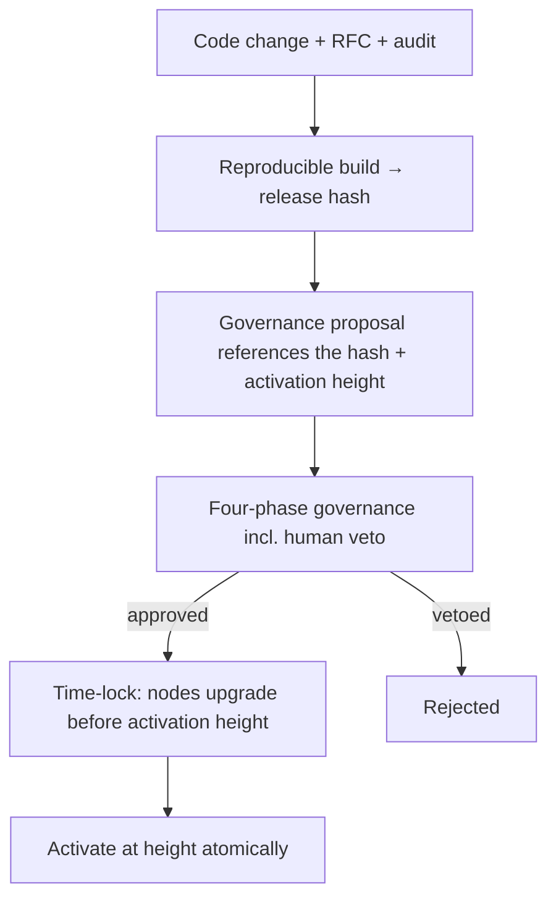

# Protocol Upgrades & Fork Governance

How Huxplex changes its own code and rules safely over decades — the hardest sustained
engineering-governance problem an L1 faces.

## Upgrade types

| Type | Example | Consensus impact | Path |
|---|---|---|---|
| **Parameter change** | fee, gas, emission, validator-set size | none (runtime config) | standard four-phase governance |
| **Soft fork** | tightening rules (old nodes still follow) | backward-compatible | governance + time-lock |
| **Hard fork** | new rules old nodes reject | requires coordinated upgrade | governance + time-lock + activation height |
| **Crypto-suite migration** | rotate ML-DSA/ML-KEM | dual-accept window, not a fork | agility path ([`03-post-quantum/migration-strategy.md`](../03-post-quantum/migration-strategy.md)) |
| **Emergency patch** | active exploit | fast, narrow | emergency governance |

> A key payoff of [crypto-agility](../03-post-quantum/crypto-agility.md): **crypto changes are
> NOT hard forks.** The suite is versioned data; both suites coexist during migration. This
> removes the single most dangerous recurring upgrade from the hard-fork category.

## On-chain governed upgrades (recommended mechanism)

- Proposals reference a **reproducible-build release hash** (so voters approve *specific* code,
  not a promise) and an **activation height**.
- A **time-lock** between approval and activation gives operators time to upgrade and the
  community time to react/fork if the change is illegitimate.
- **Forkless runtime upgrades** (Substrate-style on-chain WASM runtime) are *tempting* but we
  chose a custom Rust client (ADR-0005); we get most of the benefit via governed, time-locked,
  hash-pinned client releases + parameter changes without shipping a new binary. Evaluate an
  on-chain upgradable runtime module as a Future option.

## Safety requirements for every upgrade

1. **Audited** before the proposal reaches human review (security spend from treasury).
2. **Reproducible build** — anyone can verify the binary matches the approved source/hash.
3. **Testnet dress rehearsal** — the upgrade (especially consensus/crypto changes) is exercised
   on testnet first, including the migration state machine for suite changes.
4. **Time-locked** — no instant activation except the narrowly-scoped emergency path.
5. **Backward-verifiable** — old finalized history stays valid (never invalidate the past).
6. **Constitutional check** — upgrade cannot violate invariants ([constitutional-layer](constitutional-layer.md)).

## Emergency upgrades

For active exploits or crypto breaks, a **pre-ratified emergency path**:
- Narrow scope (only the fix), faster timeline, possibly a smaller emergency council *proposing*
  — but the **human veto is preserved** and the change is **constitution-bounded**.
- Post-incident, a full retrospective + ratification under normal governance.
- See [`08-security/incident-response.md`](../08-security/incident-response.md).

## Fork governance (the backstop)

Forks are not failures — they are the ultimate decentralization safeguard. Policy:

| Scenario | Mechanism |
|---|---|
| Legitimate contentious change | governance decides; minority may fork; both inherit history |
| Governance capture / constitution violation | community **forks away**; long time-locks + open reproducible clients make this feasible |
| Chain halt (liveness failure) | coordinated restart from last finalized state under weak-subjectivity checkpoint |
| Crypto break mid-flight | emergency migration; if contested, fork along suite lines |

Design choices that keep forking *possible* (and thus keep governance honest):
- Open-source, **reproducible** clients (no proprietary chokepoint).
- **Weak-subjectivity checkpoints** so a forked chain has a clear, agreed starting point.
- No license/IP that prevents forking (Apache-2.0).
- Minimal trusted base so no single party can prevent a fork.

## State migrations on upgrades

Hard forks that change state layout need migration logic (transform old state → new). Rules:
- Migrations are deterministic and themselves audited/tested.
- Provide a migration dry-run on testnet against a mainnet state snapshot.
- Never strand assets; provide recovery paths (mirrors the crypto-migration discipline).

## MVP / Production / Future

- **MVP**: foundation ships versioned releases; upgrades coordinated socially; activation heights
  in release notes; testnet-first.
- **Production**: on-chain governed, hash-pinned, time-locked upgrades; emergency path;
  weak-subjectivity checkpoints; reproducible builds enforced in CI.
- **Future**: on-chain upgradable runtime module (forkless upgrades), automated migration
  tooling, formal verification of upgrade safety.

---

### Open Questions
- Add an on-chain upgradable WASM runtime (forkless) despite the custom-client choice, or stick to governed binary releases?
- Emergency council composition (if any) that can propose fast fixes without becoming a capture vector.
- Weak-subjectivity checkpoint cadence and distribution.
</content>
