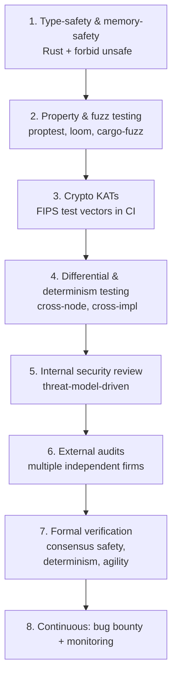

# Audits & Assurance

A chain securing funds against nation-states and quantum adversaries must treat assurance as a
continuous program, not a pre-launch checkbox. This is the audit and verification strategy.

## Assurance layers (defense in depth)

## 1–4: Built-in assurance (from day one)

- **Memory safety**: `#![forbid(unsafe_code)]` outside the crypto core (Principle #8).
- **Property testing**: `proptest` for state-transition invariants (balance, nullifier
  uniqueness), `loom` for concurrency (TCHAO parallelism). The tech stack already names these.
- **Fuzzing**: `cargo-fuzz` on serialization, tx validation, VM module loading, network message
  parsing — the classic L1 crash/panic surfaces.
- **Crypto KATs**: FIPS 203/204/205 Known-Answer-Test vectors in CI for every primitive; catches
  library regressions and implementation drift (extends the existing strong crypto test suite 🟢).
- **Differential testing**: run two crypto-library implementations and two VM engines on the same
  inputs; any divergence is a bug. Critical for determinism (T27) and multi-vendor agility.

## 5–6: Security review & external audits

| When | What | Who |
|---|---|---|
| Each major component complete | internal threat-model-driven review | core team + advisors |
| Pre-testnet | crypto integration + consensus design review | external cryptographer + distributed-systems auditor |
| Pre-mainnet | **full multi-firm audit**: consensus, VM, crypto, economics, governance | ≥2 independent top-tier firms |
| Each upgrade | scoped audit of the change | external, before human-review phase |
| Ongoing | economic/mechanism audits (agent economy, tokenomics) | mechanism-design specialists |

Principles:
- **Multiple independent firms** (no single auditor monoculture) for mainnet.
- **Audits before governance approval** of upgrades (treasury-funded — [treasury](../06-tokenomics/treasury.md)).
- **Public audit reports** (transparency/neutrality).
- **No "audited" as a marketing shield** — audits reduce risk, they don't eliminate it; say so.

## 7: Formal verification (the high-assurance targets)

Reserve formal methods for the catastrophic-impact, well-specified properties:

| Target | Property | Method |
|---|---|---|
| Q-BFT core | safety (no two conflicting finalized blocks under ≤f Byzantine) & liveness | TLA+ / Ivy spec; ideally machine-checked |
| HuxVM | determinism (same input ⇒ same output; rejects nondeterministic modules) | typed semantics + module validator proof |
| HRM invariants | conservation + no double-spend (nullifier soundness) | formal model of apply() |
| Crypto-agility state machine | downgrade-resistance; migration never strands valid objects | model-checked state machine |
| Resource logic / escrow | release conditions can't be bypassed | spec + symbolic execution |

Formal verification is expensive; prioritize by impact. Consensus safety and HuxVM determinism
are the top two (both Catastrophic if wrong: T4/T27).

## 8: Continuous assurance

- **Bug bounty**: tiered, generous for consensus/crypto/funds-loss; includes a **PQ-cryptanalysis
  track** (pay for breaking our suite — cheaper than a real break).
- **Monitoring**: live invariant checks (state-root agreement, supply conservation, nullifier
  consistency) that alert on violation — see [`13-operational/monitoring.md`](../13-operational/monitoring.md).
- **Responsible disclosure**: clear policy + secure channel + safe-harbor for researchers.
- **Re-audit cadence**: periodic re-review even without changes (deps rot, new attack classes
  emerge, PQ landscape shifts).

## Crypto-specific assurance

The crypto core gets extra scrutiny (it's the one place `unsafe` lives and the whole thesis
rests on it):
- Constant-time verification (timing side-channels, esp. ML-DSA rejection sampling — T22).
- KAT vectors + multi-vendor differential testing.
- Dedicated cryptographer audit, separate from the systems audit.
- Vendored, pinned, CVE-tracked PQ libraries.

## MVP / Production / Future

- **MVP**: built-in assurance (1–4) + internal review; strong crypto tests already exist 🟢.
- **Production**: external multi-firm audits, formal verification of consensus safety + VM
  determinism, bug bounty live, public reports.
- **Future**: continuous formal verification in CI, formal economic modeling, automated invariant
  monitoring with auto-halt on violation.

---

### Open Questions
- Which formal-methods toolchain (TLA+, Ivy, Coq/Lean, Kani) for which target?
- Can we make a meaningful PQ-cryptanalysis bounty attractive enough to surface weaknesses early?
- Budget split across audit / formal verification / bounty for maximum risk reduction.
</content>
