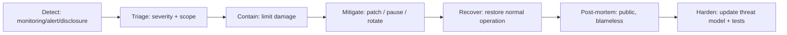

# Incident Response

What to do when — not if — something breaks. A decade-scale chain *will* face incidents; the
question is whether the response is rehearsed and bounded or improvised and panicked.

## Incident severity classes

| Sev | Definition | Examples | Response time |
|---|---|---|---|
| **SEV-0** | Chain-ending / funds-at-mass-risk | crypto suite break (T1), consensus safety violation, mass key compromise | immediate, all-hands |
| **SEV-1** | Major exploit, contained loss / liveness halt | escrow/VM exploit (T17/18), liveness halt (>1/3 down), validator collusion | < 1 hour |
| **SEV-2** | Limited exploit / degraded service | DoS (T8), localized bug, single-validator compromise | < 1 day |
| **SEV-3** | Low-impact / potential issue | metric anomaly, minor bug, suspicious activity | normal cycle |

## Response lifecycle

## Detection sources

- **Automated monitoring**: invariant violations (state-root divergence, supply non-conservation,
  nullifier inconsistency), liveness/finality stalls, anomaly detection ([monitoring](../13-operational/monitoring.md)).
- **Responsible disclosure**: secure channel + bug bounty (T-class researchers).
- **Validator/operator reports** via the operator comms channel.
- **Cryptanalysis monitoring**: the named role watching the PQ literature (T1).

## Containment tools (and their constitutional limits)

| Tool | Use | Limit |
|---|---|---|
| **Mempool/feature pause** | stop the exploited path (e.g., disable a buggy resource-logic type) | scoped, governance-ratified after |
| **Emergency suite migration** | active crypto break → rotate to fallback (SLH-DSA) | *constitutionally permitted* (C5); fast path |
| **Validator coordination halt** | liveness/safety emergency → coordinated pause | restart from last finalized state + WS checkpoint |
| **Key rotation** | compromised validator/agent keys | two-tier keys enable rotation w/o stake loss |
| **Visa revocation** | rogue agent | sub-epoch, controller or governance |

⚠️ **No god-mode.** There is **no** privileged backdoor to seize funds, rewrite history, or
remove the human veto — even in a SEV-0. The constitution
([`07-governance/constitutional-layer.md`](../07-governance/constitutional-layer.md)) bounds even
emergencies. Containment can *pause* and *rotate*, never *confiscate* or *suspend sovereignty*.
This is a deliberate tradeoff: we accept slower worst-case recovery in exchange for never having
a centralized kill-switch an attacker (or insider) could capture (T23).

## The emergency governance path

For SEV-0/1 needing a protocol change faster than four-phase governance:
1. **Emergency proposal** (narrow scope: only the fix) by core team / emergency responders.
2. **Compressed timeline** — shortened phases, but the **SVRGN human veto is preserved**.
3. **Constitution check** — the emergency change cannot violate invariants.
4. **Activation** with the shortest safe time-lock.
5. **Post-incident ratification** under full normal governance + public retrospective.

Pre-ratify this path *before* you need it; rehearse it on testnet.

## Specific playbooks

- **SEV-0 crypto break**: trigger criteria met → announce → activate emergency suite migration to
  the hash-based fallback → dual-require new suite → freeze the broken path → public retrospective.
  (Only survivable because of agility + diversity — this is *why* those exist.)
- **Consensus safety violation (two finalized conflicts)**: halt → identify equivocators (provable
  via phase contexts 🟢) → slash/eject → restart from last unambiguous finalized state under WS
  checkpoint → audit the safety bug → formal-verification follow-up.
- **Liveness halt (>1/3 offline)**: cannot finalize by design; coordinate operator restart, add
  capacity/diversity, investigate cause (often network T6/T7).
- **Funds-at-risk VM/escrow exploit**: pause the affected logic type via emergency path → patch →
  audit → resume; compensate via treasury governance if warranted.
- **Mass key compromise**: emergency rotation guidance, revocation, suite migration if the cause
  is cryptographic.

## Communication

- **Pre-written templates** for each severity (don't draft comms during a crisis).
- **Status page** + operator broadcast channel + security advisory feed.
- **Blameless, public post-mortems** — transparency builds the trust a neutral chain needs.
- **Coordinated disclosure** timing to protect users before details are public.

## Preparedness (do these *before* incidents)

- [ ] Runbooks for each playbook above, version-controlled in [`13-operational/`](../13-operational/).
- [ ] Emergency path pre-ratified and **rehearsed on testnet** (incl. suite migration drill).
- [ ] Weak-subjectivity checkpoints published regularly.
- [ ] On-call rotation + escalation tree for validators/core.
- [ ] Disaster-recovery tested ([`13-operational/disaster-recovery.md`](../13-operational/disaster-recovery.md)).

## MVP / Production / Future

- **MVP**: basic monitoring + a documented manual halt/restart procedure for the devnet.
- **Production**: full severity model, pre-ratified emergency governance, rehearsed playbooks,
  WS checkpoints, bug bounty, status comms.
- **Future**: automated invariant-triggered safe-halt, chaos/gameday drills, formalized
  emergency-path constraints, cross-validator incident simulation.

---

### Open Questions
- Who, exactly, can invoke an emergency pause without it becoming a capture vector? (Emergency council design.)
- Auto-halt on detected safety violation vs. risk of false-positive self-halt (DoS via false alarm)?
- How to compensate exploit victims fairly via treasury without moral hazard?
</content>
