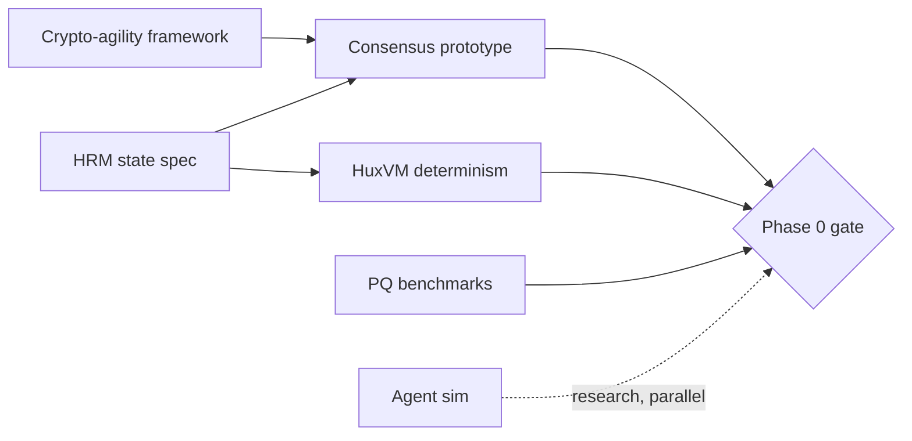

# Phase 0 — Research & Foundations (Months 0–6)

> **Goal**: freeze the specs that are expensive to change later, prove the riskiest assumptions
> cheaply, and turn the existing crypto primitives into the seed of an agile protocol — *before*
> writing consensus code.

## Why this phase exists

Huxplex today is a crypto/networking primitive library (🟢) with a grand vision and no chain.
The biggest risk is **building the wrong thing well**. Phase 0 de-risks the decisions that are
catastrophic to get wrong (consensus family, state model, crypto-agility, determinism) using
specs, prototypes, and simulations — not production code.

## Milestones & deliverables

| ID | Milestone | Deliverable | Gate |
|---|---|---|---|
| P0.1 | Specs frozen | This `/docs` blueprint reviewed + ADRs ratified | ✅ blueprint exists |
| P0.2 | Crypto-agility framework | `algo_suite` design + trait-based dispatch prototype; refactor hard-coded sizes | downgrade + dummy-V2 test passes |
| P0.3 | Consensus chosen + modeled | Q-BFT spec; TLA+ safety sketch; consensus prototype (in-memory, no net) | finalizes blocks in sim |
| P0.4 | HRM state model spec | resource/nullifier/balance formal-ish spec; reference single-shard implementation | proptest invariants pass |
| P0.5 | HuxVM determinism spike | `wasmi` integration + restricted-opcode validator; differential determinism test | identical roots across nodes |
| P0.6 | PQ overhead benchmarks | measured ML-DSA verify cost, sig sizes, parallel-execution speedup study | published numbers |
| P0.7 | Agent-economy simulation | off-chain sim of novelty/reputation under adversarial agents | "does novelty inflate?" data |
| P0.8 | Threat model + research agenda | [`08-security/`](../08-security/) + [`11-research/open-problems.md`](../11-research/open-problems.md) ratified | reviewed |

## Critical path

**Binding sequence**: agility framework + HRM spec must land before the consensus prototype is
meaningful; determinism spike gates any execution work. Agent-economy simulation runs in parallel
(it's research, not on the build critical path) and *must not* pull engineering focus.

## Team requirements

| Role | FTE | Focus |
|---|---|---|
| Protocol/distributed-systems lead | 1 | consensus, state, overall architecture |
| Cryptography engineer | 0.5–1 | agility framework, PQ benchmarks, library vetting |
| Rust systems engineer | 1 | HuxVM spike, state reference impl |
| Researcher (mechanism/econ) | 0.5 | agent-economy simulation, tokenomics modeling |
| Technical writer / PM | 0.5 | keep `/docs` + ADRs + backlog current |

Realistic minimum: **2–3 strong generalist Rust+crypto engineers** + part-time research. (The
project is described as solo — Phase 0 is also where the staffing/strategy fork is decided; see
[`11-research/open-problems.md#strategy`](../11-research/open-problems.md).)

## Budget estimate (order-of-magnitude)

- Personnel (2–3 FTE × 6 mo): the dominant cost.
- 1 external crypto/consensus design review: moderate.
- Compute for benchmarks/simulation: minor.
- **Total**: small relative to later phases; Phase 0 is deliberately cheap — its product is
  *de-risked decisions*, not infrastructure.

## Research dependencies (must resolve enough to proceed)

- Consensus family decision (ADR-0004) — *resolved in blueprint, validate in prototype*.
- PQ signature aggregation feasibility — *enough to size the validator set*.
- HuxVM engine + determinism approach (ADR-0008/0009).
- Whether novelty/reputation is even worth pursuing (sim result).

## Exit criteria (Phase 0 → Phase 1 gate)

- [ ] ADRs 0001–0009 ratified.
- [ ] Consensus prototype finalizes blocks in simulation with PQ signatures.
- [ ] HRM reference impl passes property tests (conservation, no double-spend).
- [ ] HuxVM determinism differential test green across ≥2 nodes.
- [ ] Crypto-agility dummy-V2 migration test green.
- [ ] PQ overhead numbers published; validator-set size decided.
- [ ] Go/no-go on the agent-economy direction based on simulation.

---

### Open Questions
- Solo vs. funded team — does Phase 0 conclude with a fundraise/grant, or stay bootstrapped?
- Is the consensus prototype better built fresh or by forking a reference (HotStuff-rs)?
</content>
