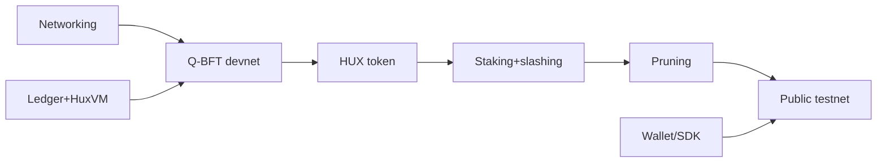

# Phase 1 — Testnet (Months 6–18) · the 12–18 month horizon

> **Goal**: a *working multi-node blockchain* — the thing that doesn't exist today. Real P2P,
> real consensus, real state, real execution, a single token, public testnet. **Zero
> AI-economy features in the critical path.**

## Milestones & deliverables

| ID | Milestone | Deliverable |
|---|---|---|
| P1.1 | Real networking | libp2p/QUIC transport + hybrid PQ handshake + signed gossip (productionize 🟢 envelopes) |
| P1.2 | Single-node ledger | HRM state over RocksDB + JMT; tx validation; HuxVM (`wasmi`) execution; nullifiers |
| P1.3 | Q-BFT devnet | 3–5 node BFT finality with ML-DSA votes over phase contexts (🟢); round-robin leader |
| P1.4 | Tokens (HUX) | HUX balances, transfers, gas/fees (scalar), block rewards |
| P1.5 | Staking + slashing v1 | stake bonding, double-sign slashing, validator set mgmt |
| P1.6 | Witness pruning | SegWit-style separation + post-finality pruning; state-growth metrics |
| P1.7 | Wallet + CLI/SDK | HD wallet (🟢), tx construction, node CLI, basic explorer |
| P1.8 | **Public testnet** | open validator onboarding, faucet, metrics dashboards, incentivized test program |
| P1.9 | Research metrics export | PQ overhead, parallel speedup, burn/fee data ("dataset generator") |

## Critical path

Networking + ledger are parallel tracks that converge at the devnet. Everything after the devnet
is layering economics and operability toward a public testnet.

## What is explicitly NOT in Phase 1

LB-VRF/PQ-SSLE (round-robin is fine for testnet), DAG mempool (direct gossip first), sharding,
intents/solvers, Work Visas, identity/personhood, on-chain governance, SVRGN/SNTNC, ZK,
multi-dimensional fees. These are Phase 2–4. (Phase-gate discipline; Principle #10.)

## Team requirements

| Role | FTE | Focus |
|---|---|---|
| Protocol lead | 1 | consensus, integration |
| Rust systems engineers | 2–3 | networking, state, VM, tokens |
| Crypto engineer | 0.5 | handshake, agility productionization, KATs |
| DevOps/infra | 1 | testnet ops, CI/CD, dashboards |
| Wallet/SDK engineer | 1 | client tooling |
| PM/dev-rel | 0.5–1 | testnet program, docs, contributors |

Realistic: **~5–7 people**. This is where solo-vs-team becomes binding — a public testnet is hard
to run solo.

## Budget estimate

- Personnel (5–7 FTE × 12 mo): dominant.
- Infra (testnet nodes, RPC, explorer, faucet): moderate, ongoing.
- First external review of networking/consensus integration: moderate.
- Incentivized testnet rewards (non-financial/points): budgeted, modest.

## Research dependencies

- Validator-set size + certificate-bandwidth decision (from Phase 0 benchmarks).
- Pruning window vs. reorg-safety vs. light-client needs.
- Determinism guarantees validated under real parallel execution (start serial, parallelize late).

## Exit criteria (Phase 1 → Phase 2 gate)

- [ ] Public testnet stable for a sustained period (months) with external validators.
- [ ] Finality, slashing, pruning all demonstrated under load.
- [ ] Crypto-agility exercised (a testnet suite-version bump rehearsed).
- [ ] Research metrics published (PQ overhead, throughput, parallel speedup).
- [ ] No safety incidents unresolved; determinism differential-tested across clients.
- [ ] SDK/wallet usable by external builders.

---

### Open Questions
- Start parallel execution (TCHAO/Block-STM) in Phase 1 or defer to Phase 2 to reduce risk? (Leaning serial in P1, parallel in P2.)
- One client implementation or two (diversity vs. resource)? (Likely one in P1, second client later.)
</content>
