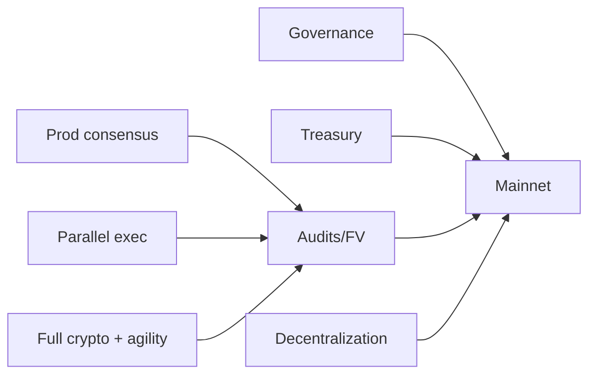

# Phase 2 — Mainnet (Months 18–30) · the 24–30 month horizon

> **Goal**: a hardened, audited, decentralized mainnet with governance and treasury — a
> **conservative** feature set securing real value. Resist the temptation to ship the AI economy
> here; mainnet's job is to be *boringly secure*.

## Milestones & deliverables

| ID | Milestone | Deliverable |
|---|---|---|
| P2.1 | Production consensus | LB-VRF leader election + PQ-SSLE; epoch rotation; DAG mempool (Narwhal-style) |
| P2.2 | Parallel execution | Block-STM-style TCHAO; `wasmtime` (restricted); multi-dimensional weight recorded |
| P2.3 | Full crypto stack | SLH-DSA validator identity keys; agility registry with live hash-based fallback; tested migration state machine |
| P2.4 | Governance live | four-phase Hive-Mind; SVRGN (bootstrap personhood) + SNTNC chambers; constitution encoded; time-locks |
| P2.5 | On-chain treasury | fee/emission/slashing inflows; milestone-gated grants; draw-down cap |
| P2.6 | Fee market v2 | EIP-1559-style base fee + governance burn fraction; sponsored fees |
| P2.7 | **Security program** | ≥2 independent audits; formal verification of consensus safety + VM determinism; bug bounty live |
| P2.8 | Decentralization | open validator set; minimal trusted base; weak-subjectivity checkpoints; reproducible builds enforced |
| P2.9 | **Mainnet genesis** | audited launch with conservative params; documented emergency path rehearsed |

## Critical path

The audit + formal-verification gate (P2.7) is **mandatory** before mainnet (P2.9). Governance +
treasury must be live so the chain is community-steerable from genesis (or shortly after, with a
published foundation→governance sunset).

## Conservative-launch principle

Mainnet ships the **minimum** to be a secure, governable settlement layer:
- ✅ consensus, state, execution, HUX, staking/slashing, governance, treasury, fee burn, agility.
- ❌ **No** intents/solvers, Work Visas, agent reputation, ZK, sharding, bridges at genesis.

Every feature on a mainnet is permanent attack surface. The AI economy (Phase 3) layers on a
*proven* chain. This is the discipline most ambitious L1s lack — and why they get exploited.

## Team requirements

| Role | FTE | Focus |
|---|---|---|
| Protocol/consensus | 2 | LB-VRF/SSLE, DAG mempool, epoch rotation |
| Execution/VM | 1–2 | Block-STM, wasmtime hardening |
| Cryptography | 1 | SLH-DSA, agility registry, migration drills |
| Governance/econ engineer | 1 | governance module, treasury, fees |
| Security lead + auditors (external) | 1 + firms | audits, FV coordination, bounty |
| DevOps/SRE | 1–2 | mainnet readiness, monitoring, DR |
| Dev-rel/PM/legal | 1–2 | launch, validator onboarding, regulatory review |

Realistic: **~8–12 people** + external auditors. Mainnet is a serious operation.

## Budget estimate

- Personnel (8–12 FTE × 12 mo): dominant.
- **Audits (multi-firm) + formal verification**: significant, non-negotiable line item.
- Bug bounty pool: significant (must be credible to attract researchers).
- Infra + monitoring + DR: ongoing.
- Legal/regulatory review (token classification — T26): meaningful.

## Research dependencies

- LB-VRF / PQ-SSLE concrete constructions + audited Rust impls (a Phase-0/1 open item).
- Block-STM correctness under HRM + PQ load.
- Constitution invariant set finalized ([`07-governance/constitutional-layer.md`](../07-governance/constitutional-layer.md)).
- Bootstrap personhood approach for legitimate SVRGN distribution (a real gap).

## Exit criteria (Phase 2 → Phase 3 gate)

- [ ] Mainnet live and stable; multiple independent audits passed; FV of consensus safety + VM determinism done.
- [ ] Governance + treasury operating on-chain; constitution enforced; emergency path rehearsed.
- [ ] Decentralized validator set; reproducible builds; weak-subjectivity checkpoints published.
- [ ] Agility migration state machine tested on mainnet-equivalent.
- [ ] Regulatory review complete; token framing defensible.

---

### Open Questions
- Foundation→full-governance sunset timeline post-genesis.
- Is bootstrap personhood strong enough to make the SVRGN veto meaningful at mainnet, or is the veto provisional?
- Sharding: confirm it stays Phase 4, not pulled forward under throughput pressure.
</content>
