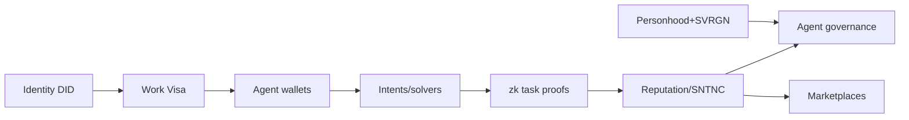

# Phase 3 — AI Economy (Months 30–48) · the 36–48 month horizon

> **Goal**: turn the proven chain into the AI-native economy the vision promises — identity,
> Work Visas, intents/solvers, agent reputation, marketplaces — **layered on a secure mainnet,
> off the consensus-critical path.**

## Milestones & deliverables

| ID | Milestone | Deliverable |
|---|---|---|
| P3.1 | Identity layer | `did:huxplex` (🟢 primitive) DID docs as HRM resources; key rotation; identity classes |
| P3.2 | Personhood + SVRGN | multi-provider ZK personhood portfolio; personhood-gated SVRGN; unlinkable voting (target) |
| P3.3 | Work Visa credentials | issuance/revocation; in-HuxVM constraint enforcement (spend caps, scopes, expiry) |
| P3.4 | Agent wallets | scoped/revocable agent keys; allowances; sponsored fees; circuit breakers |
| P3.5 | Intents + solvers | intent mempool over `huxplex/intents` (🟢 topic); solver matching; escrow resources |
| P3.6 | zk-STARK task proofs | verifiable-compute task settlement; oracle integration for the rest; dispute resolution v1 |
| P3.7 | Agent reputation / SNTNC | bounded, decaying, soulbound merit; collusion detection; autonomy tiers |
| P3.8 | Marketplaces | open auction + commit-reveal; reputation ranking; A2A commerce |
| P3.9 | Agent governance | SNTNC log-weighted machine deliberation; Agentic DAOs (capped); all under SVRGN veto |
| P3.10 | Provenance | human-origin + machine-origin records (🟢 context); deepfake-provenance product |

## Critical path

Identity → Work Visa → agent wallets → intents/solvers is the spine. Personhood (P3.2) gates
meaningful SVRGN/agent-governance. zk-STARK proofs (P3.6) gate cryptographic task settlement
(economic settlement via escrow/dispute works without them).

## The risk-management heart of Phase 3

This phase contains Huxplex's most novel and most dangerous mechanisms. Discipline:
- **Everything here is L3/L4** — a bug in reputation or marketplaces must never threaten
  consensus safety (it can't, by construction — they're off the critical path).
- **Roll out behind feature flags + caps** — small bonds, low spend caps, capped Agentic-DAO
  votes; widen as data accrues.
- **Simulate adversarially first** — the Phase-0 agent simulation matures into a continuous
  red-team before each mechanism goes live. "Does novelty inflate?" must be answered with data
  *before* SNTNC influences anything economic.
- **Human veto fully operational** before agent governance has teeth.

## Team requirements

Adds to the Phase-2 team:

| Role | FTE | Focus |
|---|---|---|
| Identity/ZK engineers | 2 | DID, personhood, STARK proofs |
| Mechanism-design researcher | 1 | reputation, marketplace, anti-collusion |
| Agent-framework engineers | 2 | Work Visa, wallets, intents/solvers |
| Economist | 0.5–1 | SNTNC issuance/decay, market design |
| Security (ongoing) | 1 + firms | audits of each new mechanism |

Realistic: **~12–18 people** including the Phase-2 base.

## Budget estimate

- Personnel (largest team yet): dominant.
- ZK proving infra + audits of novel mechanisms: significant.
- Personhood-provider integrations: meaningful.
- Continued bug bounty (now covering agent economy + ZK): significant.
- Ecosystem grants to seed agent builders ([`12-business/grants.md`](../12-business/grants.md)).

## Research dependencies (many — this is the research-heavy phase)

- Practical, audited STARK framework (proving cost realism).
- Sybil-resistant personhood that's decentralized + inclusive (top open problem).
- Anti-collusion / independence tests for reputation + attestations.
- Whether novelty scoring converges (must be answered before SNTNC goes economic).
- MEV-resistant intent matching.

## Connectors — the external-world pathway

Phase 3 introduces [HCP/1](../15-specifications/07-connector-protocol.md)
([ADR-0015](../adr/0015-connector-architecture.md),
[ADR-0016](../adr/0016-evidence-and-attestation.md)), shipped as a **profile ladder**, one rung at
a time. Do not start a rung before the previous one has soaked.

| Profile | Capability | Phase |
|---|---|---|
| **0 — Observer** | Read-only external state; emits signed events. Cannot cause effects | 3, first delivery |
| **1 — Effector** | `Reserve` / `Commit` / `Compensate` — bounded external obligations | 3, after Profile 0 soak |
| **2 — Settler** | `Settle` on external rails (bank/UPI/card/stablecoin) via bounded mandates | 3–4 |
| **3 — Custodial** | Holds on-chain value — **bridge-shaped**; inherits the bridge deferral in full | **4 at the earliest**, governance super-majority |

Profile 0 is genuinely useful alone (shipment tracking, price monitoring, status reconciliation)
and can cause no harm, which makes it the right first delivery. Discipline for this phase:
**one connector category, completely, before a second is started.**

Additional Phase 3 connector work: the connector registry with bonds and legal-operator records;
the evidence schema registry; continuous conformance testing; and interoperability profiles for
MCP, x402 and AP2 mandates rather than proprietary equivalents.

## Exit criteria (Phase 3 → Phase 4 gate)

- [ ] Agents transacting under enforced Work Visa constraints with fast revocation.
- [ ] Profile 0 and Profile 1 connectors live, with G11-T1…T14 green — including **G11-T6**
      (colluding agent + connector cannot exceed the visa) and **G11-T7** (session survives
      restart, agent death, and disconnection).
- [ ] No connector has ever widened authority, in production or in adversarial simulation.
- [ ] Intents/solvers + escrow + dispute working; zk-STARK settlement for verifiable tasks.
- [ ] Reputation/SNTNC live, bounded, decaying, with collusion detection — validated by adversarial sim.
- [ ] Personhood-gated SVRGN making the veto meaningful; agent governance under veto.
- [ ] No L3 mechanism has ever threatened L1 safety (verified).

---

### Open Questions
- If adversarial simulation shows novelty/reputation is hopelessly gameable, do we ship a weakened version or cut it? (Pre-commit the decision criteria.)
- Can personhood be strong + decentralized + inclusive enough by Phase 3, or does the veto stay provisional into Phase 4?
- Practical on-chain STARK verification cost at agent-economy scale.
</content>
