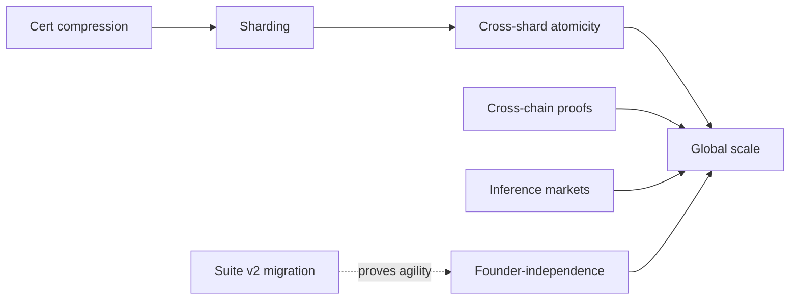

# Phase 4 — Global Scale (Months 48–60+) · the 60-month horizon

> **Goal**: scale to the "trillion-agent" vision — sharding, cross-chain, the second crypto-suite
> migration, and maturing the chain into durable, founder-independent civilization-scale
> infrastructure. Also the phase where the **"exportable module suite"** endgame is realized.

## Milestones & deliverables

| ID | Milestone | Deliverable |
|---|---|---|
| P4.1 | Sharding (S-EUTXO) | activate shard layout (resources already shard-ready); per-shard JMT; global root |
| P4.2 | Cross-shard atomicity | two-phase cross-shard commit with vector-clock ordering; data-availability strategy |
| P4.3 | Certificate compression | STARK-compressed quorum certificates → relax validator-set bound (the aggregation wall) |
| P4.4 | Crypto-suite v2 migration | execute a *real* PQ→PQ migration (e.g., ML-DSA-65 or a new scheme) end-to-end |
| P4.5 | Cross-chain (proofs, not bridges) | PQ light-client verification; cross-chain identity; **no custodial bridges** |
| P4.6 | Inference markets | SNTNC-staked inference markets; the SNTNC flywheel under constitutional caps |
| P4.7 | Privacy maturity | shielded resources at scale; mixnet intent overlay; ZK-private reputation |
| P4.8 | Founder-independence | full decentralization of development + governance + infra; minimal trusted base achieved |
| P4.9 | Exportable modules | causal-clock SDK, PQ-pruning framework, novelty lib, soulbound-merit module (readme v4) |

## Critical path

Certificate compression (P4.3) is the **enabler** for meaningful sharding at scale — it breaks the
PQ-aggregation bandwidth wall that bounds the validator set. Cross-shard atomicity is the hardest
systems problem in the project. Suite-v2 migration (P4.4) is the *proof* that the entire agility
thesis works in production.

## The two defining achievements of Phase 4

1. **A real crypto migration.** Until Huxplex has actually rotated its PQ suite on mainnet, the
   crypto-agility thesis is unproven. P4.4 is where the central architectural bet pays off (or
   reveals flaws to fix). This may be triggered earlier by an emergency (a scheme break) — in
   which case Phase 4's migration milestone arrives whenever the threat does.

2. **Founder-independence.** A civilization-scale chain cannot depend on its founders. By Phase 4,
   development, governance, treasury, and infrastructure must be sufficiently decentralized that
   the chain survives the original team leaving. This is the true test of "designed to last
   decades."

## The strategy fork resolves here

The readme's v4 vision is explicit: if research succeeds, Huxplex becomes "a research reference
implementation for future sovereign chains" — a **module suite** (causal clock, PQ pruning,
novelty, soulbound merit). Phase 4 commits to *both* a running L1 *and* exported, reusable
modules. If the sovereign-L1 path underperforms, the **modules are the durable value** and a
graceful pivot target ([`11-research/open-problems.md#strategy`](../11-research/open-problems.md)).

## Team requirements

A mature, decentralized contributor ecosystem rather than a single team:
- Multiple independent client teams (client diversity for resilience).
- Specialized working groups: sharding, cryptography/migration, ZK/privacy, agent economy,
  governance.
- External research collaborations (academia, other PQ chains).
- Foundation transitioning to a steward/grant-maker, not a central developer.

## Budget estimate

- Funded primarily by the **on-chain treasury** (fees/emission) by now — the chain should
  largely fund its own development, the mark of sustainability.
- Major line items: sharding R&D, certificate-compression research, second-suite audit, privacy
  infrastructure, ecosystem grants.

## Research dependencies (the hardest remaining problems)

- STARK-compressed PQ quorum certificates (cost realism).
- Cross-shard atomicity + data availability under PQ sizes.
- Shielded state surviving a crypto-suite migration (privacy + migration interaction).
- Inference-market design that keeps the SNTNC flywheel under the human veto in practice.

## Exit criteria (Phase 4 → ongoing)

- [ ] Sharding live with safe cross-shard atomicity; throughput meeting the agent-economy targets.
- [ ] At least one full PQ→PQ suite migration executed on mainnet.
- [ ] Cross-chain via proofs (no custodial bridges); cross-chain identity.
- [ ] Development + governance + infra credibly founder-independent.
- [ ] Exportable modules published + adopted by ≥1 external project.

---

### Open Questions
- Does sharding ever become truly necessary, or does cert-compression + parallel execution suffice on a single chain?
- Is the long-term value the L1 or the module suite? (The market answers this by Phase 4.)
- How to migrate shielded/ZK state across a crypto-suite change without breaking unlinkability?
</content>
