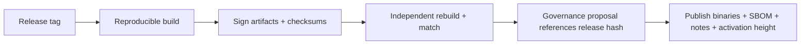

# CI/CD

CI/CD for an L1 is a **security boundary**: the pipeline that builds the client is exactly what a
supply-chain attacker targets (T20). Reproducibility and signing are first-class, not afterthoughts.

## Pipeline stages

Every PR must pass all stages. Merges to default are gated.

## Required checks (per PR)

| Check | Tool | Gate |
|---|---|---|
| Formatting | `rustfmt --check` | block |
| Lints | `clippy -D warnings` | block |
| Build (all crates, MSRV + stable) | `cargo build` | block |
| Tests | `cargo test --workspace` | block |
| Property tests | `proptest` | block |
| Concurrency | `loom` (targeted) | block on touched code |
| Crypto KATs | FIPS 203/204/205 vectors | block (crypto crates) |
| Determinism | differential cross-run/cross-impl state-root check | block |
| Dependency audit | `cargo-audit` (CVEs), `cargo-deny` (licenses/bans), `cargo-vet` (trust) | block |
| No dep cycles | custom/`cargo-deny` | block |
| Coverage | `cargo-llvm-cov` | report (target floor on critical crates) |

## Scheduled / heavier jobs

- **Nightly fuzzing** (`cargo-fuzz`) on parsers, tx validation, VM module loading, network
  messages — long runs, corpus persisted.
- **Long property runs** with higher case counts.
- **Devnet smoke**: spin a 3–5 node ephemeral devnet, produce blocks, assert finality + state-root
  agreement + pruning.
- **Benchmark tracking**: PQ verify cost, throughput, parallel speedup — regressions flagged
  (perf is a feature on a PQ chain).
- **Migration rehearsal**: dummy suite-v2 migration end-to-end (agility regression guard).

## Reproducible builds (the supply-chain spine)

- Pinned toolchain (`rust-toolchain.toml`), locked deps (`Cargo.lock` committed — already present),
  vendored crypto.
- **Deterministic, reproducible release binaries**: anyone can rebuild and byte-match the released
  artifact. This is what lets the community verify (and fork) without trusting the build server.
- **SBOM** generated per release; dependency provenance recorded.
- Build in a hermetic environment (container with pinned digest).

### The recipe — NORMATIVE (G0-T2) 🟢

Run it: **`./scripts/check-reproducible.sh`**. It stages two independent clean copies of the
source, builds each at the canonical path, and compares artifact hashes.

| Ingredient | Value | Why |
|---|---|---|
| Toolchain | `rust-toolchain.toml` → **1.85.0** | Compiler version changes codegen |
| Dependencies | `cargo build --locked` | An unlocked resolve is a different program |
| Timestamps | `SOURCE_DATE_EPOCH=1600000000` | Fixes any embedded build time |
| Path erasure | `--remap-path-prefix=<canonical>=/huxplex`, `--remap-path-prefix=<CARGO_HOME>=/cargo` | Absolute paths leak into debug info |
| **Canonical build path** | **`/tmp/hux-reproducible-build`** (override with `HUX_BUILD_PATH`) | See below — load-bearing |

> **Why a canonical build path is required, and is not a workaround.**
> `--remap-path-prefix` takes the absolute source path as its *argument*, so building at two
> different paths yields two different `RUSTFLAGS` strings. `RUSTFLAGS` feeds rustc's
> `-C metadata` hash, which feeds symbol names — so the artifacts differ even when the source
> is identical. **Erasing the path from the output does not erase it from the flag that erased
> it.** Debian, Nix and others solve this the same way: agree on one build path. Two builders
> following this recipe get identical bytes; one who ignores it does not, and that is a
> property of Rust rather than a defect here.

**Status:** ✅ passing on the pure-Rust tree as of 2026-09-22 — `libhux_crypto.rlib` and
`libhux_network.rlib` byte-identical across two independent clean copies.

> ⚠️ **This baseline must be re-verified at G5.** `aws-lc-rs` ([ADR-0019](../adr/0019-transport-authentication.md))
> compiles C and assembly at build time, so the **C toolchain becomes part of the recipe** and
> `rust-toolchain.toml` alone stops determining the output bytes. Pinning it (a container image
> with a fixed `cc`) is ADR-0019 condition 3 and G0 item 8. If reproducibility cannot be
> restored after that dependency lands, it is a **stop condition** — the decision returns to the
> options in ADR-0019's addendum rather than the requirement being weakened. See
> [`18-implementation-plan/04-sequencing-and-risks.md`](../18-implementation-plan/04-sequencing-and-risks.md) R4.

## Release process

- Releases are **signed** (maintainer keys now; PQ-signed + multi-party later).
- Protocol-affecting releases reference a governance proposal + **activation height** + time-lock
  ([`07-governance/protocol-upgrades.md`](../07-governance/protocol-upgrades.md)).
- Release notes state consensus-compatibility and required-by height.

## Environments

| Env | Purpose | Cadence |
|---|---|---|
| `devnet` | ephemeral, per-PR/nightly, throwaway | continuous |
| `testnet` | public, persistent, pre-prod | per release-candidate |
| `mainnet` | production | governance-gated, time-locked |

## Security in CI

- Secrets via OIDC/short-lived tokens, never long-lived keys in CI.
- Least-privilege CI runners; protected branches; required reviews enforced by config.
- Dependency update PRs (Dependabot/Renovate) **gated by `cargo-audit`/`cargo-vet`** — no blind
  bumps (supply chain).
- Signing keys in HSM, not CI.

## MVP / Production / Future

- **MVP**: fmt/clippy/test/build + `cargo-audit` + devnet smoke; `Cargo.lock` committed (✅).
- **Production**: full matrix incl. KATs, determinism differential, fuzzing, reproducible signed
  releases, SBOM, migration rehearsal, governance-linked releases.
- **Future**: multi-party reproducible-build attestation, PQ-signed releases, automated
  formal-verification jobs in CI.

---

### Open Questions
- ~~Which reproducible-build approach (Nix, pinned container, `cargo` deterministic flags) gives byte-identical artifacts across machines?~~ ✅ **Answered 2026-09-22:** pinned toolchain + `--locked` + `SOURCE_DATE_EPOCH` + `--remap-path-prefix` + a **canonical build path**, verified by `scripts/check-reproducible.sh`. Re-open at G5 when `aws-lc-rs` brings a C toolchain into the recipe.
- Does the recipe hold **across machines and operating systems**, not just across two checkouts on one host? (The script proves the second; a multi-party attestation job proves the first, and is a Production item.)
- Coverage floors per crate — what's meaningful vs. gameable?
</content>
