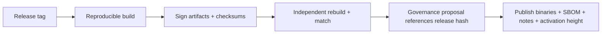

# CI/CD

CI/CD for an L1 is a **security boundary**: the pipeline that builds the client is exactly what a
supply-chain attacker targets (T20). Reproducibility and signing are first-class, not afterthoughts.

## Pipeline stages

Every PR must pass all stages. Merges to default are gated.

## Required checks (per PR)

| Check | Tool | Gate |
|---|---|---|
| Formatting | `rustfmt --check` | block |
| Lints | `clippy -D warnings` | block |
| Build (all crates, MSRV + stable) | `cargo build` | block |
| Tests | `cargo test --workspace` | block |
| Property tests | `proptest` | block |
| Concurrency | `loom` (targeted) | block on touched code |
| Crypto KATs | FIPS 203/204/205 vectors | block (crypto crates) |
| Determinism | differential cross-run/cross-impl state-root check | block |
| Dependency audit | `cargo-audit` (CVEs), `cargo-deny` (licenses/bans), `cargo-vet` (trust) | block |
| No dep cycles | custom/`cargo-deny` | block |
| Coverage | `cargo-llvm-cov` | report (target floor on critical crates) |

## Scheduled / heavier jobs

- **Nightly fuzzing** (`cargo-fuzz`) on parsers, tx validation, VM module loading, network
  messages — long runs, corpus persisted.
- **Long property runs** with higher case counts.
- **Devnet smoke**: spin a 3–5 node ephemeral devnet, produce blocks, assert finality + state-root
  agreement + pruning.
- **Benchmark tracking**: PQ verify cost, throughput, parallel speedup — regressions flagged
  (perf is a feature on a PQ chain).
- **Migration rehearsal**: dummy suite-v2 migration end-to-end (agility regression guard).

## Reproducible builds (the supply-chain spine)

- Pinned toolchain (`rust-toolchain.toml`), locked deps (`Cargo.lock` committed — already present),
  vendored crypto.
- **Deterministic, reproducible release binaries**: anyone can rebuild and byte-match the released
  artifact. This is what lets the community verify (and fork) without trusting the build server.
- **SBOM** generated per release; dependency provenance recorded.
- Build in a hermetic environment (container with pinned digest).

## Release process

- Releases are **signed** (maintainer keys now; PQ-signed + multi-party later).
- Protocol-affecting releases reference a governance proposal + **activation height** + time-lock
  ([`07-governance/protocol-upgrades.md`](../07-governance/protocol-upgrades.md)).
- Release notes state consensus-compatibility and required-by height.

## Environments

| Env | Purpose | Cadence |
|---|---|---|
| `devnet` | ephemeral, per-PR/nightly, throwaway | continuous |
| `testnet` | public, persistent, pre-prod | per release-candidate |
| `mainnet` | production | governance-gated, time-locked |

## Security in CI

- Secrets via OIDC/short-lived tokens, never long-lived keys in CI.
- Least-privilege CI runners; protected branches; required reviews enforced by config.
- Dependency update PRs (Dependabot/Renovate) **gated by `cargo-audit`/`cargo-vet`** — no blind
  bumps (supply chain).
- Signing keys in HSM, not CI.

## MVP / Production / Future

- **MVP**: fmt/clippy/test/build + `cargo-audit` + devnet smoke; `Cargo.lock` committed (✅).
- **Production**: full matrix incl. KATs, determinism differential, fuzzing, reproducible signed
  releases, SBOM, migration rehearsal, governance-linked releases.
- **Future**: multi-party reproducible-build attestation, PQ-signed releases, automated
  formal-verification jobs in CI.

---

### Open Questions
- Which reproducible-build approach (Nix, pinned container, `cargo` deterministic flags) gives byte-identical artifacts across machines?
- Coverage floors per crate — what's meaningful vs. gameable?
</content>
