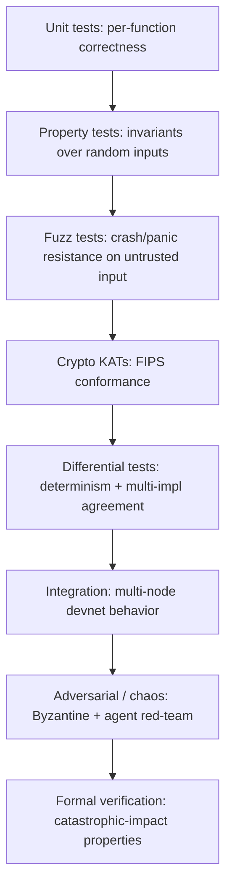

# Testing Strategy

## Philosophy

For an L1, **a bug is a loss event or a chain halt.** Testing is not about coverage numbers; it's
about *establishing invariants and proving they hold under adversarial and concurrent conditions*.
The existing crypto test suite already models this well — extend its discipline everywhere.

## The testing pyramid (Huxplex flavor)

## 1. Unit tests (co-located `#[cfg(test)]`)

The repo's standard. The crypto module is exemplary — it already tests:
- sign/verify roundtrip, tampered message, wrong key, **byte-flip in signature**, all-zero sig;
- **randomized signing** (two sigs differ, both verify) — a subtle FIPS-204 property most miss;
- **context/domain separation** (mainnet≠testnet, prepare≠commit, full canonical context matrix);
- HD derivation determinism, multi-validator cross-key rejection.

This is the bar for every new subsystem.

## 2. Property tests (`proptest`)

Encode **invariants**, test over random inputs:

| Subsystem | Invariant |
|---|---|
| HRM state | conservation (Σconsumed = Σcreated per kind); no double-spend (nullifier unique) |
| Serialization | round-trip identity; canonical encoding (same value ⇒ same bytes) |
| Fee/weight | monotonicity; no underflow/overflow; weight ≥ 0 |
| Consensus | a finalized block never reverts; ≤f Byzantine ⇒ safety |
| VM | gas metering monotone; bounded execution; no nondeterminism |

## 3. Fuzzing (`cargo-fuzz`)

Untrusted input surfaces (the classic L1 attack entry points):
- Transaction/block deserialization, network message parsing, **WASM module loading/validation**,
  RPC inputs, ZK proof verification.
- Goal: no panic/crash/OOM on any input; malformed input is *rejected*, never *mishandled*.
- Corpus persisted; nightly long runs (CI).

## 4. Crypto KATs (FIPS conformance)

- FIPS 203/204/205 Known-Answer-Test vectors for ML-KEM/ML-DSA/SLH-DSA in CI.
- Catches library regressions, parameter drift, and multi-vendor divergence.
- **Side-channel tests**: timing-variance checks on secret-dependent paths (ML-DSA rejection
  sampling — T22).

## 5. Differential testing (determinism — the catastrophic one)

- Run **two crypto implementations** and **two VM engines** on identical inputs; any divergence is
  a bug (catches T27 nondeterminism + multi-vendor agility issues).
- Run the same blocks through multiple nodes; assert **identical state roots**. A state-root
  mismatch in CI blocks merge.

## 6. Integration / devnet tests

- Ephemeral 3–5 node devnet in CI: produce blocks, assert finality, state-root agreement,
  slashing on injected double-sign, pruning correctness.
- Network partition / rejoin; node restart + state-sync from snapshot.
- Upgrade test: apply a governed upgrade at an activation height; assert continuity.

## 7. Adversarial / chaos testing (the novel-mechanism guard)

- **Byzantine consensus tests**: nodes that equivocate, withhold, send invalid votes, target the
  leader — assert safety holds and faults are slashable.
- **Agent red-team / economic simulation**: simulated adversarial agents attacking
  reputation/novelty/markets (the Phase-0 sim, kept as a continuous test). Answers the readme's
  research questions *as tests* ("does novelty inflate?" becomes a failing/passing assertion).
- **Chaos / gameday**: random node kills, latency injection, clock skew (HLC anti-grinding).
- **Migration drills**: dummy suite-v2 migration end-to-end (agility regression test).

## 8. Formal verification (catastrophic-impact only)

Reserved for the properties where a bug ends the chain ([`08-security/audits.md`](../08-security/audits.md) §7):
- Q-BFT safety/liveness (TLA+/Ivy), HuxVM determinism, HRM conservation/nullifier soundness,
  agility downgrade-resistance, escrow release-condition soundness.

## Coverage & metrics

- Coverage tracked (`cargo-llvm-cov`); **floors on critical crates** (crypto, consensus, state,
  vm), but coverage is a *floor, not a goal* — invariant tests matter more than line %.
- Mutation testing (`cargo-mutants`) on critical crates to validate the tests actually catch bugs.

## Test data & reproducibility

- `proptest-regressions/` committed (replay found failures).
- Fuzz corpora versioned.
- Mainnet-state snapshots (sanitized) for migration/upgrade dry-runs.

## MVP / Production / Future

- **MVP**: unit + property + KATs + devnet smoke + determinism differential (the foundation 🟢 is
  already strong).
- **Production**: fuzzing, Byzantine + chaos tests, agent adversarial sim, mutation testing,
  formal verification of consensus safety + VM determinism.
- **Future**: continuous formal verification in CI, large-scale agent-economy simulation as a
  standing red-team, cross-client conformance suite.

---

### Open Questions
- Which formal-methods toolchain per property (TLA+ vs Kani vs Lean)?
- How to make the agent-economy adversarial simulation a deterministic, CI-runnable test rather than a one-off study?
</content>
