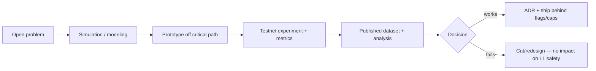

# Future Research Agenda

The structured research program that turns the [open problems](open-problems.md) into work.
Huxplex is explicitly a **research chain** ("the chain is a dataset generator") — research is a
first-class output, not a side effect.

## Research tracks

### Track 1 — Post-quantum systems cryptography
- **PQ signature aggregation / certificate compression** (R-A1): the highest-leverage problem.
  Investigate STARK-proving ML-DSA verification, lattice-based aggregate signatures, and
  threshold variants. *Deliverable*: a feasibility study + prototype; decides whether large
  validator sets and full sharding are viable.
- **PQ randomness & leader election** (R-A3, R-A4): concrete LB-VRF / PQ-SSLE constructions;
  decentralized randomness beacon.
- **Migration cryptography** (R-A8): privacy-preserving suite migration for shielded state.
- **Side-channel-hardened PQ** (T22): constant-time ML-DSA at scale.

### Track 2 — Consensus & execution at PQ scale
- **DAG mempool tuned for large signatures** (R-B1): how Narwhal-style dissemination behaves with
  2,420 B sigs; fair ordering / MEV resistance.
- **Parallel execution under HRM** (R-B2): Block-STM vs declared-access benchmarks; deterministic
  merge proofs.
- **Cross-shard atomicity + DA** (R-B6): the hard scaling problem; erasure coding, DA committees.
- **Bounded-state cryptography** (R-B7): nullifier accumulators, state expiry.

### Track 3 — Mechanism design for agent economies (the novel science)
This is where Huxplex can produce genuinely new knowledge. The chain *is the laboratory*.
- **Novelty/merit metric dynamics** (R-C1): does any causal-novelty metric converge vs inflate
  under adversarial optimization? Simulate, then measure on testnet.
- **Sybil/collusion resistance of soulbound merit** (R-C2, R-C3): formal + empirical.
- **Intent/solver market design** (R-C4): MEV-resistant matching, solver competition dynamics.
- **Bounding machine economic power** (R-C7): keeping the SNTNC flywheel under the human veto.
- **Dispute resolution against colluding agents** (R-C6).

### Track 4 — Identity, personhood & privacy
- **Decentralized, inclusive proof-of-personhood** (R-D1, R-D8): the linchpin of the sovereignty
  thesis; survey + design a provider-neutral portfolio.
- **Coercion-resistant ZK governance** (R-D2): vote privacy + auditability.
- **Accountable anonymity for agents** (privacy + accountability reconciliation).

### Track 5 — Governance that lasts decades
- **Constitutional design** (R-D4, R-D5): minimal invariant sets; super-process thresholds;
  capture resistance under apathy (R-D3, R-D7).
- **Liquid democracy dynamics**: delegation graphs, turnout effects.

### Track 6 — Cryptoeconomics
- **Burn-model stability** (R-E1) and **long-run security budget** (R-E2): the readme's core
  economic questions, answered with on-chain data.
- **Soulbound merit decay calibration** (R-E3).

## Research methodology

The critical discipline: **novel mechanisms are validated by simulation and testnet data
*before* they influence anything economic, and they live off the consensus-critical path so a
negative result costs nothing structural.**

## Research outputs (the "deliverables" the readme promises)

- Causal-novelty distribution data; agent-behavior studies; PQ signature performance benchmarks;
  token-burn equilibrium studies; collusion simulation reports; slashing stress tests.
- Published as open datasets + papers/specs; feeds the exportable module suite (Phase 4).

## Collaboration

- Engage academic PQ cryptography, distributed-systems, and mechanism-design groups.
- Coordinate with other PQ-chain efforts on shared primitives (LB-VRF, aggregation).
- Bug-bounty + research-grant tracks fund external cryptanalysis (cheaper than a real break).

## Prioritization (what to fund first)

1. **PQ aggregation/certificate compression** (R-A1) — unblocks scale; do early.
2. **Proof-of-personhood** (R-D1) — unblocks the sovereignty thesis; long lead time.
3. **Novelty/merit dynamics** (R-C1) — answers whether the AI-economy thesis is even sound.
4. **Burn-model stability** (R-E1) — answers whether the economy self-sustains.

---

### Notes
This agenda is intentionally larger than any one team can execute — it is the multi-decade
research surface. The roadmap ([`09-roadmap/`](../09-roadmap/)) sequences which subset each phase
must resolve to proceed.
</content>
