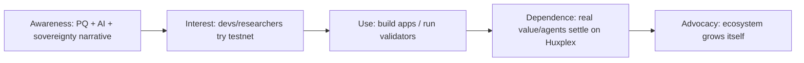

# Adoption Strategy

How Huxplex goes from "interesting research repo" to "infrastructure people depend on" — including
the hard regulatory dimension most technical blueprints omit.

## The adoption funnel

Each stage needs a different artifact: awareness ← the vision + this blueprint; interest ←
testnet + SDK; use ← grants + reference apps; dependence ← security track record + mainnet;
advocacy ← a self-sustaining community + treasury.

## Sequencing: who adopts, in what order

1. **Researchers / cryptographers** (Phase 0–1) — drawn by open PQ work and the chain-as-lab.
   Cheapest to reach, highest-credibility seeds.
2. **Validators / operators** (Phase 1) — drawn by incentivized testnet + excellent ops docs.
3. **Builders** (Phase 2) — drawn by SDK + grants + the three wedge use cases.
4. **Agent operators** (Phase 3) — drawn by Work Visa tooling as accountable-agent demand matures.
5. **Institutions / other chains** (Phase 4) — drawn by track record + exportable modules.

## The three adoption wedges (lead with these)

| Wedge | Adopter | "Why not just Ethereum?" answer |
|---|---|---|
| **PQ vault / long-horizon security** | institutions, archives, custodians | Ethereum's keys/history are quantum-fragile; Huxplex is PQ-native + agile |
| **Content provenance** | media, AI platforms, creators | durable, decentralized, PQ-safe human-vs-machine origin (ready now 🟢) |
| **Accountable AI agents** | agent/AI builders | native bounded, auditable, revocable agent authority (Work Visas) |

Adoption is *use-case-led*, not chain-maximalist. We don't ask people to "believe in Huxplex"; we
solve a problem they have.

## The regulatory dimension (T26 — do not ignore)

Tokens that look like investments attract securities regulation; an AI-agent economy attracts
AI/financial-conduct scrutiny; biometric personhood attracts privacy law (GDPR/BIPA-style).
Strategy:

- **Utility-first token design**: HUX is gas/utility; SVRGN/SNTNC are **soulbound, non-purchasable**
  (hard to construe as investment instruments). See [token-design](../06-tokenomics/token-design.md).
- **No public token sale pre-mainnet**; no yield/ROI marketing; research framing throughout.
- **Privacy by design for personhood**: no raw biometrics on-chain, ZK proofs only — aligns with
  data-minimization law ([human-identity](../05-identity/human-identity.md)).
- **Jurisdictional diversity + legal review** before mainnet; avoid a single coercible
  jurisdiction (also a T23/nation-state mitigation).
- **Honest disclaimers** (the readme's instinct is correct) — under-claim, document risk.

This is a **gating item for mainnet** (Phase 2 exit criterion), not an afterthought.

## Bootstrapping demand without speculation

The tension: most chains bootstrap with token incentives, which conflict with the
non-speculative, research-first framing. Alternatives:
- **Grants** to builders (treasury, not sale).
- **Research participation** as the early "yield" (data, co-authorship, reputation).
- **Reference applications** built by the core team for each wedge (show, don't tell).
- **Incentivized testnet** with non-financial points/recognition.

## Risks to adoption

| Risk | Mitigation |
|---|---|
| Three-token complexity confuses users | great docs/SDK; abstract complexity; lead with use cases |
| PQ urgency not yet felt by market | lead with provenance/agent wedges that have *present* value |
| Research framing reads as "not serious/not investable" | reframe as *credibility* — the chain that doesn't overclaim is the one to trust for decades |
| Regulatory action | utility-first, no pre-sale, legal review, privacy-by-design |
| Network effects favor incumbents | don't compete head-on; own the PQ/agent/provenance niches |

## MVP / Production / Future

- **MVP**: researcher + validator adoption; one reference wedge app on testnet.
- **Production**: builder adoption on mainnet; legal/regulatory posture solid; grants active.
- **Future**: agent-operator + institutional adoption; modules adopted by other chains;
  self-sustaining ecosystem.

---

### Open Questions
- Which wedge converts first — and should the core team build that reference app itself?
- Optimal jurisdiction(s) for the foundation given the token + AI + privacy regulatory surface?
- Can a research-framed, non-speculative chain reach escape-velocity adoption at all? (The central business risk.)
</content>
