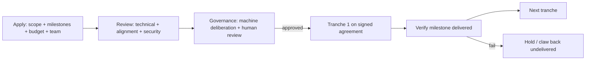

# Grants Program

Grants are how a research-first chain converts treasury into ecosystem and research output
without a speculative token machine. Funded from the [treasury](../06-tokenomics/treasury.md) and
governed by [Hive-Mind governance](../07-governance/governance-model.md).

## Objectives

1. Fund work Huxplex **needs but the core team can't do alone** (clients, tooling, audits, research).
2. Resolve **open research problems** ([`../11-research/open-problems.md`](../11-research/open-problems.md)) —
   grants are the funding arm of the research agenda.
3. Seed the **builder and agent-operator ecosystem**.
4. Strengthen **security** (audits, bounties, formal verification, PQ cryptanalysis).

## Grant categories

| Category | Examples | Priority |
|---|---|---|
| **Core research** | PQ aggregation (R-A1), proof-of-personhood (R-D1), novelty-metric studies (R-C1), burn-model analysis (R-E1) | 🔴 highest |
| **Security** | external audits, formal verification, **PQ-cryptanalysis bounties** | 🔴 highest |
| **Infrastructure** | second client, RPC/archive/explorer, wallets, SDKs | high |
| **Developer tooling** | resource-logic frameworks, Work Visa SDK, intent/solver libs | high |
| **Applications** | provenance apps, PQ vaults, agent reference apps | medium |
| **Exportable modules** | causal-clock SDK, PQ-pruning lib, soulbound-merit module (v4) | medium |
| **Education/community** | docs, tutorials, courses, translations | medium |

## Process

- **Milestone-gated disbursement** (tranches, not lump sums) — reduces waste and rug risk.
- **On-chain transparency** — every grant + disbursement is public (neutrality).
- **Conflict-of-interest rules** — core team / large holders recuse from votes on their own grants.
- **Open deliverables** — funded work is open-source / open-data (Apache-2.0 / CC).

## Funding tiers

| Tier | Size | Process |
|---|---|---|
| Micro | small | streamlined, fast committee approval (delegated authority + cap) |
| Standard | medium | full review + governance |
| Major / multi-year | large | full governance + milestone contract + periodic re-approval |

## Safeguards

- Per-period grant budget cap (subset of the treasury draw-down cap).
- Milestone verification (automated where possible; human review otherwise).
- Clawback for non-delivery; reputation impact for grantees (ties to identity layer later).
- No grants that violate constitutional invariants or fund speculation.

## Special program: PQ-cryptanalysis bounties

A standing, well-funded track that **pays researchers to break Huxplex's crypto suite**. Finding a
weakness via bounty is enormously cheaper than discovering it via exploit. This directly funds
research that protects against the project's defining threat (T1). See
[`../08-security/audits.md`](../08-security/audits.md).

## MVP / Production / Future

- **MVP**: small foundation-run grant/bounty program (bootstrap), transparent, focused on
  security + core research.
- **Production**: treasury-funded, governance-approved, milestone-gated grants across all
  categories; standing audit + cryptanalysis bounties.
- **Future**: retroactive public-goods funding for proven-valuable work; quadratic/conviction
  funding experiments; ecosystem-run sub-DAOs with delegated budgets.

---

### Open Questions
- Delegated micro-grant authority limits vs. full governance overhead — where's the line?
- Retroactive vs prospective funding mix for public goods?
- How to verify research-grant deliverables (open problems rarely have clean "done" criteria)?
</content>
