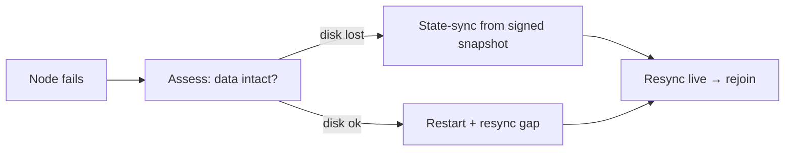

# Disaster Recovery

Recovery from catastrophic operational failures — both single-operator (your node/keys) and
network-wide (the chain). Complements [incident-response](../08-security/incident-response.md)
(which covers *security* incidents); this covers *availability/data* disasters.

## Disaster classes

| Class | Example | Scope |
|---|---|---|
| **Node failure** | disk death, corruption, host loss | single operator |
| **Key loss/compromise** | lost mnemonic, stolen hot key | single operator |
| **Network liveness halt** | >1/3 validators offline, no finality | chain-wide |
| **State corruption** | bug corrupts state on many nodes | chain-wide |
| **Crypto break** | a PQ scheme is broken | chain-wide (see incident-response) |
| **Data loss** | history lost (too few archive nodes) | ecosystem |

## Single-node recovery

- **Backups**: regular signed state snapshots; config + (encrypted) keystore backed up separately
  from data.
- **Fast recovery**: state-sync from a recent **signed** snapshot avoids full replay.
- **Validators**: ensure failover does **not** create a double-signer (mutual exclusion) — a
  botched recovery that runs the hot key on two hosts causes a slash. Better to be *down* than
  *double-signing*.

## Key disaster recovery

| Scenario | Recovery |
|---|---|
| Lost hot key (validator) | cold key authorizes a new hot key — no stake/identity loss (two-tier design) |
| Lost cold key | recover from BIP39 mnemonic backup; if mnemonic lost → identity lost (back it up!) |
| Compromised hot key | rotate immediately via cold key; revoke old key in DID/registration |
| Lost user key | mnemonic backup; or **social recovery** (M-of-N guardians) if configured |
| Compromised agent key | controller revokes the Work Visa (sub-epoch) + reissues |

The two-tier validator keys + social recovery + Work Visa revocation mean *most* key disasters are
recoverable **without** loss — but the **master mnemonic / cold key has no backstop**, so its
offline backup is the single most important operator duty.

## Chain-wide recovery

### Liveness halt (no finality)
BFT halts (rather than forking) when >1/3 are offline — this is *safe* but *not live*. Recovery:
1. Diagnose (usually network T6/T7 or a bad release).
2. Coordinate operators (out-of-band comms channel) to restore the missing validators / roll back
   a bad upgrade.
3. Restart from the **last finalized state** under a **weak-subjectivity (WS) checkpoint** that
   all honest nodes agree on.
4. Post-mortem; add capacity/diversity to prevent recurrence.

### State corruption (bug)
1. Halt (coordinated) to prevent spreading corrupt state.
2. Identify the last known-good finalized state (WS checkpoint).
3. Patch the bug (emergency governance path, time-locked, constitution-bounded).
4. Restart from the known-good state; reconcile.

### Weak-subjectivity checkpoints (the recovery anchor)
Regularly published, signed checkpoints of finalized state roots. They are the agreed "ground
truth" a recovering or new node trusts, and the anchor for restarting a halted chain or
forking away from a captured one. Publish them on a predictable cadence and via multiple
independent channels (so no single source can poison recovery).

## Data preservation (the research mission)

- The chain's value as a "dataset generator" depends on **history surviving**. Ensure a healthy
  set of **archive nodes** (treasury-funded if necessary) so pruning by full nodes never means
  permanent data loss.
- Consider erasure-coded / distributed archival of history (Future).

## Preparedness (do before disaster)

- [ ] Automated, tested, **signed** snapshot backups (restore-tested, not just taken).
- [ ] Mnemonic / cold-key offline backups in multiple secure locations.
- [ ] Failover that guarantees no double-signing.
- [ ] WS checkpoints published + verified regularly.
- [ ] Out-of-band operator comms channel established + tested.
- [ ] DR runbooks rehearsed (gameday drills) — including a chain-restart simulation on testnet.
- [ ] Enough archive nodes that history is durable.

## RTO / RPO targets (indicative)

| Disaster | RTO (recovery time) | RPO (data loss) |
|---|---|---|
| Single node | minutes–hours (state-sync) | ~0 (resync the gap) |
| Validator key (hot) | hours (rotate via cold) | 0 |
| Liveness halt | hours (coordinated restart) | 0 (restart from finalized) |
| State corruption | hours–days (patch + restart) | back to last good checkpoint |

## MVP / Production / Future

- **MVP**: manual snapshot/restore + documented restart procedure (devnet).
- **Production**: automated tested backups, WS checkpoints, two-tier key recovery, rehearsed
  chain-restart runbook, durable archives.
- **Future**: erasure-coded distributed archives, automated DR orchestration, regular gameday
  drills as a standing practice.

---

### Open Questions
- WS checkpoint cadence + distribution that's both tamper-resistant and convenient.
- Funding + incentivizing enough archive nodes for durable history.
- Can chain-restart-from-checkpoint be partially automated without creating a centralized trigger?
</content>
