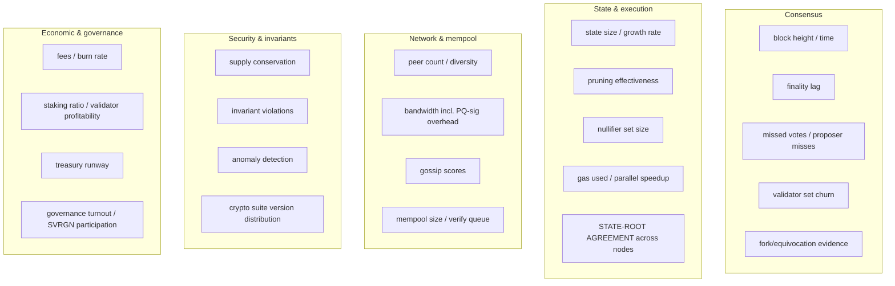

# Monitoring & Observability

Observability is doubly important for Huxplex: it's how operators stay healthy **and** it's the
mechanism that turns the chain into the "dataset generator" the research mission requires. The
same telemetry serves ops alerts and research analysis.

## What we monitor (layered)

## Critical alerts (page someone)

| Alert | Why critical | Tied to |
|---|---|---|
| **State-root divergence across nodes** | nondeterminism / consensus split — catastrophic | T27 |
| **Finality stall** | liveness halt (possible >1/3 down) | T5/T6 |
| **Equivocation evidence detected** | Byzantine validator | T4 |
| **Supply non-conservation** | minting/accounting bug — funds at risk | T17/T18 |
| **Invariant violation** (balance/nullifier) | state corruption | audits |
| **Single crypto-suite dependency / downgrade attempt** | agility failure | T1 |
| **Treasury anomalous outflow** | governance/treasury attack | T16 |
| **Validator double-sign risk** (your own key seen twice) | self-inflicted slash | validator-guide |

These map directly to the incident severity model
([incident-response](../08-security/incident-response.md)). Some may, in Production, trigger
**automated safe-halt** — balanced against false-positive self-DoS risk (open question).

## Health metrics (dashboards, not pages)

- **Node**: CPU/RAM/disk, sync status, version, uptime.
- **Consensus**: height, round, finality lag, participation rate.
- **PQ-specific**: signature-verification throughput, mempool verify backlog, per-block signature
  bytes — the metrics unique to a PQ chain, and key research outputs.
- **Economic**: fee levels, burn rate, staking ratio, validator margins.

## Research telemetry (the "deliverables")

The readme promises published data; monitoring is its source:
- causal-novelty distributions, agent-behavior series, PQ signature performance benchmarks,
  token-burn equilibrium data, collusion-simulation metrics, slashing stress-test results.
- Exported in a stable, documented schema; archive nodes retain the raw history behind it.

## Stack (indicative)

- **Metrics**: Prometheus-compatible `/metrics` endpoint per node; Grafana dashboards.
- **Logs**: structured (JSON), no secrets ever; centralized aggregation for operators.
- **Tracing**: distributed tracing across the node's async subsystems for latency debugging.
- **On-chain monitors**: independent watchers verifying invariants (supply, state-root, nullifier
  consistency) and publishing alerts — these are *external* checks, not self-reported, so a buggy
  node can't hide its own violation.

## Invariant monitoring (defense in depth)

Beyond per-node metrics, run **independent invariant checkers** that recompute critical
properties from chain data:
- Σ supply conserved across blocks.
- Every finalized block's state root reproducible from its transactions (catches T27 in the wild).
- No nullifier appears twice.
- Crypto-suite usage within the governance-set floor.

A violation here is a SEV-0/1 trigger.

## MVP / Production / Future

- **MVP**: Prometheus metrics + Grafana on the devnet; manual review of state-root agreement.
- **Production**: full alerting + severity mapping, independent invariant monitors, research
  telemetry export, status page.
- **Future**: automated invariant-triggered safe-halt, anomaly-detection ML for novel attacks,
  public real-time research data feeds.

---

### Open Questions
- Which invariant violations should auto-halt vs. alert-only (false-positive self-DoS risk)?
- Stable schema for research telemetry that survives protocol upgrades.
- Who runs the *independent* invariant monitors so they're not captured (treasury-funded public good?).
</content>
