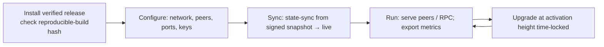

# Node Operations

Running any Huxplex node (validator, full, RPC, or archive). Validator-specific concerns are in
[validator-guide](validator-guide.md). 🟡 marks forward-looking (unbuilt) components.

## Node types

| Type | Holds | Signs blocks | Use |
|---|---|---|---|
| **Validator** | full state + keys | yes | consensus |
| **Full node** | full state, recent history, prunes witnesses post-finality | no | verification, serving peers |
| **RPC node** | full state + APIs | no | apps/wallets endpoint |
| **Archive node** | full history incl. witnesses (no pruning) | no | research, audit, deep queries ("dataset generator") |
| **Light client** 🟡 | headers + proofs | no | constrained devices (PQ proof sizes a concern, R-B9) |

At least a few **archive nodes** are essential — the research mission depends on full historical
data, and pruning means full nodes discard witnesses.

## Lifecycle

## Configuration essentials 🟡

- **Network**: `mainnet` / `testnet` — this is also a **signing domain** (context strings bind to
  it 🟢), so a misconfigured network can't cross-replay. Set it correctly.
- **Peers**: bootstrap peers, max in/out peer counts, peer-scoring thresholds.
- **Ports**: QUIC/UDP transport port; RPC port (firewalled appropriately).
- **Storage**: data dir on NVMe; pruning mode (full vs archive); snapshot cadence.
- **Crypto suite**: the active `algo_suite` floor (agility) — refuse sub-floor downgrades.
- **Resources**: thread pool for parallel execution; mempool limits.

## Sync strategies

- **State-sync (recommended)**: download a recent **signed** JMT snapshot, verify its root against
  finalized headers, then sync live. Fast; doesn't replay all history.
- **Full sync**: replay from genesis — for archive nodes / maximum verification.
- Snapshots are gossiped and signed; verify before trusting (don't sync state from an unverified
  source).

## Routine operations

| Task | Cadence | Notes |
|---|---|---|
| Apply governed upgrades | per release | verify hash; before activation height |
| Verify reproducible build | per release | byte-match the released artifact |
| Monitor health | continuous | [monitoring](monitoring.md) |
| Snapshot / backup | scheduled | for fast recovery ([disaster-recovery](disaster-recovery.md)) |
| Prune (full nodes) | automatic post-finality | witness/signature pruning keeps disk bounded |
| Key rotation (validators) | per epoch | hot key |
| Capacity review | periodic | state growth, bandwidth (PQ-driven) |

## PQ-specific operational realities

- **Bandwidth**: 2,420 B signatures make gossip heavier than classical chains — provision network
  generously; a DAG mempool spreads the load off the consensus hot path.
- **CPU**: ML-DSA verification (~38× Ed25519) dominates — more cores help; batch/lazy verification
  in the mempool reduces wasted work on spam.
- **Disk**: witness pruning is what keeps full-node disk bounded — ensure it's enabled (archive
  nodes opt out intentionally).

## Networking & resilience

- **Sentry topology** for validators: public sentry nodes front the validator, which only peers
  with its sentries — shields against DDoS/eclipse (T6/T7).
- **Peer diversity**: spread across networks/ASNs to resist eclipse.
- **Firewalling**: expose only what's needed; RPC nodes rate-limit and authenticate sensitive
  methods.

## Observability

Every node exports metrics (the chain is instrumented by design):
- consensus (height, finality lag, missed votes), mempool (size, verify queue), network (peers,
  bandwidth, gossip scores), state (size, growth, pruning), resource use (CPU/RAM/disk).
See [monitoring](monitoring.md).

## MVP / Production / Future

- **MVP**: full + validator nodes, full sync, manual upgrades, basic metrics (devnet).
- **Production**: state-sync from signed snapshots, RPC/archive node types, sentry topology,
  automated pruning, reproducible-build verification, rich metrics.
- **Future**: light clients (pending PQ-proof cost work), one-click operator tooling, autoscaling
  RPC fleets.

---

### Open Questions
- Light-client feasibility under PQ proof sizes (R-B9) — when, if ever?
- Reference sentry/mesh config + recommended cloud vs bare-metal profiles.
- Snapshot cadence vs. storage vs. recovery-time tradeoff.
</content>
