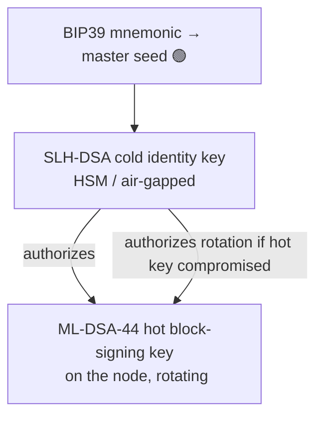
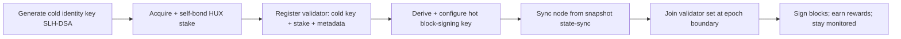

# Validator Guide

> Forward-looking guide: most of this targets the Phase-1 testnet and Phase-2 mainnet. Where a
> step relies on unbuilt components it is marked 🟡. The crypto/key primitives (🟢) already exist.

## Who should validate

Validators secure consensus by staking HUX and signing blocks. You should run a validator if you
can provide: reliable uptime, secure key custody, monitoring, and the operational discipline to
respond to incidents. **Validation is a security responsibility, not passive yield** — misbehavior
is slashed ([staking](../06-tokenomics/staking.md)).

## Key architecture (two-tier — important)

- **Cold identity key (SLH-DSA-128s, 🟡)**: rarely used (registration, rotation). Keep air-gapped /
  in an HSM. Compromise of the hot key does **not** lose your identity/stake — the cold key
  authorizes a new hot key.
- **Hot block-signing key (ML-DSA-44, 🟢)**: lives on the node, signs votes over domain-separated
  phase contexts (`…:block:preprepare/prepare/commit:v1` — already implemented & tested). Rotates
  per epoch.
- Derive keys with the HD scheme (`m/44'/931931'/…` 🟢). Back up the mnemonic offline.

> ⚠️ **Never run the same hot key on two nodes simultaneously** — double-signing is
> cryptographically provable and triggers the maximum slash + ejection. Use a single active
> signer with failover that guarantees mutual exclusion (no naive active-active).

## Hardware (indicative — refine with Phase-1 benchmarks)

| Resource | Testnet | Mainnet |
|---|---|---|
| CPU | 8 cores | 16+ cores (parallel exec + PQ verify are CPU-heavy) |
| RAM | 16 GB | 32–64 GB |
| Disk | 500 GB NVMe | 1–2 TB NVMe (state + recent history; archive = more) |
| Network | 100 Mbps, low latency | 1 Gbps, stable, low latency (PQ sigs are bandwidth-heavy) |
| Key custody | encrypted keystore | **HSM / TEE** for cold key |

PQ specifics drive these: 2,420 B signatures stress bandwidth; ML-DSA verification stresses CPU;
parallel execution wants cores.

## Onboarding flow 🟡

1. Generate the cold identity key (air-gapped).
2. Acquire and self-bond the minimum HUX stake; optionally attract delegations.
3. Submit a registration transaction (cold key + stake + endpoint metadata).
4. Configure the hot signing key on the node.
5. Sync (state-sync from a signed snapshot, then live).
6. Become active at the next epoch boundary; begin signing.

## Operating responsibilities

- **Uptime**: missed blocks reduce rewards; sustained downtime is slashable (minor). Use
  monitoring + alerting ([monitoring](monitoring.md)).
- **Upgrades**: apply governed releases before their **activation height** (time-locked) — verify
  the **reproducible-build hash** matches the governance proposal before running it.
- **Key hygiene**: rotate hot keys per epoch; protect the cold key; never log secrets.
- **Incident response**: follow runbooks ([incident-response](../08-security/incident-response.md));
  participate in coordinated halts/restarts if needed.
- **Governance**: validators are key governance participants — review proposals, especially
  upgrades and crypto-suite migrations.

## Slashing — what gets you punished

| Fault | Penalty | How to avoid |
|---|---|---|
| Double-signing (equivocation) | major slash + jail + eject | single active signer, mutual-exclusion failover |
| Causal regression (🟡, when enabled) | medium slash | correct clock/state handling |
| Extended downtime | minor slash / reward loss | HA infra, monitoring |
| Running broken/unverified client | risk of forking off / missed finality | run only verified governed releases |

## Rewards

Block reward (emission) + fee share, minus your delegators' commission. See
[incentives](../06-tokenomics/incentives.md). Rewards must exceed honest operating cost for the
set to stay healthy — a monitored protocol parameter.

## Security checklist

- [ ] Cold key air-gapped / in HSM; mnemonic backed up offline (multiple locations).
- [ ] Hot key isolated; secrets zeroized; no Debug-logging of keys.
- [ ] Firewall: only required ports; sentry/mesh topology to shield the validator (anti-DDoS/eclipse).
- [ ] Monitoring + alerting live before joining the active set.
- [ ] Failover guarantees **no** simultaneous double-signing.
- [ ] Reproducible-build hash verified for every release.
- [ ] Incident runbooks on hand; on-call defined.

---

### Open Questions
- Recommended sentry-node / validator-mesh topology under PQ bandwidth (single doc + reference config).
- HSM/TEE products with usable SLH-DSA + ML-DSA support — vendor matrix needed.
- Minimum self-bond and commission norms (set with Phase-2 economic modeling).
</content>
