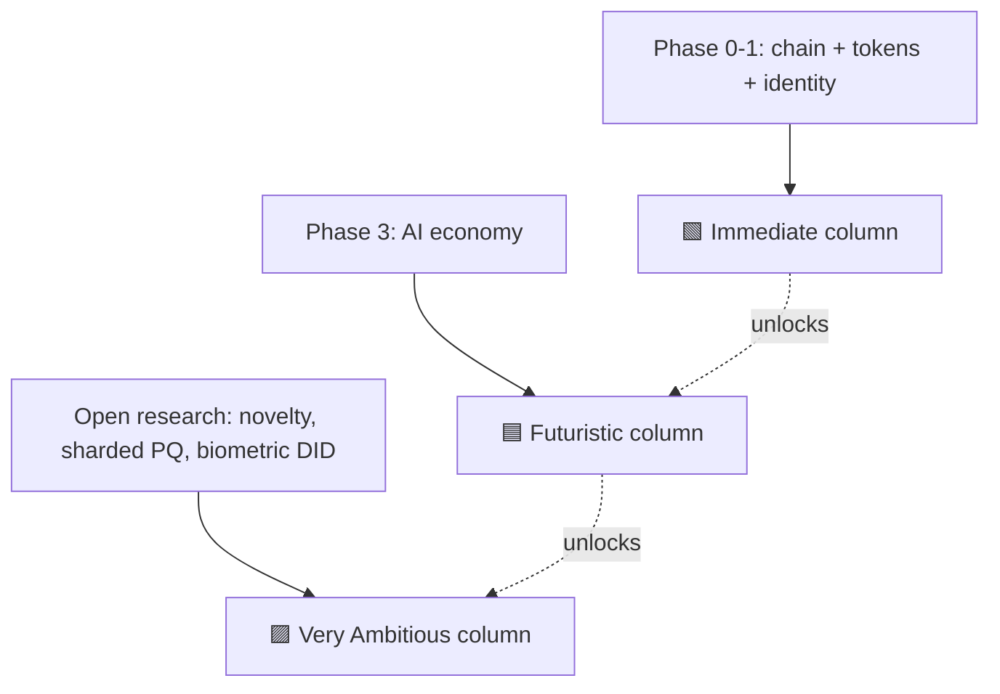

# 00 — Master Use-Case Matrix

> Every catalogued use case in one place. Sort it by horizon to see the product roadmap; sort
> by difficulty to see the research risk; sort by differentiator to see *why Huxplex and not
> some other chain*.

**Legend.** Horizon: 🟩 Immediate (0–3y) · 🟦 Futuristic (3–10y) · 🟪 Very Ambitious (10y+).
Difficulty: ⚪ Easy · 🟠 Intermediate · 🔴 Hard. Differentiator (the Huxplex edge it leans on):
**PQ** post-quantum integrity · **AI** agent-as-actor · **SOV** human sovereignty/veto ·
**MERIT** soulbound merit / causal novelty.

## The realistic near-term core (🟩 + ⚪/🟠)

These are the use cases that exist almost as soon as there is a working, token-bearing chain
with basic agent identity. **This column is the product.**

| Use case | Field | Diff. | Edge |
|---|---|---|---|
| Long-horizon notarization (deeds, wills, archives) quantum-safe | Finance/Legal | ⚪ | PQ |
| PQ-secured value transfer & settlement | Finance | ⚪ | PQ |
| Agent wallets with capability-scoped Work Visas | Agent economy | 🟠 | AI · SOV |
| Spending limits / kill-switch over autonomous agents | Agent economy | 🟠 | AI · SOV |
| Tamper-evident scientific data provenance & timestamping | Science | ⚪ | PQ |
| Supply-chain provenance with 30-yr integrity | Supply chain | 🟠 | PQ |
| Verifiable credentials (`did:huxplex`) for humans & orgs | Identity | 🟠 | PQ |
| DAO treasury with hard human veto on large outflows | Governance | 🟠 | SOV |
| Machine-to-machine micropayments (metered API/compute) | Agent economy | 🟠 | AI |
| Audit-grade immutable logs for regulated industries | Enterprise | ⚪ | PQ |
| Content provenance / C2PA-style signing, PQ edition | Media | 🟠 | PQ |
| Reproducibility receipts for compute jobs | Science | 🟠 | PQ |

## The maturing middle (🟦 Futuristic)

Needs the agent economy, ZK, identity, and governance layers shipped and hardened.

| Use case | Field | Diff. | Edge |
|---|---|---|---|
| Intent-centric agent labor markets (solvers bid on goals) | Agent economy | 🔴 | AI · MERIT |
| Cross-org agent contracting with reputation collateral | Agent economy | 🔴 | AI · MERIT |
| ZK proof-of-personhood without raw biometrics on-chain | Identity | 🔴 | SOV |
| Privacy-preserving health-record consent ledger | Healthcare | 🔴 | PQ · SOV |
| Decentralized physical infra (DePIN) with agent operators | Supply chain | 🔴 | AI |
| Clinical-trial integrity + agent-assisted monitoring | Healthcare | 🔴 | PQ · AI |
| Sovereign data unions (humans license data to agents) | Data/Society | 🔴 | SOV · AI |
| Royalty splitting for AI-assisted creative work | Media | 🟠 | AI · MERIT |
| Carbon / environmental MRV with sensor-agent attestation | Climate | 🔴 | AI · PQ |
| Soulbound professional reputation portable across employers | Identity | 🔴 | MERIT |
| Public-sector records with multi-decade quantum safety | Public sector | 🟠 | PQ |
| Agent-run grant/treasury allocation under human constitution | Governance | 🔴 | AI · SOV |

## The moonshots (🟪 Very Ambitious)

Depend on unproven breakthroughs. Treat as research bets; several may be impossible.

| Use case | Field | Diff. | Edge |
|---|---|---|---|
| Measured non-redundant causal contribution as an economy | Philosophy/Econ | 🔴 | MERIT |
| Machine-civilization settlement substrate (agent-majority economy) | Society | 🔴 | AI · SOV |
| Interplanetary / high-latency settlement (causal, not wall-clock) | Frontier | 🔴 | AI |
| Constitutional invariants that survive an AI-dominated polity | Governance | 🔴 | SOV |
| Post-labor merit & dignity accounting (contribution ≠ wage) | Society | 🔴 | MERIT |
| Civilization-scale tamper-proof archive ("the long now" ledger) | Knowledge | 🟠 | PQ |
| Verifiable autonomy for safety-critical agent swarms | Defense/Infra | 🔴 | AI · SOV |
| Collusion-resistant collective intelligence measurement | Philosophy | 🔴 | MERIT |

## How to read the columns against the roadmap

The honest sequencing rule from the [executive summary](../00-executive-summary.md): **do not
ship a Futuristic use case before the Immediate column is real, and do not stake the project's
credibility on a Very Ambitious one.** The 🟩 column must stand on its own commercially even if
every 🟪 idea fails.

## Field index

Each field has its own file with expanded narratives, dependencies, failure modes, and
field-specific open questions:

- [01 Finance & DeFi](01-finance-and-defi.md)
- [02 AI Agent Economy](02-ai-agent-economy.md)
- [03 Identity, Personhood & Sovereignty](03-identity-personhood-sovereignty.md)
- [04 Science, Research & Academia](04-science-research-academia.md)
- [05 Supply Chain, IoT & Physical](05-supply-chain-iot-physical.md)
- [06 Governance, Civics & Public Sector](06-governance-civics-public-sector.md)
- [07 Healthcare & Biotech](07-healthcare-biotech.md)
- [08 Security, Defense & Critical Infrastructure](08-security-defense-critical-infra.md)
- [09 Creative, Media, IP & Culture](09-creative-media-ip-culture.md)
- [10 Knowledge & Education](10-knowledge-education.md)

Cross-cutting impact:
- [11 Impact on Society](11-impact-on-society.md)
- [12 Impact on Humans](12-impact-on-humans.md)
- [13 Philosophical Implications](13-philosophical-implications.md)
- [14 Very Ambitious / Civilizational](14-very-ambitious-civilizational.md)

---

### Open Questions
- What is the smallest set of these use cases that constitutes a viable *first* product?
- Which 🔴 entries share a single research blocker (e.g. a sound novelty metric), so that one
  breakthrough unlocks many at once?
- Are any "🟩 Immediate" entries actually better served by an existing PQ-capable chain,
  meaning Huxplex should not bother competing there?
