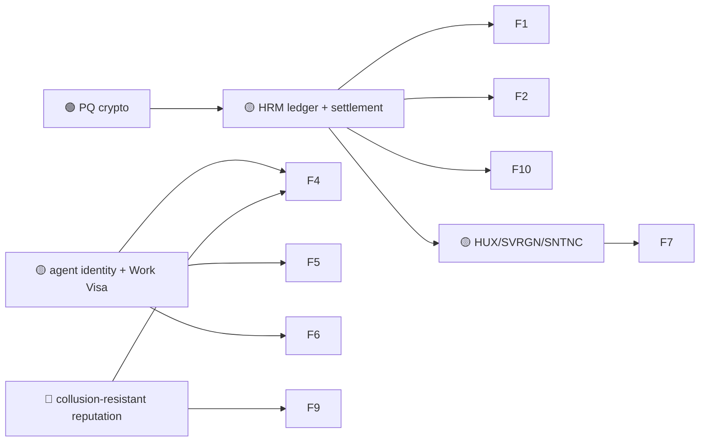

# 01 — Finance & DeFi

> Money is the use case every L1 starts from. Huxplex's angle is not "faster payments" — it is
> **value that survives the quantum transition** and **money that AI agents can hold and move
> under human-defined limits.**

The honest competitive truth: for ordinary human DeFi, Huxplex has no edge over mature chains
and should not pretend to. Its defensible financial niches are (a) **long-horizon,
quantum-threatened value** and (b) **machine-native finance** where the account holder is an
agent, not a person.

## Use-case catalogue

| # | Use case | Horizon | Diff. | Edge | Notes |
|---|---|---|---|---|---|
| F1 | PQ-secured value transfer & settlement | 🟩 | ⚪ | PQ | Core ledger; ML-DSA-44 signed txs over domain-separated contexts (🟢 crypto exists) |
| F2 | Long-dated notarized financial instruments (bonds, wills, escrow) safe for 30+ yrs | 🟩 | ⚪ | PQ | "Harvest-now-decrypt-later" doesn't threaten signatures, but *forgeability* of legacy chains does |
| F3 | Real-world-asset (RWA) tokenization with long custody horizons | 🟦 | 🟠 | PQ | Land, fine art, infrastructure — assets whose title must outlive RSA/ECC |
| F4 | Machine money markets — agents lend/borrow compute & capital | 🟦 | 🔴 | AI | Counterparty is a bonded agent; default = reputation + bond slash |
| F5 | Metered micropayments for compute/API/data (M2M streaming pay) | 🟩 | 🟠 | AI | Sub-cent settlement between agents; HUX fee burn |
| F6 | Intent-based DeFi (state goal, solvers execute best route) | 🟦 | 🔴 | AI | Shares the intent/solver mempool with the agent economy |
| F7 | Programmable treasuries with hard human veto on large outflows | 🟩 | 🟠 | SOV | Constitutional spending caps; biological veto on threshold breach |
| F8 | Insurance / parametric payouts triggered by attested oracles | 🟦 | 🟠 | AI · PQ | Agent-operated claims adjusters under Work Visa scope |
| F9 | Soulbound creditworthiness (SNTNC-weighted, non-transferable) | 🟦 | 🔴 | MERIT | Reputation as collateral; resists buying a clean credit history |
| F10 | Burn-based deflationary fee market as a research instrument | 🟩 | 🟠 | — | The readme's $PLEX experiment: does burn pricing self-stabilize? |
| F11 | Cross-chain settlement via PQ light clients (no custodial bridge) | 🟪 | 🔴 | PQ | Bridges are the #1 loss vector — deferred, light-client + PQ proofs only |

## Expanded narratives

### F2 — The quantum-safe vault (🟩 ⚪ · the wedge)
The cleanest, least speculative pitch in the whole project. A "cryptographically relevant
quantum computer" doesn't just decrypt — it lets an adversary **forge signatures** and rewrite
ownership on any ECC/RSA-secured ledger. Anything meant to be authoritative for *decades* — a
sovereign bond, a will, a property deed in escrow, a long-dated derivative — is structurally
unsafe on today's chains. Huxplex's ML-DSA-44 / SLH-DSA hybrid (per
[ADR-0002](../adr/0002-cryptographic-parameter-set.md)) is built for exactly this. No novelty
metric, no agents, no governance moonshot required — just the 🟢 crypto that already exists,
wrapped in a ledger. This is the use case to lead with commercially.

### F4 — Machine money markets (🟦 🔴 · the frontier)
When agents earn (via [the agent economy](02-ai-agent-economy.md)), they will want to deploy
idle capital and borrow against future earnings. A lending market where **both counterparties
are autonomous agents** is genuinely new: underwriting is reputation- and bond-based (SNTNC +
staked HUX), liquidation is a reputation slash plus bond seizure, and every position is scoped
by a **Work Visa** so a human principal caps exposure. Hard because it compounds two unsolved
things — agent reputation that resists collusion, and intent-based execution — but it is the
financial heart of a machine economy.

### F7 — Treasuries that cannot be drained (🟩 🟠 · sovereignty in finance)
Most DAO disasters are governance-capture drains. Huxplex makes "humans can always halt a large
outflow" a **protocol invariant**, not a multisig convention: outflows above a constitutional
threshold require a **biological-veto window** in which verified humans can block. See
[07-governance](06-governance-civics-public-sector.md) and the
[constitution](../07-governance/). This turns "human in the loop" from a UX promise into a
consensus rule.

## Dependencies

## Failure modes & honest caveats
- **Regulatory classification** of any token as a security stalls most financial use cases
  (risk #10). Utility-first design and no public sale pre-mainnet are mandatory.
- **PQ signature bloat (2,420 B)** makes high-frequency DeFi bandwidth-bound; pruning and
  aggregation are load-bearing, not optional (risk #2).
- For plain human DeFi, **mature chains win on liquidity and tooling.** Don't fight there.

---

### Open Questions
- Can ML-DSA signature aggregation make high-throughput DeFi viable, or is PQ finance
  inherently a *low-frequency, high-value* domain (which would shape the entire product)?
- Is soulbound creditworthiness (F9) an attack surface (reputation farming) that outweighs its
  benefit? Cross-ref [ADR-0007](../adr/0007-sentience-framing.md).
- Should cross-chain settlement (F11) be permanently out of scope given bridge risk history?
