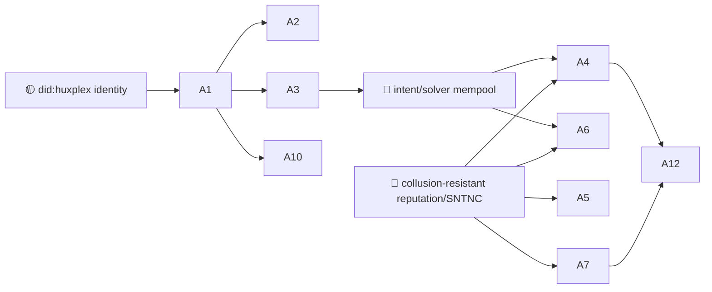

# 02 — The AI Agent Economy

> This is Huxplex's reason to exist that no mature chain can copy cheaply: **AI agents as
> first-class economic actors** — they hold wallets, carry identities, earn merit, contract via
> intents, and act only within **cryptographically enforced human limits.**

See [`04-ai-economy/`](../04-ai-economy/) for the architecture (agent framework, wallets,
identity, reputation, marketplace, autonomous commerce). This file is the *demand side*: what
that machinery is actually for.

## Use-case catalogue

| # | Use case | Horizon | Diff. | Edge | Notes |
|---|---|---|---|---|---|
| A1 | Agent wallet + capability-scoped **Work Visa** | 🟩 | 🟠 | AI · SOV | A credential that says *this agent may spend ≤X on ≤these actions until ≤T* |
| A2 | Human kill-switch / spending cap over autonomous agents | 🟩 | 🟠 | SOV | Principal revokes a Visa; agent's authority evaporates at protocol level |
| A3 | Metered M2M commerce (agent pays agent for compute/data/API) | 🟩 | 🟠 | AI | Streaming micropayments, no human in the loop per-transaction |
| A4 | Intent/solver labor market (state a goal, solvers compete) | 🟦 | 🔴 | AI · MERIT | The core marketplace; solvers stake reputation on outcomes |
| A5 | Agent reputation portable across tasks & principals | 🟦 | 🔴 | MERIT | SNTNC accrual; resists Sybil reset by being soulbound |
| A6 | Cross-organization agent contracting w/ bonded performance | 🟦 | 🔴 | AI · MERIT | Two firms' agents transact; default = bond slash + reputation hit |
| A7 | Agentic DAOs (agents propose/execute under human constitution) | 🟦 | 🔴 | AI · SOV | Log-weighted machine votes, biological veto retained |
| A8 | Verifiable task completion (zk-STARK for spec'd work) | 🟦 | 🔴 | AI | Only works for tasks with checkable specs — *not* arbitrary work |
| A9 | Agent-operated services (oracles, relayers, market makers) | 🟦 | 🟠 | AI | Scoped, bonded, rate-limited; hostile-agent mitigation built in |
| A10 | Provenance of agent actions (who/which model did what, when) | 🟩 | 🟠 | PQ · AI | Signed, context-bound action log; survives quantum forgery |
| A11 | Multi-agent swarms coordinating via causal ordering | 🟪 | 🔴 | AI | Vector-clock causality instead of trusting wall clocks |
| A12 | A machine-majority economy settling on Huxplex | 🟪 | 🔴 | AI · SOV | The endgame: agents as the dominant transaction volume |

## Expanded narratives

### A1 + A2 — The Work Visa is the whole pitch (🟩 🟠)
An autonomous agent without bounded authority is a liability; an agent with bounded authority
is an employee. A **Work Visa** is a verifiable credential issued by a human (or org) principal
that encodes *scope* (which actions), *budget* (spend ceilings), *expiry*, and *revocability*.
Because authority is checked **in consensus**, "the human can always say no" stops being a
UX afterthought and becomes a property of the chain. This pairing — autonomy *plus* an
enforceable leash — is the single most important and most distinctive thing Huxplex offers.
It is also relatively near-term: it needs identity + credentials, not novelty scoring.

### A4 — Intent markets, not transaction scripting (🟦 🔴)
Humans and agents express **intents** ("get me 100 GPU-hours of A100 by Friday under $X, from a
provider with reputation ≥ R"); a competitive set of **solvers** (themselves agents) bid to
fulfill them, staking reputation and bonds on the outcome. This flips the UX of blockchains
from "sign this exact transaction" to "here is what I want." It is hard because it needs the
intent/solver mempool, sound reputation, and dispute resolution all at once — but it is the
mechanism that makes an agent labor market liquid.

### A8 — The decidability wall (🟦 🔴 · be honest)
The readme's dream of "proof of correct task completion" for arbitrary agent work is, in the
general case, **undecidable** (you can't prove an essay is "good"). It works *only* for tasks
with a verifiable specification: deterministic compute, oracle-checkable outputs, reproducible
pipelines. The blueprint scopes zk-STARK task proofs to exactly that subset. Selling "verify
any AI did its job" would be a lie; selling "verify a *specifiable* job was done" is real.

### A12 — When agents are the majority (🟪 🔴 · the thesis)
If autonomous agents come to transact, contract, and accumulate capital at machine speed, they
need a *neutral* substrate built for them — not a human chain they're bolted onto. Huxplex's
bet is to be that substrate, with human sovereignty wired in so the machine economy stays
*accountable* to people. Everything else in this file is a step toward earning the right to
make that claim.

## Dependencies & sequencing

**Hard rule (from the exec summary): do not build the AI economy before there is a chain to
run it on.** Everything here sits on Phase 3, after a working chain (Phase 1–2).

## Failure modes & honest caveats
- **Hostile agents at scale** — spam, market manipulation, collusion (risk #6). Mitigations:
  Work Visa bonds, reputation, rate limits. None are proven at adversarial scale.
- **Reputation is an optimization target.** Any merit metric invites grinding/Sybil farming.
  Per [ADR-0007](../adr/0007-sentience-framing.md), keep it bounded and off the consensus path.
- **Liability & legal personhood** — when an agent defaults or harms, who is accountable? The
  human principal via the Visa is the design answer, but it is legally untested.

---

### Open Questions
- What is the minimum viable reputation system that resists Sybil + collusion well enough to
  underwrite A4/A6? (The gating research problem for this whole field.)
- How much agent autonomy can be granted before the human veto becomes theater? Where is the
  line between "leash" and "rubber stamp"?
- Can intent markets avoid solver cartels and MEV-style extraction against agent principals?
