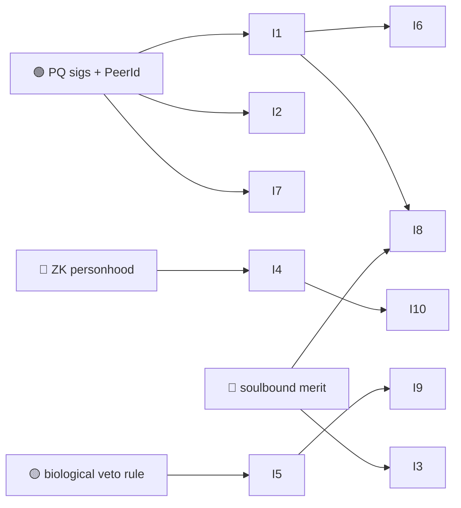

# 03 — Identity, Personhood & Sovereignty

> In a world of indistinguishable AI, the scarce, valuable thing is **provable personhood** and
> **provable agent-hood** — and a way for humans to retain authority over both. This is where
> Huxplex's "human sovereignty as a hard constraint" thesis is cashed out.

See [`05-identity/`](../05-identity/) (DID method, human/AI/hybrid identity, ZK proofs,
privacy) and [`07-governance/`](../07-governance/) (the biological veto, constitution).

## Use-case catalogue

| # | Use case | Horizon | Diff. | Edge | Notes |
|---|---|---|---|---|---|
| I1 | `did:huxplex` verifiable credentials for humans & orgs | 🟩 | 🟠 | PQ | PQ-signed, long-lived identity anchors |
| I2 | Distinct, attestable **agent identity** (which model, whose principal) | 🟩 | 🟠 | AI · PQ | Separates "an agent" from "a person" cryptographically |
| I3 | Soulbound professional reputation portable across employers | 🟦 | 🔴 | MERIT | Your track record follows you, can't be bought or reset |
| I4 | ZK proof-of-personhood (prove "I am a unique human" w/o raw biometrics) | 🟦 | 🔴 | SOV | The privacy-preserving anti-Sybil grail |
| I5 | The **biological veto** — humans halt machine action at protocol level | 🟩 | 🟠 | SOV | A consensus rule, not a social norm |
| I6 | Selective-disclosure credentials (prove age/license, reveal nothing else) | 🟦 | 🟠 | PQ | ZK presentation of PQ-anchored claims |
| I7 | Long-lived identity that survives the quantum transition | 🟩 | ⚪ | PQ | SLH-DSA root-of-trust for decade-scale keys |
| I8 | Provenance/attestation graph (who vouched for whom) | 🟦 | 🟠 | MERIT | Web-of-trust without a central issuer |
| I9 | Constitutional invariants binding even an AI-run polity | 🟪 | 🔴 | SOV | Unamendable "humans keep the veto" clauses |
| I10 | Dignity/identity floor — an unrevokable baseline credential per human | 🟪 | 🔴 | SOV | Anti-exclusion: nobody can be deleted from personhood |

## Expanded narratives

### I4 — Personhood without surveillance (🟦 🔴 · the tightrope)
The thesis *needs* a way to tell humans from agents at scale, but the obvious implementation —
biometric DIDs — is the fastest way to **destroy** the sovereignty it's meant to protect. Raw
biometrics on-chain create a permanent, quantum-durable surveillance asset and a central point
of capture (risk #8). The only acceptable path is **ZK proof-of-personhood**: prove uniqueness
and humanity without revealing the biometric itself, with no raw template ever stored. This is
unsolved at population scale and is one of the project's defining 🔴 bets. Get it wrong and the
whole "sovereignty" pitch inverts into "the most efficient panopticon ever built."

### I5 + I9 — Sovereignty as code (🟩→🟪)
"Human sovereignty" is meaningless as a slogan. Huxplex makes it mechanical: a **biological
veto** is a consensus-checked rule where a quorum of verified humans can block a class of
machine actions within a time window. In the near term (I5) this guards treasuries and
dangerous operations. In the limit (I9) it becomes a **constitutional invariant** — a small set
of unamendable clauses that even a governance system dominated by AI voting power cannot strip
out. Whether such an invariant can truly survive a sufficiently capable adversarial majority is
a deep open question (it's partly a social, not just cryptographic, guarantee).

### I3 — Reputation you can't launder (🟦 🔴)
Soulbound (non-transferable) SNTNC means a professional or agent reputation can't be sold,
gifted, or reset by spinning up a new wallet. That's powerful for trust — and dangerous: it
makes reputation a permanent record (forgiveness, decay, and appeal must be designed in) and a
juicy target for farming. Cross-ref the [ADR-0007](../adr/0007-sentience-framing.md) constraint
that merit must be bounded and opt-in.

## Dependencies

## Failure modes & honest caveats
- **Biometric privacy failure undermines the entire sovereignty claim** (risk #8). No raw
  biometrics on-chain, ever — ZK personhood or nothing.
- **Soulbound = unforgiving.** Permanent reputation needs decay, appeal, and dispute, or it
  becomes a caste system.
- **Sovereignty's social half.** Code can enforce a veto only if enough verified humans exist
  and participate; apathy defeats it as surely as capture.

---

### Open Questions
- Is privacy-preserving proof-of-personhood achievable at population scale without *any* trusted
  biometric issuer, or is some federation of issuers unavoidable?
- Can a constitutional invariant be made genuinely unamendable against a future AI-weighted
  supermajority, or is "unamendable" always ultimately social?
- How do soulbound credentials handle redemption, error correction, and the right to be
  forgotten — which sit in direct tension with permanence?
