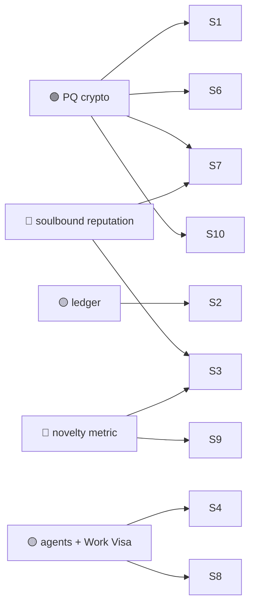

# 04 — Science, Research & Academia

> Science runs on trust in records: *this data existed at this time, this result is reproducible,
> this person did this work.* Huxplex's post-quantum integrity and provenance primitives map
> onto that need cleanly — and this is a field where the 🟩 use cases are genuinely strong and
> non-speculative.

## Use-case catalogue

| # | Use case | Horizon | Diff. | Edge | Notes |
|---|---|---|---|---|---|
| S1 | Tamper-evident data timestamping & provenance | 🟩 | ⚪ | PQ | "This dataset existed, unaltered, on this date" — quantum-durable |
| S2 | Reproducibility receipts (inputs+code+env hash → output) | 🟩 | 🟠 | PQ | Verifiable computational reproducibility |
| S3 | Decentralized peer review with reputation (anti–citation-ring) | 🟦 | 🔴 | MERIT | Reviewers stake soulbound reputation; novelty scoring (opt-in) |
| S4 | DeSci funding: intent-based grants, agent-assisted disbursement | 🟦 | 🔴 | AI · SOV | Funders state goals; milestones verified before release; human veto |
| S5 | Open data commons with licensing + usage accounting | 🟦 | 🟠 | AI · SOV | Data unions; agents pay-per-use; provenance preserved |
| S6 | Pre-registration of hypotheses (immutable, anti–p-hacking) | 🟩 | ⚪ | PQ | Locks the hypothesis before the data |
| S7 | Author/contribution attribution (CRediT-style, verifiable) | 🟩 | 🟠 | PQ · MERIT | Granular, non-repudiable credit |
| S8 | Agent co-researchers with provenance of every action | 🟦 | 🔴 | AI | Which model ran which analysis, signed and bounded |
| S9 | Novelty/non-redundancy measurement of contributions | 🟪 | 🔴 | MERIT | The "causal novelty" research line — opt-in, off critical path |
| S10 | Century-scale archival of the scientific record | 🟪 | 🟠 | PQ | A "long now" archive that survives quantum + institutional decay |

## Expanded narratives

### S1 + S6 — The integrity layer science actually lacks (🟩 ⚪/🟠 · ship this)
The replication crisis is partly a *records* problem: data gets quietly edited, hypotheses get
retrofitted to results (HARKing/p-hacking), and "when did this exist?" is unanswerable years
later. A PQ-signed, domain-context-bound timestamp (reusing the 🟢 crypto that exists today)
gives an unforgeable answer that stays valid even after a quantum computer would have broken an
ECC-based notary. **Pre-registration** (S6) locks a hypothesis before data collection. These
need almost nothing Huxplex-specific beyond a working ledger — they're among the strongest
near-term, low-risk applications in the whole catalogue.

### S3 — Peer review that resists capture (🟦 🔴)
Academic peer review suffers from citation rings, prestige bias, and unaccountable reviewers.
A system where reviewers carry **soulbound reputation** they can lose for bad-faith or
demonstrably wrong reviews changes the incentives. This edges into the project's risky novelty
machinery — and must inherit its guardrails: any "novelty score" is opt-in, advisory, bounded,
and never a hard gate on publication. Done carefully it's transformative; done naively it just
moves Goodhart's law into the review process.

### S9 — Measuring non-redundant contribution (🟪 🔴 · the project's deepest bet)
This is the academic face of the "proof of sentience" research line: can you *measure* whether
a contribution added genuinely new causal information versus restating prior work? If it
worked, it would reshape credit, funding, and hiring. The blueprint is explicit that this is
**unproven, adversarially fragile, and may be impossible** — it belongs in [`11-research/`](../11-research/),
not on anyone's critical path. Listed here because the *field* is where the idea is least
dangerous and most interesting to study.

## Dependencies

## Failure modes & honest caveats
- **Garbage in, signed garbage out** — a chain proves *integrity of a record*, not *truth of a
  claim*. Over-selling "blockchain-verified science" is itself a research-integrity hazard.
- Novelty scoring (S9) is the riskiest idea in the project; keep it advisory and bounded.
- Adoption is sociological — academia changes incentives slowly; tooling alone won't move it.

---

### Open Questions
- What is the minimal reproducibility receipt (S2) that journals/funders would actually require?
- Can novelty/non-redundancy be measured robustly enough to *inform* (never gate) review and
  funding, or does it inevitably become a gameable metric?
- Who runs a century-scale archive (S10), and how is its governance kept independent of any one
  institution over that horizon?
