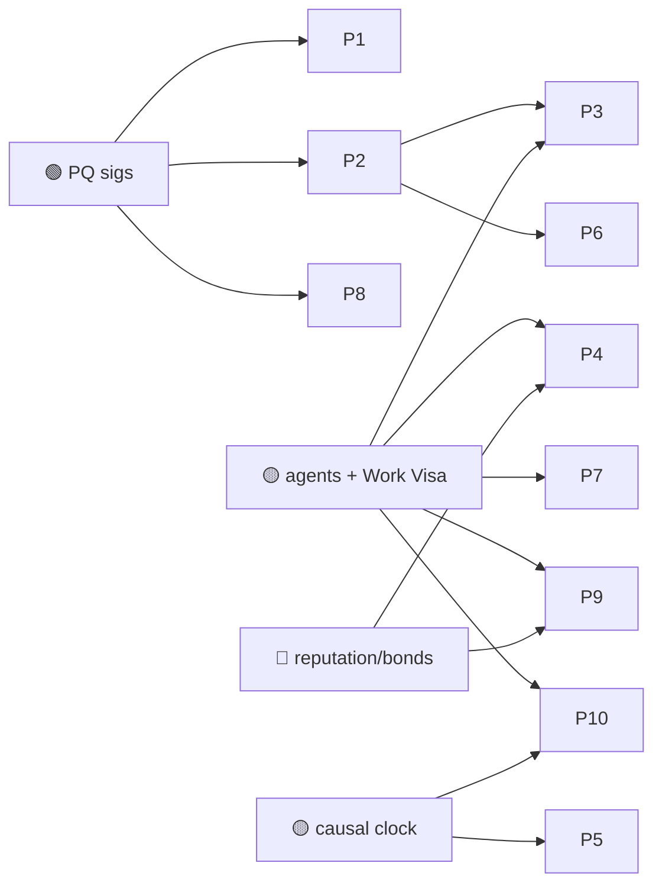

# 05 — Supply Chain, IoT & the Physical World

> Where the digital ledger meets atoms: provenance of goods, machine-to-machine coordination,
> sensor networks, robotics, and decentralized physical infrastructure (DePIN). Huxplex's edge:
> **devices and machines are the agents**, and their attestations need to stay trustworthy for
> the lifetime of the physical asset — often decades.

## Use-case catalogue

| # | Use case | Horizon | Diff. | Edge | Notes |
|---|---|---|---|---|---|
| P1 | Provenance of goods with 30-yr integrity (pharma, food, parts) | 🟩 | 🟠 | PQ | Cold-chain, recall, anti-counterfeit; survives quantum forgery |
| P2 | Device identity for IoT fleets (`did:huxplex` per device) | 🟩 | 🟠 | PQ · AI | Each sensor/actuator is a signing identity |
| P3 | Machine-to-machine micropayments for resources (energy, bandwidth) | 🟦 | 🟠 | AI | Devices pay devices; metered, bounded by Work Visa |
| P4 | DePIN — decentralized wireless/compute/storage with agent operators | 🟦 | 🔴 | AI | Provider agents bonded & reputation-scored |
| P5 | Robotics/drone swarm coordination via causal ordering | 🟪 | 🔴 | AI | Vector clocks over unreliable wall-clocks in the field |
| P6 | Tamper-evident sensor attestation (MRV for carbon, safety) | 🟦 | 🔴 | PQ · AI | Trust the reading because the device signs it; see [Climate](#climate-cross-link) |
| P7 | Autonomous logistics negotiation (intent-based freight/routing) | 🟦 | 🔴 | AI | "Move this pallet by Friday under $X" → solver agents bid |
| P8 | Critical-component lifecycle records (aviation, nuclear, medical) | 🟩 | 🟠 | PQ | Parts whose audit trail must outlive current crypto |
| P9 | Energy-grid coordination (prosumer trading, demand response) | 🟦 | 🔴 | AI | Agent-mediated local energy markets |
| P10 | Machine economy for physical labor (robots earning/spending) | 🟪 | 🔴 | AI · SOV | Robots as bonded economic actors under human Visas |

## Expanded narratives

### P1 + P8 — Provenance that outlives the product (🟩 🟠 · solid near-term)
A jet engine, an implantable device, or a nuclear component has an audit trail that must remain
unforgeable for *its entire service life* — 30, 40, 50 years. An ECC-signed provenance record
created today is forgeable the moment a CRQC exists, retroactively poisoning the audit trail of
parts still flying. PQ-signed provenance is the rare case where "post-quantum" is not paranoia
but a literal lifecycle requirement. Strong, concrete, near-term — and a wedge into regulated
industries that already mandate long retention.

### P4 — DePIN with accountable machine operators (🟦 🔴)
Decentralized physical networks (wireless coverage, storage, compute, sensing) live or die on
*whether providers actually deliver*. Huxplex adds bonded, reputation-scored **agent operators**:
a provider agent stakes SNTNC + HUX, serves under a Work Visa, and is slashed for fraud or
downtime. The hard part is honest proof-of-physical-service (proof of coverage/storage/sensing),
which is an active research area beyond Huxplex itself.

### P5 + P10 — When the agents have bodies (🟪 🔴)
Robot swarms and autonomous machines operating in the field can't trust synchronized wall-clocks
or constant connectivity. Huxplex's **causal ordering** (vector clocks + hybrid logical clocks,
the readme's "causal clock engine") lets them coordinate and settle by *what caused what* rather
than *what time it was*. Extend that to robots **earning and spending** under human Work Visas
and you get a physical-labor machine economy — the most ambitious entry here, gated on both the
agent economy and a lot of unproven robotics integration.

### P6 — Trust the sensor, not the operator (🟦 🔴)
Carbon credits, emissions reporting, and safety compliance are riddled with fraud because the
*operator* self-reports. If the **device** signs its readings (PQ, context-bound) and an agent
cross-checks them, you get measurement-reporting-verification (MRV) that's hard to fake. See
[Climate & Environment in the impact files](11-impact-on-society.md). Hard because secure
hardware roots-of-trust in cheap field devices are not a solved problem.

## Dependencies

## Failure modes & honest caveats
- **Oracle/sensor trust** — the chain can't verify a lying sensor; secure hardware roots-of-trust
  are the weak link, and they're outside Huxplex's scope.
- **PQ bandwidth on constrained devices** — 2,420 B signatures are heavy for tiny IoT radios;
  aggregation/batching is essential.
- **Physical-world disputes** can't be resolved on-chain alone; need off-chain adjudication.

---

### Open Questions
- Can lightweight devices carry PQ signatures within their power/bandwidth budgets, or is a
  gateway-attestation model required (devices sign to a gateway that anchors on-chain)?
- What proof-of-physical-service schemes are robust enough to underwrite DePIN payouts?
- Does causal ordering give a real advantage for swarm robotics over existing time-sync, or is
  it a solution looking for a problem here?
