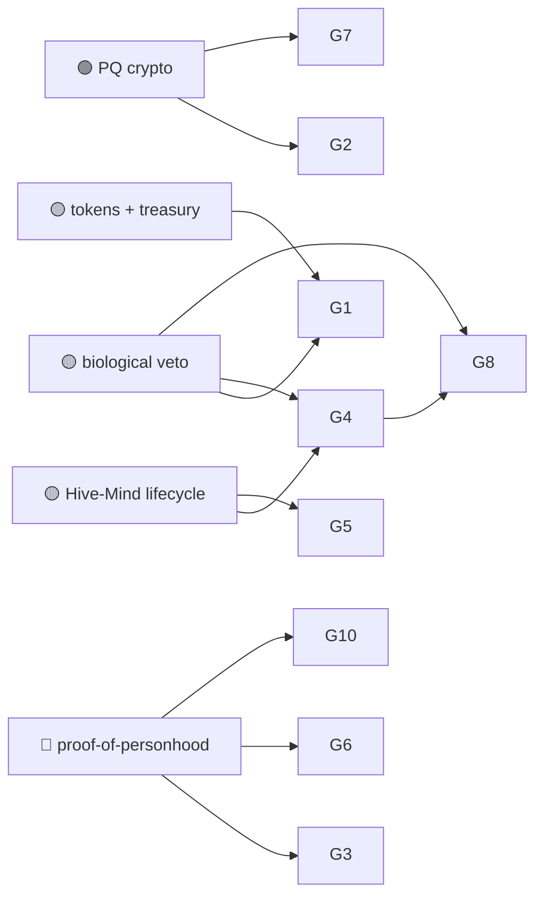

# 06 — Governance, Civics & Public Sector

> Governance is where Huxplex's most distinctive constraint lives: **a hard, protocol-level
> human veto** over machine action, plus a minimal **constitutional layer** of unamendable
> invariants. See [`07-governance/`](../07-governance/) for the Hive-Mind four-phase lifecycle
> and the constitution.

## Use-case catalogue

| # | Use case | Horizon | Diff. | Edge | Notes |
|---|---|---|---|---|---|
| G1 | DAO/treasury with hard human veto on large outflows | 🟩 | 🟠 | SOV | Constitutional spending caps enforced in consensus |
| G2 | Long-horizon public records (deeds, registries) quantum-safe | 🟩 | 🟠 | PQ | Land titles & vital records that must survive decades |
| G3 | Verifiable voting with selective-disclosure privacy | 🟦 | 🔴 | SOV · PQ | ZK ballots; receipt-free; PQ-durable |
| G4 | Four-phase Hive-Mind governance (propose→deliberate→decide→veto) | 🟦 | 🔴 | SOV | Log-weighted machine votes + biological veto |
| G5 | Agentic policy execution under human constitution | 🟦 | 🔴 | AI · SOV | Agents implement, humans retain override |
| G6 | Participatory budgeting / quadratic-style funding | 🟦 | 🟠 | SOV | Anti-plutocracy weighting; needs proof-of-personhood |
| G7 | Transparent, auditable public procurement | 🟩 | 🟠 | PQ | Immutable bid/award trail; anti-corruption |
| G8 | Constitutional invariants binding an AI-weighted polity | 🟪 | 🔴 | SOV | Unamendable "humans keep the veto" clauses |
| G9 | Cross-jurisdiction coordination on neutral substrate | 🟪 | 🔴 | SOV | A polity-neutral settlement layer between institutions |
| G10 | Sortition / citizen-assembly tooling with verified personhood | 🟦 | 🔴 | SOV | Random, accountable, Sybil-resistant selection |

## Expanded narratives

### G1 + G4 — Governance that machines can run but humans can stop (🟩→🟦)
The core governance idea: let machine voting power scale with contribution (**log-weighted** to
resist plutocracy), let agents propose and execute at machine speed — but preserve a
**biological veto** that a quorum of verified humans can exercise within a deliberation window.
G1 is the near-term, narrow form (veto on big treasury moves). G4 is the full **Hive-Mind**
lifecycle. The design tension is real and named in the risk register (#7): too much machine
weight → capture; too little human participation → the veto is theater.

### G2 + G7 — Public records that survive the century (🟩 🟠 · low-risk wins)
Property registries, vital records, and procurement trails are exactly the *long-horizon,
high-stakes, integrity-critical* documents that justify post-quantum security. A deed forged on
a quantum-broken legacy chain is a stolen house. These are unglamorous, concrete, and among the
strongest public-sector pitches precisely because they need PQ integrity and *not* the
speculative AI machinery.

### G8 — Can a constitution bind a superior intelligence? (🟪 🔴 · the deep one)
The civilizational bet: encode a small set of **unamendable invariants** (humans retain the
veto; certain rights can't be revoked) that hold even when AI agents dominate the chain's voting
power and capital. This is only *partly* a cryptographic guarantee — ultimately it rests on
whether enough verified humans exist, participate, and are willing to exercise the veto. It may
be the most important and most fragile idea in the project. Honestly flagged as 🔴 / research.

## Dependencies

## Failure modes & honest caveats
- **Governance capture** (risk #7) — plutocracy if weighting is wrong, paralysis if humans don't
  show up. The veto only works if personhood is solved (depends on the 🔴 from [Identity](03-identity-personhood-sovereignty.md)).
- **Public-sector adoption is political**, slow, and procurement-bound; tech readiness ≠ uptake.
- **On-chain voting has a long history of low turnout and bribery (vote-buying).** Receipt-free,
  personhood-gated designs are necessary but not sufficient.

---

### Open Questions
- Can the biological veto be made robust to human apathy (the failure mode that quietly kills
  every "human-in-the-loop" guarantee)?
- Is log-weighted machine voting genuinely capture-resistant, or just plutocracy with a slower
  exponent?
- Would any real jurisdiction anchor authoritative records (G2) on a neutral chain it doesn't
  control — or is sovereignty itself the adoption blocker?
