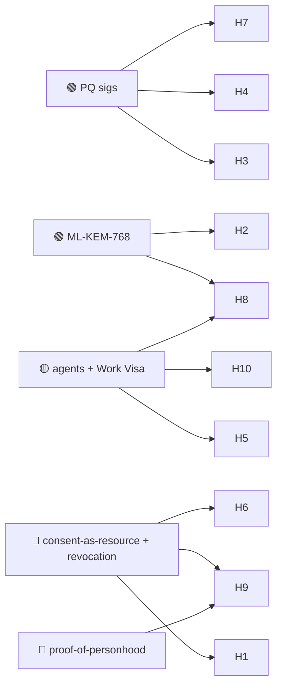

# 07 — Healthcare & Biotech

> Health data is the most sensitive, longest-lived, most regulated data humans produce. It must
> stay confidential for a lifetime and verifiable for decades — a near-perfect match for
> **post-quantum confidentiality + consent that the patient actually controls.** It is also the
> field where the privacy stakes are highest, so every use case here is sovereignty-first.

## Use-case catalogue

| # | Use case | Horizon | Diff. | Edge | Notes |
|---|---|---|---|---|---|
| H1 | Patient-controlled consent ledger (who may access what, when) | 🟦 | 🔴 | SOV · PQ | Consent as a revocable, auditable on-chain capability |
| H2 | Long-term confidentiality of records (lifetime + beyond) | 🟩 | 🟠 | PQ | ML-KEM-768 protects against harvest-now-decrypt-later |
| H3 | Clinical-trial data integrity (anti-fraud, anti-selective-reporting) | 🟦 | 🟠 | PQ | Immutable protocol + results; pre-registered endpoints |
| H4 | Verifiable provenance of medical supplies & devices | 🟩 | 🟠 | PQ | Anti-counterfeit drugs; device lifecycle (see [Supply Chain](05-supply-chain-iot-physical.md)) |
| H5 | Agent-assisted triage/monitoring under bounded authority | 🟦 | 🔴 | AI · SOV | Care agents act within Work-Visa limits; human override |
| H6 | Genomic data unions (license your genome, accounted & revocable) | 🟦 | 🔴 | SOV · AI | Patients monetize/donate data with provenance & consent |
| H7 | Credentialing of clinicians (verifiable, portable, revocable) | 🟩 | 🟠 | PQ · MERIT | License & qualification credentials anti-forgery |
| H8 | Research data commons across institutions (privacy-preserving) | 🟦 | 🔴 | SOV · PQ | Federated; agents compute over data they never exfiltrate |
| H9 | Lifetime longitudinal health record portable across borders | 🟪 | 🔴 | PQ · SOV | A record that follows the person, not the provider |
| H10 | Pandemic/biosurveillance coordination on neutral substrate | 🟪 | 🔴 | AI · SOV | Cross-border sensor + agent attestation, privacy-bounded |

## Expanded narratives

### H2 — The harvest-now-decrypt-later clock is already ticking (🟩 🟠)
This is the use case where post-quantum is *urgently* concrete, not speculative. Health records
encrypted today with classical crypto can be **stolen now and decrypted later** once a quantum
computer exists — and unlike a password, you can't rotate your genome or your diagnosis history.
ML-KEM-768 (the 🟢 KEM Huxplex already implements) is designed for exactly this forward-secrecy
problem. Any data with a multi-decade confidentiality requirement is a candidate today.

### H1 — Consent the patient holds, not the hospital (🟦 🔴)
Today consent is a PDF in someone else's filing system. Modeled as an HRM resource, consent
becomes a **revocable, auditable capability**: the patient grants scoped access (this provider,
this purpose, until this date), every access is logged, and revocation is enforced. Hard because
it must integrate with messy real-world health IT and survive emergency-access edge cases
(unconscious patient, etc.) without becoming either a privacy hole or a care blocker.

### H5 — Care agents on a leash (🟦 🔴 · where Work Visas matter most)
An AI monitoring agent that can flag deterioration, reorder routine labs, or escalate to a
human — but **only within a Work Visa** that caps its authority and keeps a human clinician in
the loop for anything consequential — is the safety-critical archetype of Huxplex's "autonomy
plus enforceable limit." The veto isn't a feature here; it's a patient-safety requirement.

## Dependencies

## Failure modes & honest caveats
- **Regulation is the gate** — HIPAA/GDPR and their successors govern everything here; a chain
  must *enable* compliance (data minimization, right-to-erasure) not fight it. On-chain
  immutability vs. right-to-be-forgotten is a real, unresolved tension (store ciphertext/hashes
  off-chain, keys/consent on-chain).
- **Emergency access** must never be blocked by a consent mechanism — break-glass design is
  mandatory and easy to get dangerously wrong.
- **Liability** for agent-assisted care decisions is legally untested.

---

### Open Questions
- How is the right-to-erasure reconciled with an immutable ledger? (Likely: no PII on-chain
  ever; only hashes, consent capabilities, and pointers.)
- Can break-glass emergency access be both auditable and instantaneous?
- Will providers and regulators accept patient-held consent, or does institutional control of
  records make H1 a non-starter outside pilot programs?
