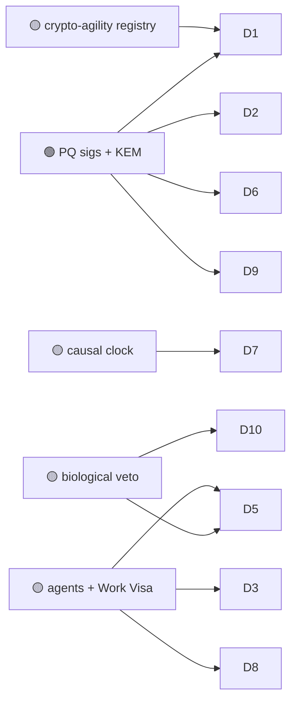

# 08 — Security, Defense & Critical Infrastructure

> The bluntest version of Huxplex's thesis: the cryptography securing power grids, financial
> rails, defense logistics, and state secrets **will break** when a cryptographically relevant
> quantum computer arrives. Migration is not optional, and the integrity of long-lived records
> can't wait for the threat to be live. This field is where "post-quantum by construction" is a
> requirement, not a differentiator.

> ⚠️ **Scope note.** This file covers *defensive* and *authorized* applications only —
> resilience, integrity, secure coordination. It does not address offensive capability.

## Use-case catalogue

| # | Use case | Horizon | Diff. | Edge | Notes |
|---|---|---|---|---|---|
| D1 | Post-quantum migration substrate for legacy systems | 🟩 | 🟠 | PQ | Crypto-agile registry; rotate suites without state hard-fork |
| D2 | Tamper-evident audit logs for critical infrastructure | 🟩 | ⚪ | PQ | SCADA/grid/ICS event integrity, quantum-durable |
| D3 | Secure M2M coordination for infrastructure (grid, water, transit) | 🟦 | 🔴 | AI · PQ | Bounded agents coordinate, humans retain veto |
| D4 | Defense logistics & supply provenance (long-lived integrity) | 🟦 | 🟠 | PQ | Parts, materiel, chain-of-custody over decades |
| D5 | Verifiable autonomy for safety-critical agent swarms | 🟪 | 🔴 | AI · SOV | Provable bounds on what autonomous systems may do |
| D6 | Secure messaging / comms with hybrid PQ key exchange | 🟩 | 🟠 | PQ | X25519 + ML-KEM-768 hybrid handshake |
| D7 | Resilient settlement during infrastructure disruption | 🟦 | 🔴 | PQ | Causal ordering tolerates partition/high-latency |
| D8 | Cross-agency record sharing on neutral, attestable substrate | 🟦 | 🔴 | PQ · SOV | Inter-institution trust without a central owner |
| D9 | Critical-component lifecycle (aviation/nuclear/medical) | 🟩 | 🟠 | PQ | See [Supply Chain P8](05-supply-chain-iot-physical.md) |
| D10 | Kill-switch & containment for autonomous systems | 🟦 | 🔴 | SOV | Protocol-level "humans can always halt the machines" |

## Expanded narratives

### D1 — Crypto-agility as the actual product (🟩 🟠 · the most defensible thing here)
The blueprint's *top* architectural priority is a **versioned algorithm registry** so the entire
cryptographic suite can be rotated under governance without a hard fork of the state model
(see [03-post-quantum/crypto-agility.md](../03-post-quantum/crypto-agility.md) and
[ADR-0002](../adr/0002-cryptographic-parameter-set.md)). For critical infrastructure facing a
*moving* cryptographic threat (ML-DSA/ML-KEM are young; one could be broken), the ability to
migrate cleanly is worth more than any single algorithm. This is sellable to security-conscious
operators *today*, independent of the AI vision.

### D5 + D10 — Autonomy you can prove is bounded (🟪/🟦 🔴 · the safety thesis)
As autonomous systems enter safety-critical domains, the question becomes: *can you prove what
they're allowed to do, and can a human always stop them?* Huxplex's Work Visas (scoped authority)
+ biological veto (protocol-level halt) are a substrate for **verifiable autonomy**: an agent's
permissions are cryptographic and inspectable, and containment is a consensus rule, not a hope.
This is the most consequential safety idea in the project — and the hardest, because "bounded in
the protocol" doesn't bound an agent's effects in the physical world.

### D6 + D7 — Comms and settlement that survive both quantum and disruption (🟩→🟦)
The hybrid handshake (X25519 + ML-KEM-768) gives forward secrecy against both classical and
quantum adversaries *now* — even if one primitive falls, the other holds. Combined with **causal
ordering** that tolerates network partition and high latency, you get coordination that degrades
gracefully under exactly the conditions (jamming, outage, contested networks) where it matters
most.

## Dependencies

## Failure modes & honest caveats
- **"Bounded in protocol" ≠ "bounded in reality."** A Visa caps on-chain authority; it does not
  physically stop an actuator. Real safety needs hardware interlocks too.
- **Public ledgers and classified data don't mix** — these use cases need permissioned or
  hybrid deployments; only hashes/attestations go on a public chain.
- **Procurement & accreditation** for defense/critical-infra are multi-year; a young chain
  (young PQ primitives included) is a hard sell for the most conservative buyers.

---

### Open Questions
- Can verifiable on-chain autonomy bounds be coupled to *physical* interlocks so the guarantee
  is end-to-end, not just ledger-deep?
- For classified/regulated contexts, what is the right public/permissioned split (anchor hashes
  publicly, keep payloads private)?
- Are ML-DSA/ML-KEM mature enough for critical infrastructure, or does the hybrid + agility story
  need years of cryptanalysis before serious adoption?
